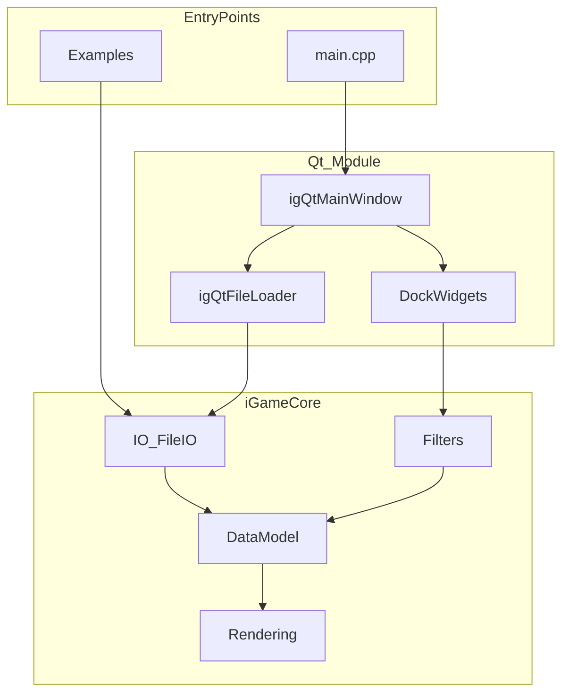

# iGameVis developer version

[中文版说明](README.zh.md)

## Project Architecture

iGameVis is a CAE simulation result visualization platform built on the `iGameCore` core library and an optional `Qt` GUI module.



### Core Directories

| Directory | Responsibility |
|-----------|----------------|
| [`iGameCore/Core/`](iGameCore/Core/) | CellModel, Common, DataModel — base objects and mesh data structures |
| [`iGameCore/Filters/`](iGameCore/Filters/) | Feature extraction, flow/vector/tensor, deformation, visual analytics |
| [`iGameCore/IO/`](iGameCore/IO/) | VTK/CGNS/Spline format readers/writers; unified entry `FileIO::ReadFile()` |
| [`iGameCore/Rendering/`](iGameCore/Rendering/) | Scene, OpenGL rendering, Meshlet acceleration |
| [`Qt/`](Qt/) | GUI main window, file loader, visualization Dock panels |
| [`Examples/`](Examples/) | Standalone example programs (`EXAMPLE_COMPILE=ON`) |

### Invocation Paths

1. **GUI**: `main.cpp` → `igQtMainWindow` → `igQtFileLoader::OpenFile()` → `FileIO::ReadFile()` → `Scene::AddModel()` → Dock widgets call Filters / DrawObject
2. **Examples**: `Examples/<module>/main` → `FileIO::ReadFile()` → `Filter::New()->Execute()` → `Scene` → `RenderWindow::Show()`

### 开源指标模块

完整文档见 **[doc/modules/](doc/modules/README.md)**。

| 指标 | 模块 | 中文 | English |
|------|------|------|---------|
| 7.1 | 高阶可视化 | [README_7.1.md](doc/modules/README_7.1.md) | [README_7.1.en.md](doc/modules/README_7.1.en.md) |
| 10.1 | 智能可视分析 | [README_10.1.md](doc/modules/README_10.1.md) | [README_10.1.en.md](doc/modules/README_10.1.en.md) |
| 10.2 | 特征提取 | [README_10.2.md](doc/modules/README_10.2.md) | [README_10.2.en.md](doc/modules/README_10.2.en.md) |
| 10.3 | 物理场特征可视交互 | [README_10.3.md](doc/modules/README_10.3.md) | [README_10.3.en.md](doc/modules/README_10.3.en.md) |
| 11.2 | vtk/CGNS 数据接口 | [README_11.2.md](doc/modules/README_11.2.md) | [README_11.2.en.md](doc/modules/README_11.2.en.md) |
| 11.3 | 场可视化输出 | [README_11.3.md](doc/modules/README_11.3.md) | [README_11.3.en.md](doc/modules/README_11.3.en.md) |
| 11.4 | CAE 高精并行可视化软件 | [README_11.4.md](doc/modules/README_11.4.md) | [README_11.4.en.md](doc/modules/README_11.4.en.md) |

## File Import

File import cannot have Chinese path.

## Requirements

- QT 5.15.2（推荐 MSVC 2019 64-bit Kit；亦兼容 5.14.2）

## Install

~~~shell
# Needn't to use ThirdParty's SubModule
git clone https://github.com/mky8812/editOpeniGame.git
# If you need to use ThirdParty's SubModule. SubModule's detail see target file(.gitmodules)
git clone --recurse-submodules https://github.com/mky8812/editOpeniGame.git
~~~

## Build

To Build this Project, you need to check if you have Configured Qt5 Cmake Path in your `environment variables`.

If `NOT`, you have to edit `Qt ` module's CMakeLists.txt. Replace the Qt5 cmake path with the Qt path on your computer.

~~~cmake
#UNIX
set(Qt5_DIR "/usr/lib/Qt/5.14.2/gcc_64/lib/cmake/Qt5")
#Windows
set(Qt5_DIR "D:/Qt/5.14.2/msvc2017_64/lib/cmake/Qt5")
~~~

After Edit your qt path, Clear the CMAKE cache.

~~~shell
#1. Enter the cmake build path
cd out/build/x64-debug
cd out/build/x64-release
#2 .use cmake clean command to clear
cmake --build . --target clean
~~~

Then you can open the Project correctly. Enjoy it !

ps. Use Cmake to Build in Command

```shell
cmake -B build -DCMAKE_BUILD_TYPE=Release
cmake --build build --parallel 12
cmake --build build --target install
```

use qt-cmake to build project(Only available in qt6 version)

```shell
cd build
~/projects/packages/qt/host/qt-everywhere-src-6.5.3/qtbase/bin/qt-cmake ..
cmake --build . --parallel 8
./iGameVis # run this app
```

Compile iGameVis on Web by using Wasm(Temporarily not applicable)

```shell
cd build/wasm
source ~/projects/packages/emsdk/emsdk_env.sh
emcc -v # check version, must using 3.1.25
~/projects/packages/qt/wasm/qt-everywhere-src-6.5.3/qtbase/bin/qt-cmake ../../
cmake --build . --parallel 8
python3 -m http.server # to start http-server by using python3 http module. then visit http://localhost:8000/Qt_OpenGL.html
```

## How to Use iGameVis

Detail process see `iGameVisNoticeToUsers.md`
