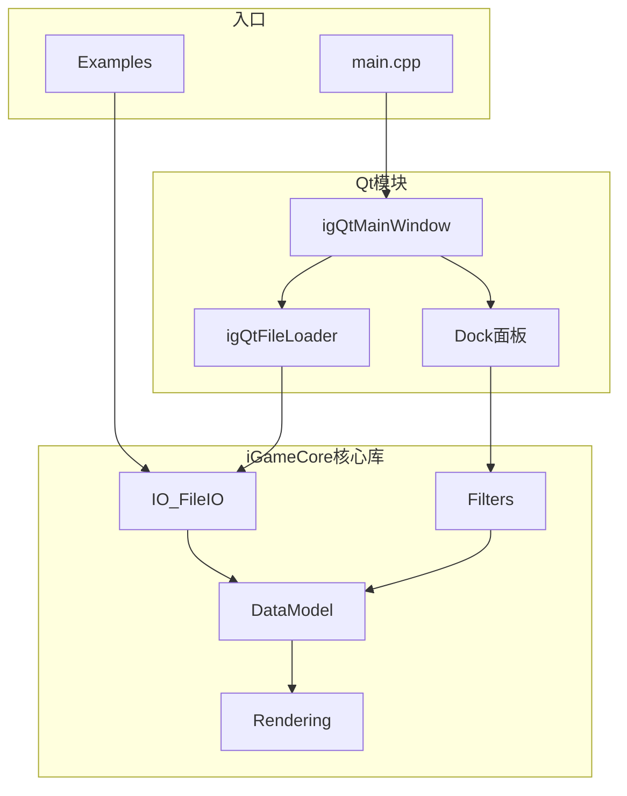

# iGameVis 开发者版本

[English README](README.md)

## 项目框架架构

iGameVis 是基于 `iGameCore` 核心库与可选 `Qt` 前端模块构建的 CAE 仿真结果可视化平台。



### 核心目录

| 目录 | 职责 |
|------|------|
| [`iGameCore/Core/`](iGameCore/Core/) | CellModel、Common、DataModel — 基础对象与网格数据结构 |
| [`iGameCore/Filters/`](iGameCore/Filters/) | 特征提取、流场/矢量/张量、形变、可视分析等算法 |
| [`iGameCore/IO/`](iGameCore/IO/) | VTK/CGNS/Spline 等格式读写，统一入口 `FileIO::ReadFile()` |
| [`iGameCore/Rendering/`](iGameCore/Rendering/) | Scene、OpenGL 渲染、Meshlet 加速 |
| [`Qt/`](Qt/) | GUI 主窗口、文件加载、可视化 Dock 面板 |
| [`Examples/`](Examples/) | 独立示例程序（`EXAMPLE_COMPILE=ON`） |

### 调用路径

1. **GUI 路径**：`main.cpp` → `igQtMainWindow` → `igQtFileLoader::OpenFile()` → `FileIO::ReadFile()` → `Scene::AddModel()` → Dock 面板调用 Filters / DrawObject
2. **示例路径**：`Examples/<module>/main` → `FileIO::ReadFile()` → `Filter::New()->Execute()` → `Scene` → `RenderWindow::Show()`

### 开源指标模块

完整文档见 **[doc/modules/](doc/modules/README.md)**。

| 指标 | 模块名称 | 中文 | English |
|------|----------|------|---------|
| 7.1 | 高阶可视化模块 | [README_7.1.md](doc/modules/README_7.1.md) | [README_7.1.en.md](doc/modules/README_7.1.en.md) |
| 10.1 | 智能可视分析模块 | [README_10.1.md](doc/modules/README_10.1.md) | [README_10.1.en.md](doc/modules/README_10.1.en.md) |
| 10.2 | 特征提取模块 | [README_10.2.md](doc/modules/README_10.2.md) | [README_10.2.en.md](doc/modules/README_10.2.en.md) |
| 10.3 | 物理场特征可视交互模块 | [README_10.3.md](doc/modules/README_10.3.md) | [README_10.3.en.md](doc/modules/README_10.3.en.md) |
| 11.2 | vtk/CGNS 数据接口模块 | [README_11.2.md](doc/modules/README_11.2.md) | [README_11.2.en.md](doc/modules/README_11.2.en.md) |
| 11.3 | 可视化功能模块 | [README_11.3.md](doc/modules/README_11.3.md) | [README_11.3.en.md](doc/modules/README_11.3.en.md) |
| 11.4 | CAE 高精并行可视化软件 | [README_11.4.md](doc/modules/README_11.4.md) | [README_11.4.en.md](doc/modules/README_11.4.en.md) |

## 文件导入

文件导入路径不能包含中文字符。

## 环境要求

- QT 5.15.2（推荐 MSVC 2019 64-bit Kit；亦兼容 5.14.2）

## 安装

~~~shell
# 不使用 ThirdParty 子模块
git clone https://github.com/hu-shuhan/editOpeniGame.git
# 使用 ThirdParty 子模块（详见 .gitmodules）
git clone --recurse-submodules https://github.com/hu-shuhan/editOpeniGame.git
~~~

## 编译

编译前请确认已在环境变量中配置 Qt5 的 CMake 路径。

若未配置，需编辑 `Qt` 模块的 `CMakeLists.txt`，将 Qt5 路径替换为本机路径：

~~~cmake
#UNIX
set(Qt5_DIR "/usr/lib/Qt/5.14.2/gcc_64/lib/cmake/Qt5")
#Windows
set(Qt5_DIR "D:/Qt/5.14.2/msvc2017_64/lib/cmake/Qt5")
~~~

修改 Qt 路径后，请清除 CMake 缓存：

~~~shell
#1. 进入 cmake 构建目录
cd out/build/x64-debug
cd out/build/x64-release
#2. 使用 cmake clean 命令清除缓存
cmake --build . --target clean
~~~

然后即可正常打开项目。

使用命令行 CMake 编译：

```shell
cmake -B build -DCMAKE_BUILD_TYPE=Release
cmake --build build --parallel 12
cmake --build build --target install
```

使用 qt-cmake 编译（仅 Qt6 版本可用）：

```shell
cd build
~/projects/packages/qt/host/qt-everywhere-src-6.5.3/qtbase/bin/qt-cmake ..
cmake --build . --parallel 8
./iGameVis # 运行应用
```

使用 Wasm 编译 Web 版 iGameVis（暂不可用）：

```shell
cd build/wasm
source ~/projects/packages/emsdk/emsdk_env.sh
emcc -v # 检查版本，需使用 3.1.25
~/projects/packages/qt/wasm/qt-everywhere-src-6.5.3/qtbase/bin/qt-cmake ../../
cmake --build . --parallel 8
python3 -m http.server # 启动 http-server 后访问 http://localhost:8000/Qt_OpenGL.html
```

## 使用说明

详细操作流程见 `iGameVisNoticeToUsers.md`
