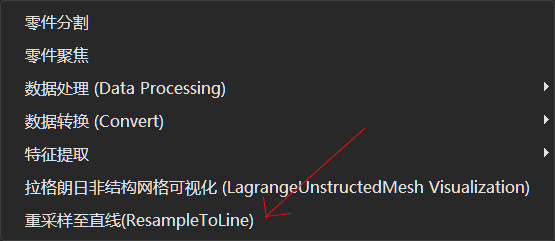

# ResampleToLine filter 使用说明

## 1.Filter概述

ResampleToLine是一种重采样过滤器，用于将网格的点重采样至一条直线上。

输入：无结构网格

输出：包含点属性线段

## 2.调用方式

在算法处理菜单下，使用ResampleToLine选项，在弹出窗口中设置线段两个端点的坐标、重采样的数量。

### 按钮位置




### 数据描述

**point1** 此属性控制第一个端点的坐标

**point2** 此属性控制第二个端点的坐标

**采样数量** 此属性控制线条的采样点数量

**指定容差** 此属性控制采样点与采样单元的最近距离，0为自动容差

**X\Y\Z轴** 以包围盒中心为基准设置该轴方向的端点，在平面模型中使用

**执行**点击后生成一条含数据的线段

## 3.使用示例

测试示例位置

```powershell
/Examples/Filter/TestResampleToline.cpp
```

## 4.注意事项

对于每个采样点的值与paraview有可接受范围内的误差，是由于浮点数精度与采样方式之间的共同作用导致的结果。
