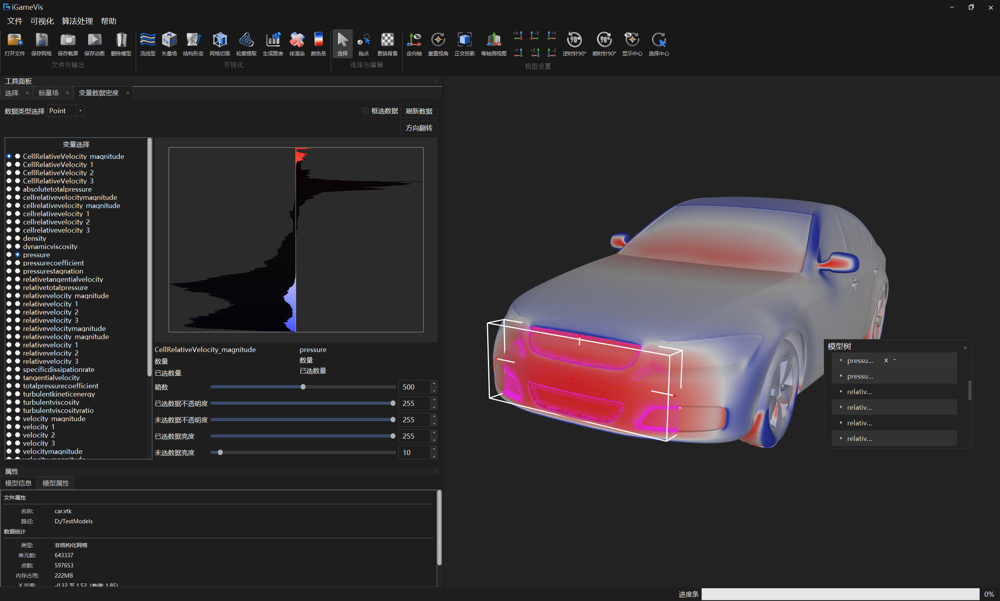
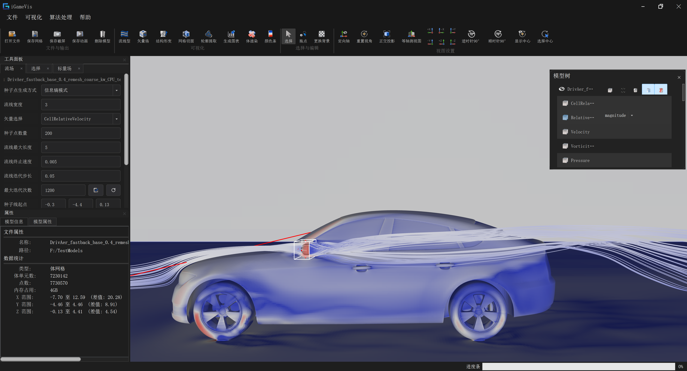
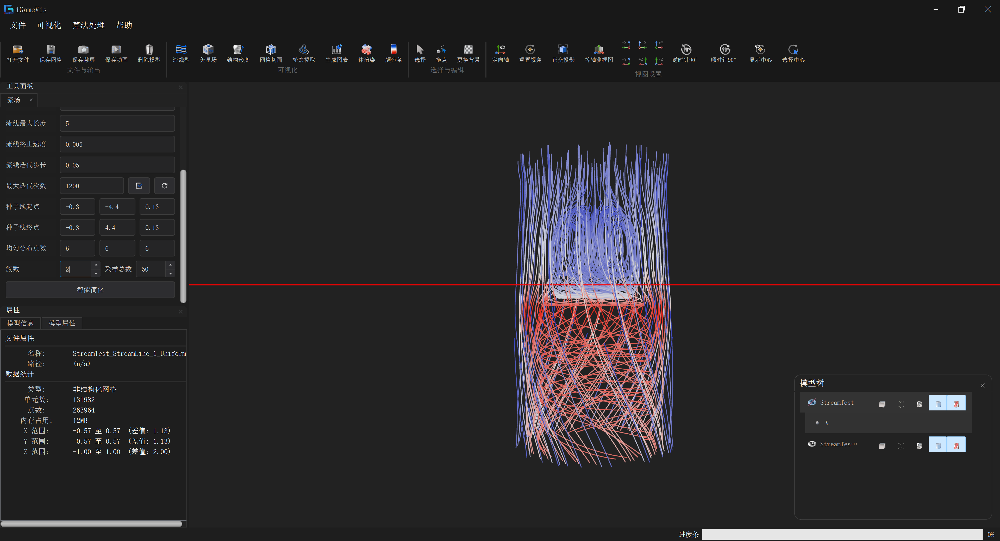
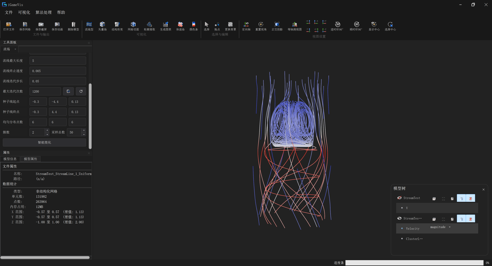
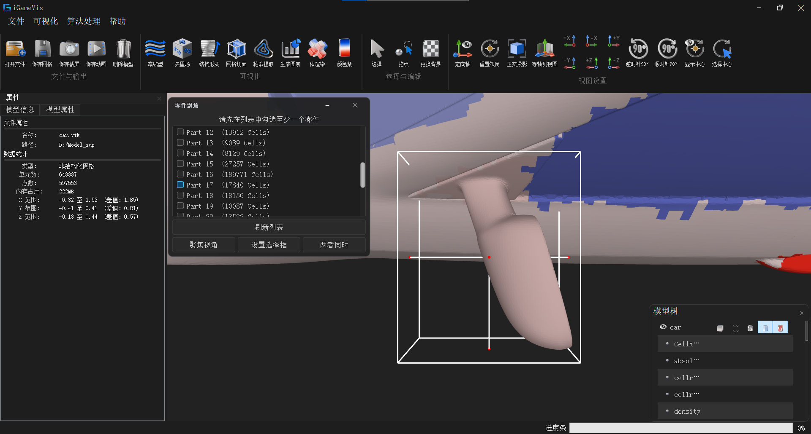

# 指标 10.1：面向 CAE 仿真数据的智能可视分析

## 指标构成

面向 CAE 仿真多维物理场数据，提供由用户交互驱动、由数据特征引导的智能可视分析能力，共含四个子功能：

| # | 子功能 | 状态 |
|---|--------|------|
| 1 | 选点驱动的局部区域图表分析：选择一个点，根据当前属性自动确定 bounding box，对局部区域做图表分析 | ✅ 已实现 |
| 2 | 基于信息熵的区域流线种子点自动计算 | ✅ 已实现 |
| 3 | 智能流线筛选 | ✅ 已实现 |
| 4 | 基于语义分割的 table 属性 | ✅ 已实现 |

> 本文档记录已完成的子功能 **1**、**2**、**3**、**4**。

---

## 子功能 1：选点驱动的局部区域图表分析

### 功能说明

用户在 3D 模型上选择一个点（或单元 / 框选区域），系统按当前属性自动计算该选择的 bounding box，将分析范围收缩到该局部区域，并在此区域上生成图表（探针线 / 径向图、并行坐标、变量相关性、变量密度），辅助发现局部区域内的变量关联与分布规律。

流程：**选点 / 框选 → 自动求 bounding box → 局部区域图表分析**。

### 源码路径

| 路径 | 类 / API | 说明 |
|------|----------|------|
| `Qt/src/IQWidgets/igQtDataChangeWidget.*` | `igQtDataChangeWidget` | 局部区域图表分析主面板（选区、径向图、图表绘制） |
| `iGameCore/Filters/PlotLine/iGameGeneratePlotLineDataFilter.*` | `GeneratePlotLineDataFilter` | 探针线 / 区域数据生成 |
| `iGameCore/Filters/ParallelCoordinates/iGameGenerateParallelCoordinatesData.*` | `GenerateParallelCoordinatesData` | 并行坐标数据生成 |
| `iGameCore/Filters/VariableCorrelation/iGameGenerateVariableCorrelationDataFilter.*` | `GenerateVariableCorrelationDataFilter` | 变量相关性矩阵 |
| `iGameCore/Filters/VariableDensity/iGameGenerateVariableDensityDataFilter.*` | `GenerateVariableDensityDataFilter` | 变量密度分布 |
| `iGameCore/Rendering/Core/Interactor/iGameBoxStyle.*` | `BoxStyle` | 框选盒交互，提供 bounding box 极值点 |

### 关键实现

1. **选择 → bounding box**：从选区（`SelectBox` 的 `BoxStyle`）取极值点，构造包围盒：

   ```cpp
   auto boxStyle = DynamicCast<iGame::BoxStyle>(interactor->GetSpecialInteractor("SelectBox"));
   auto minMaxP  = boxStyle->GetBox()->GetExtremePoint();
   auto boundingBox = BoundingBox(minMaxP.first, minMaxP.second);
   SetRadialPoint(boundingBox);   // 将分析范围绑定到该局部区域
   ```

   未显式框选时，退化为整模型包围盒 `m_Mesh->GetBoundingBox()`。

2. **局部区域图表**：在选定区域上按属性生成 `PlotLineData`，并根据变量的色相 / 饱和度生成图层：

   ```cpp
   auto Data = PlotLineData::New(attrs, dataType, MIN_H, MAX_H, MIN_S, MAX_S);
   ```

3. **选区联动**：选区变化通过 `SelectionCallbackEvent(itemType, ids, ope)` 回调，实时刷新被选中变量的图像（`GenerateChoosedVariableImage`）。

### 调用方式

对应示例 `Examples/Filter/VisualizationData/TestPlotLineData.cpp`：

```cpp
auto dataObj = iGame::FileIO::ReadFile("./Models/Tet_Plane.vtk");
auto attrs   = dataObj->GetAttributeSet();

auto filter = iGame::GeneratePlotLineDataFilter::New();
filter->SetInput(dataObj);
// 分析范围：显式框选时用选区包围盒，否则退化为整模型包围盒
filter->SetBoundingBox(dataObj->GetBoundingBox());
filter->Execute();
auto plotData = filter->GetOutput();
```

并行坐标 / 变量相关性 / 变量密度同为 `Filter::New() → SetInput() → Execute() → GetOutput()` 模式，分别见
`TestParallelCoordinatesData.cpp` / `TestVariableCorrelationData.cpp` / `TestVariableDensityData.cpp`。

### GUI

| 入口 | 说明 |
|------|------|
| 菜单「可视化」→ `action_DataChange` | 打开左侧「数据变化」面板 |
| `dockWidget_DataChangeField` / `igQtDataChangeWidget` | 选点 / 框选 → 局部区域径向图 / 探针线图表 |
| 菜单「可视化」→ `action_ParallelCoordinates` / `dockWidget_ParallelCoordinatesField` | 并行坐标 |
| 菜单「可视化」→ `action_VariableCorrelation` / `dockWidget_VariableCorrelationField` | 变量相关性 |
| 菜单「可视化」→ `action_VariableDensity` / `dockWidget_VariableDensityField` | 变量密度 |



### 测试用例

| Target | 源文件 | 默认数据 |
|--------|--------|----------|
| `testPlotLineData` | `Examples/Filter/VisualizationData/TestPlotLineData.cpp` | `./Models/Tet_Plane.vtk` |
| `testParallelCoordinatesData` | `Examples/Filter/VisualizationData/TestParallelCoordinatesData.cpp` | `./Models/Tet_Plane.vtk` |
| `testVariableCorrelationData` | `Examples/Filter/VisualizationData/TestVariableCorrelationData.cpp` | `./Models/Tet_Plane.vtk` |
| `testVariableDensityData` | `Examples/Filter/VisualizationData/TestVariableDensityData.cpp` | `./Models/Tet_Plane.vtk` |

---

## 子功能 2：基于信息熵的区域流线种子点自动计算

### 功能说明

对区域内的矢量场自动计算流线种子点：将区域划分为均匀盒格，用**方向信息熵**度量每个盒子内流场方向的复杂程度，优先在熵最高（流动方向最杂乱、结构最丰富）的盒子里布种，从而把有限的种子点集中到最值得观察的区域，避免均匀撒点造成的浪费与遗漏。

### 源码路径

| 路径 | 类 / 函数 | 说明 |
|------|-----------|------|
| `iGameCore/Filters/StreamView/iGameStreamTracer.*` | `StreamTracer::getEntropySeeding` | 信息熵种子点计算（核心） |
| `iGameCore/Filters/StreamView/iGameStreamTracer.*` | `StreamTracer::getModelSelect` / `getAllSubBlockCenters` / `computeSubBlockCenters` | 从选区求焦点 bounding box 并划分子块中心 |
| `iGameCore/Core/Common/iGamePointFinder.h` | `PointFinder`（`GetNumberOfBoxes` / `GetPointsInBox`） | 均匀盒格空间划分 |
| `Qt/src/IQWidgets/igQtStreamTracerWidget.cpp` | `generateStreamline` | GUI 触发种子生成与流线计算 |

### 算法要点

`getEntropySeeding(vectorName, topPercent = 0.1f, ptsPerExtrema = 2)`：

1. **盒格划分**：由 `PointFinder` 将点集划分为 `GetNumberOfBoxes()` 个空间盒子，`GetPointsInBox(i)` 给出盒内点集。
2. **方向熵计算**（并行，逐盒）：对盒内每个点的矢量做方向分箱——采用 Lambert 圆柱等面积投影，方位角 `φ` 24 箱、极角 `cosθ` 15 箱，共 360 个等面积方向箱；统计各箱概率 `p`，计算香农熵 `H = -Σ p·ln(p)`。
3. **区域筛选**：按熵降序排序，取熵最高的前 `topPercent` 个盒子。
4. **极值布种**（并行）：在每个入选盒子内，按矢量模长排序，取 `ptsPerExtrema` 个最小模长点与最大模长点作为种子（覆盖低速滞止区与高速区）。

计算过程使用 `ThreadPool::parallelFor` 并行化。

### 调用方式

对应示例 `Examples/Filter/Vector/TestStreamline.cpp`：

```cpp
auto dataObj = iGame::FileIO::ReadFile("./Models/Driver/driver-1.vtk");

auto tracer = iGame::StreamTracer::New();
tracer->initStreamTracer(dataObj);      // 绑定模型 / 网格
tracer->AddPtFinder(pointFinder);       // 提供盒格划分
// 信息熵种子点：熵最高 2.5% 的盒子、每盒 8 个极值点
auto seeds = tracer->getEntropySeeding(vectorName, 0.025f, 8);

// 结合均匀子块中心（可选），再计算流线
tracer->SetInput(seeds, vectorName, lengthOfStreamLine, lengthOfStep, terminalSpeed, maxSteps);
tracer->Execute();
auto streamlines = tracer->GetOutput();
```

### GUI

| 入口 | 说明 |
|------|------|
| 菜单 流线型 / `action_FlowField` | 打开左侧「流场」流线面板 |
| `dockWidget_FlowField` / `igQtStreamTracerWidget` | 种子点生成方式下拉框选「信息熵模式」（`control == 6`） |
| 「选择」面板 → 启用选择盒 | 框选关注区域，使熵排序限定在选区内（可选） |

面板中种子模式 `control == 6` 即"信息熵种子"：先调用 `getEntropySeeding` 得到高熵区种子，再叠加均匀子块中心 `computeSubBlockCenters`，随后生成流线。

区域来源支持"选区自动包围盒"：`getModelSelect` 依据选中的点 / 单元自动求 bounding box，再在焦点区域内划分子块中心作为布种范围。



> 图中「种子点生成方式」选择「信息熵模式」，矢量选择 `CellRelativeVelocity`；视图中的小方框为选择盒，用于把熵排序限定在关注区域内。

### 测试用例

| Target | 源文件 | 默认数据 |
|--------|--------|----------|
| `testStreamline` | `Examples/Filter/Vector/TestStreamline.cpp` | `./Models/Driver/DrivAer_fastback_base_0.4_remesh_coarse_kw_CPU_test_P_V.cgns` |

---

## 子功能 3：智能流线筛选

### 功能说明

一次布种往往生成成百上千条流线，直接显示会互相遮挡、难以观察。智能流线筛选按**形状特征**对流线聚类，从每一类中挑选代表流线，在大幅减少数量的同时保留流场的结构多样性——既去掉大量近似冗余的流线，又不丢失有代表性的流动模式。筛选结果按所属类别（`ClusterLabel`）着色，便于区分不同流动模式。

### 源码路径

| 路径 | 类 / 函数 | 说明 |
|------|-----------|------|
| `iGameCore/Filters/StreamView/iGameStreamlineSimplifier.*` | `StreamlineSimplifier` | 流线筛选（核心） |
| `Qt/src/IQWidgets/igQtStreamTracerWidget.cpp` | `igQtStreamTracerWidget::Simplifier` | GUI 触发筛选、缓存原始流线、结果着色 |

### 算法流程

`StreamlineSimplifier::Execute()` 分为五步：

1. **流线重建 `ExtractStreamlines`**：依据 `StreamlineId`（cell 属性）与 `Velocity`（point 属性）把 `IG_LINE` 单元还原成一条条流线；剔除点数 `< 3` 的，并按弧长过滤（短于弧长中位数 10% 的直接丢弃）。
2. **曲率直方图 `ComputeHistograms`**：沿流线计算相邻方向向量夹角作为离散曲率，落到 `CurvBins`（默认 40）个区间，得到归一化直方图及其 CDF。
3. **距离矩阵 `BuildDistanceMatrix`**：为每条流线提取 5 维形状特征（弯曲比 bendRatio、最大转角 maxTurn、Top-K 平均转角、中段平均转角、弯曲段占比），归一化后加权 L1 距离（权重 `0.10/0.35/0.25/0.20/0.10`）；再叠加曲率 CDF 距离，合成 `0.95·特征距离 + 0.05·曲率距离`。
4. **层次聚类 `ClusterAverage`**：平均连接（average-linkage）凝聚聚类，合并到 `NumClusters` 个类别。
5. **代表采样 `SampleRepresentatives`**：按 `TotalTarget` 在各类间按配额分配（小类全选、余量补给大类），类内按等间隔（linspace）取代表流线。

`BuildOutputMesh` 重建输出网格，并写入 `Velocity` 与 `ClusterLabel` 属性用于着色。

### 参数

| Setter | 含义 | 默认 |
|--------|------|------|
| `SetCurvBins(int)` | 曲率直方图分箱数 | 40 |
| `SetNumClusters(int)` | 聚类目标类别数 | 20 |
| `SetTotalTarget(int)` | 筛选后保留的流线总数 | 50 |

### 调用方式

```cpp
auto simp = iGame::StreamlineSimplifier::New();
simp->SetInput(streamlineMesh);   // 输入：含 StreamlineId / Velocity 的流线网格
simp->SetCurvBins(40);
simp->SetNumClusters(clusterCount);
simp->SetTotalTarget(keepCount);
if (simp->Execute()) {
    auto simplified = simp->GetOutput();   // 输出：筛选后的代表流线，带 ClusterLabel
}
```

### GUI

| 入口 | 说明 |
|------|------|
| 模型树 → 选中流线对象（名称含 `_StreamLine`） | 指定筛选目标 |
| `dockWidget_FlowField` → `簇数` / `采样总数` | 聚类类别数 / 保留流线总数 |
| `dockWidget_FlowField` → **智能简化** 按钮 | 触发 `Simplifier()` |

首次筛选会缓存原始流线快照，后续可反复调参而不丢失原始数据；结果按 `ClusterLabel` 云图着色。每次生成都会产出独立的流线对象（命名为 `<模型名>_StreamLine_<序号>_<模式>`），可分别对不同流线对象施加不同筛选参数，互不影响。

**筛选前**：一次布种生成的全部流线（131982 个 line 单元），互相遮挡难以观察。



**筛选后**：簇数 2、采样总数 50，保留的代表流线按 `ClusterLabel` 着色，可清晰区分两类流动模式（中心涡旋 / 外围绕流）。



### 测试用例

| Target | 源文件 | 默认数据 | 说明 |
|--------|--------|----------|------|
| `testStreamline` | `Examples/Filter/Vector/TestStreamline.cpp` | `./Models/StreamTest.vtk` | 先生成流线，再对输出调用 `StreamlineSimplifier` |

> 筛选功能当前无独立示例 Target；GUI 路径见上表，代码路径见「调用方式」。

---

## 子功能 4：基于语义分割的 table 属性

### 功能说明

对当前 CAE 网格执行 P3SAM 零件语义分割，取得分割网格中逐单元的 `part_id`，再将低分辨率分割结果映射回原始高分辨率网格。映射结果以 `IG_BLOCK_MAPPING` 类型、`IG_CELL` 挂载位置写入当前原始 `DataObject` 的 `AttributeSet`，成为可由后续界面和算法访问的单元属性。查找数据面板随后动态读取点 / 单元属性，生成 table 列，并支持按 `part_id`、其他物理场属性和当前选区查询。

流程：**当前模型 → 三角化 / 简化 → P3SAM 分割 → 读取 `part_id` → 映射回原始单元 → 写入 `AttributeSet` → table 查询与零件联动**。

这里的 `part_id` 是分割区域 / 零件的整数标识，不包含“螺栓”“叶片”等人类可读类别名称；语义服务若要提供类别名称，还需另行返回并挂载 `class_id` / `class_name` 一类属性。

### 源码路径

| 路径 | 类 / API | 说明 |
|------|----------|------|
| `iGameCore/Core/Common/P3SAM/iGameP3SAMSegmenter.*` | `P3SAMSegmenter` | 三角化、简化、请求分割、解析 VTK、映射回原始网格的完整流程 |
| `iGameCore/Core/Common/P3SAM/iGameP3SAMClient.*` | `P3SAMClient` | 通过 TCP 发送 OBJ 与后处理标志，接收带分割属性的 VTK |
| `iGameCore/Core/Common/iGameBlockMapping.*` | `BlockMapping` | 从分割网格读取 `part_id`，按空间位置映射到原始 Surface / Unstructured / Volume Mesh |
| `iGameCore/Core/DataModel/iGameDataObject.*` | `SetBlockMapping` / `GetBlockMapping` / `HasBlockMapping` | 将映射数组作为 `IG_BLOCK_MAPPING + IG_CELL` 属性写入并读取当前 `AttributeSet` |
| `Qt/src/IQWidgets/igQtSearchInfoWidget.*` | `igQtSearchInfoWidget` | 动态生成 table 属性列、数值查询、选区 / 零件过滤和分页 |
| `Qt/src/IQWidgets/igQtPartFocusWidget.*` | `igQtPartFocusWidget` | 枚举 `part_id`、统计各零件单元数、选择零件并联动 table / 相机 / 选择盒 |
| `Qt/src/IQCore/igQtMainWindow.cpp` | “零件分割”“零件分割(自文件)”“零件聚焦” | GUI 入口与各组件之间的信号连接 |

### 算法与数据流程

1. **模型预处理**：`P3SAMSegmenter::Execute()` 将输入转换为可绘制表面并三角化，再按 `m_simplificationRatio` 简化网格，导出为 OBJ，以降低网络传输与服务端推理负载。
2. **语义分割**：`P3SAMClient` 向配置的 P3SAM 服务发送 `[post_process][obj_size][obj_data]`，接收 VTK 分割结果。返回网格必须包含名称精确为 `part_id` 的逐单元整数属性。
3. **低分辨率结果回映射**：`BlockMapping::GetPartId` 取得分割网格的 `part_id`；系统以分割单元质心和对应 ID 构造体素查找网格，再查询原始网格每个单元的质心，将最近分割区域的 ID 写入新的 `IntArray`。质心收集、体素赋值和原始单元查询均使用 `ThreadPool::parallelFor`。
4. **写回原始属性集**：映射数组命名为 `part_id` 后执行：

   ```cpp
   resultArray->SetName("part_id");
   original->SetBlockMapping(resultArray);
   ```

   `SetBlockMapping` 最终调用：

   ```cpp
   m_Attributes->AddAttribute(IG_BLOCK_MAPPING, IG_CELL, resultArray);
   ```

   因而修改的是当前原始模型自身的 `AttributeSet`，不是只保存在临时简化网格或 `P3SAMSegmenter` 内部；重复分割时会删除旧的 BlockMapping 属性后写入新结果。
5. **table 属性生成**：`igQtSearchInfoWidget::refreshProperties` 遍历 `AttributeSet`，按 `IG_POINT` / `IG_CELL` 筛选属性；标量生成一列，向量 / 张量同时生成模长列和各分量列。检测到 `IG_BLOCK_MAPPING`、`part_id` 或 `block_id` 时，单元模式会优先选中该属性。
6. **查询与零件联动**：table 支持 `=`、`>`、`<` 数值条件；有 3D 选区时只列出选中点 / 单元。零件聚焦面板按 `part_id` 汇总单元数，勾选零件后通过 `setSelectedPartIds` 将候选行限制为这些零件对应的单元，再继续应用属性条件。
7. **大数据分页**：过滤结果只保存单元 / 点 ID，显示阶段按 100、500、1000 或 5000 条/页读取属性值，并支持上一页、下一页和指定页跳转，避免一次创建全部 `QTableWidgetItem`。

### 调用方式

在线 P3SAM 分割：

```cpp
auto segmenter = iGame::P3SAMSegmenter::New();
segmenter->SetServerHost("127.0.0.1");
segmenter->SetServerPort(8765);
segmenter->SetInput(dataObj);               // 当前原始模型
segmenter->SetSimplificationRatio(0.1f);
segmenter->SetPostProcess(false);
segmenter->SetTimeout(300000);

if (segmenter->Execute()) {
    auto* partIds = dataObj->GetBlockMapping();
    auto* attrs   = dataObj->GetAttributeSet(); // 已包含 IG_CELL 的 part_id
}
```

已有分割 VTK 时，可读取 `UnstructuredMesh` 后直接回映射：

```cpp
auto segmented = iGame::DynamicCast<iGame::UnstructuredMesh>(
    iGame::FileIO::ReadFile("segment_result.vtk"));
auto partIds = iGame::BlockMapping::GetMappingBlockCellsArray(originalMesh, segmented);
if (partIds) {
    partIds->SetName("part_id");
    dataObj->SetBlockMapping(partIds);
}
```

### GUI

| 入口 | 说明 |
|------|------|
| 打开文件| 打开car.vtk |
| 菜单「算法处理」→「零件分割(自文件)」 | 读取已有的带 `part_id` VTK，将结果映射到当前模型（使用output_p600000_pr4000_t0.95_s42_npp.vtk） |
| 菜单「算法处理」→「零件聚焦」 | 列出 `Part <id> (<N> Cells)`；勾选零件后聚焦相机 / 设置选择盒，并联动 table |
| 菜单项「查找数据」/ `action_SearchInfo` | 在点 / 单元 table 中查看全部属性；有分割结果时默认进入单元模式并优先选择 `part_id` |



### 测试与验证数据

| 项目 | 入口 / 输入 | 说明 |
|------|-------------|------|
| 离线映射验证 | 「零件分割(自文件)」 | 选择用户提供的 `UnstructuredMesh` VTK；其 `CELL_DATA` 必须包含名称精确为 `part_id` 的属性 |
| table 验证 | 「查找数据」 | 切换到单元数据，确认 `part_id` 出现在属性列中，并使用 `=` 查询指定零件 ID |

> 当前没有独立的命令行示例 Target，也没有随仓库提交的分割结果 VTK；离线验证需自行提供包含 `part_id` 的 VTK，在线验证需另行启动 P3SAM 服务端。

---

## 相关示例汇总

| 示例 Target | 源文件 | 默认数据 | 说明 | 条件 |
|-------------|--------|----------|------|------|
| `testPlotLineData` | `Examples/Filter/VisualizationData/TestPlotLineData.cpp` | `./Models/Tet_Plane.vtk` | 探针线 / 局部区域数据 | 默认 |
| `testParallelCoordinatesData` | `Examples/Filter/VisualizationData/TestParallelCoordinatesData.cpp` | `./Models/Tet_Plane.vtk` | 并行坐标 | 默认 |
| `testVariableCorrelationData` | `Examples/Filter/VisualizationData/TestVariableCorrelationData.cpp` | `./Models/Tet_Plane.vtk` | 变量相关性 | 默认 |
| `testVariableDensityData` | `Examples/Filter/VisualizationData/TestVariableDensityData.cpp` | `./Models/Tet_Plane.vtk` | 变量密度 | 默认 |
| `testStreamline` | `Examples/Filter/Vector/TestStreamline.cpp` | `DrivAer_fastback_base_0.4_remesh_coarse_kw_CPU_test_P_V.cgns` | 流线积分 / 熵种子 / 筛选输入 | 默认 |
