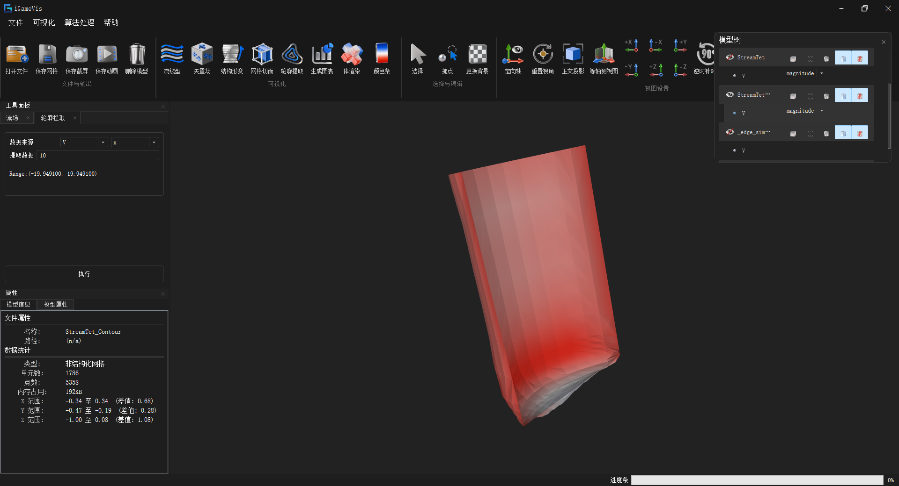
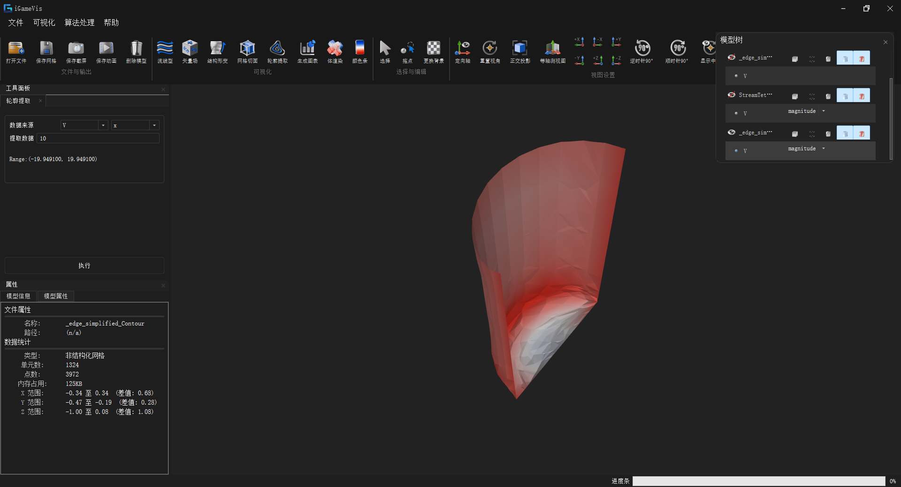

# 指标 10.2：仿真数据关键特征提取

## 指标构成

面向 CAE 仿真物理场数据，提供关键特征场提取、基于神经网络的涡结构检测与人工标注对比评估，以及关键区域交互与关键事件时域演化支撑。技术指标要求：**仿真数据关键特征提取精度（Precision / Recall）≥ 90%**。

| # | 子功能 | 状态 |
|---|--------|------|
| 1 | 经典物理特征提取：梯度 / 曲率 / Laplacian / 涡量 / 等值线与等值面 | ✅ 已实现 |
| 2 | 基于神经网络的涡提取，与人工标注对比，计算准确率 / 精确率 / 召回率（精度 ≥ 90%） | ✅ 已实现（评估逻辑）；GUI 指标浮层待恢复 |
| 3 | 支持针对不同类型数据，构建相应的程序接口，实现不同精度要求下的特征提取 | ✅ 已实现（等值线 / 等值面 × 面网格 / 体网格 × 原始 / 简化网格） |
| 4 | 关键事件的时域演化可视化；选中区域单独作用形变场 | ⏳ 部分实现（阶段一：表面绘制颜色 / 不透明度映射 ✅；时序 / 形变见 11.3；区域限定形变待增强） |

> 本文档记录子功能 **1**、**2**、**3** 的完整实现，以及 **4** 与现有交互 / 可视化模块的衔接说明。
> 与 **10.1** 的区别：10.1 侧重**分析数据生成**（局部图表、熵种子、流线筛选）；10.2 侧重**特征场提取与涡结构检测评估**。
> 与 **11.3** 的区别：11.3 提供**时序切换、结构形变、动画导出**通用能力；10.2 的关键事件时域演化依赖这些能力展示检测结果。

---

## 子功能 1：经典物理特征提取（其他关键特征）

### 功能说明

从当前选中的物理属性（标量 / 矢量）出发，在网格上提取经典微分几何与流体力学特征，供后续涡检测、选区分析等使用。按**输出形态**分为两类：

**A. 特征标量场**：结果写入原模型的 `AttributeSet`，可直接以云图显示。

| 特征 | 输出属性名 | 说明 |
|------|------------|------|
| 梯度 | `gradient` | 标量 / 矢量场空间梯度 |
| 曲率 | `curvatures` | 曲面曲率（余切型离散） |
| Laplacian | `laplacians` | 离散 Laplacian |
| 涡量 | `vorticities` | 经典涡量 \(\omega = \nabla \times v\)（非神经网络） |

**B. 特征几何**：结果是一个**新的网格对象**，作为独立模型加入模型树，而不是追加属性。

| 特征 | 输出 | 说明 |
|------|------|------|
| 等值线 / 等值面 | 新的 `UnstructuredMesh`，命名为 `<原名>_Contour` | 由标量场的指定等值数值抽取轮廓，支持一次传入多个等值数值 |

等值线与等值面是**同一个算法**（`ContourFilter`）按输入单元维度自动分派的两种结果：

| 输入单元 | 输出单元 | 结果 |
|----------|----------|------|
| 2D 单元（三角形 / 四边形 / 多边形及其二次单元） | `IG_LINE` | **等值线**（marching squares 型 case 表） |
| 3D 单元（四面体 / 六面体 / 棱柱 / 棱锥 / 多面体及其二次单元） | `IG_TRIANGLE` | **等值面**（marching tetrahedra 型 case 表） |

多边形先扇形三角化后按三角形处理，多面体先 `clipCelltoTetra()` 拆成四面体后按四面体处理；混合网格的输出会在同一个 `UnstructuredMesh` 中同时包含线段与三角面。原模型的点 / 单元属性会按插值边与来源单元重映射到轮廓结果上，因此轮廓对象自身也能着色显示。

### 适用网格类型（重要）

| 特征 | 要求的输入 | 体网格（含 3D 单元）怎么办 |
|------|------------|----------------------------|
| 梯度 / 曲率 / Laplacian | **表面网格**（全 2D 单元） | 先做一次**表面提取**，再在提取出的面网格上计算 |
| 涡量 | **3D 体单元** | 直接在体网格上计算；纯面网格反而不支持 |
| 等值线 / 等值面 | 面网格、体网格、非结构网格、结构化网格**均可** | 直接算：2D 单元出等值线，3D 单元出等值面，无需表面提取 |

**表面网格**（`IG_SURFACE_MESH`，或全部由 2D 单元构成的 `IG_UNSTRUCTURED_MESH`）可以直接执行梯度 / 曲率 / Laplacian。

**体网格**（`IG_VOLUME_MESH`，或含四面体、六面体等 3D 单元的 `IG_UNSTRUCTURED_MESH`）不能直接算这三项，必须先走一步：

> 菜单「Filters」→ **数据处理 (Data Processing)** → **表面提取 (Surface Extraction)**

该操作把模型的边界面提取成一个独立的面网格对象，命名为 `<原名>_surface`，并加入模型树。在模型树中选中这个 `_surface` 对象后，再执行梯度 / 曲率 / Laplacian 即可。

注意两点：

- **渲染时看到的"抽壳"不等于表面网格。** 抽壳结果存放在 `DrawObject` 的 `m_RenderableMesh.SurfaceMesh` 中，只供渲染器使用；数据对象本身仍是体网格，filter 读到的是它。必须显式执行一次表面提取，把面网格作为独立对象加入模型树。
- **提取后算的是边界面上的量。** 面网格上的梯度是沿曲面的切向梯度，与体内标量场的三维梯度不是同一个量，解读结果时需要注意。

若在体网格上直接执行这三项，会弹出 `Not Surface Mesh !` —— 这是 filter 的默认提示文案，含义即"当前输入不是面网格"（体网格分支尚未接通，见 `iGameGradientFilter.cpp` 中 `ComputeGradientWithVolumeMesh` 的调用处）。

### 源码路径

| 路径 | 类 / API | 说明 |
|------|----------|------|
| `iGameCore/Filters/FeatureExtraction/iGameGradientFilter.*` | `GradientFilter` | 梯度 |
| `iGameCore/Filters/FeatureExtraction/iGameCurvatureFilter.*` | `CurvatureFilter` | 曲率 |
| `iGameCore/Filters/FeatureExtraction/iGameLaplacianFilter.*` | `LaplacianFilter` | Laplacian |
| `iGameCore/Filters/FeatureExtraction/iGameVortexFilter.*` | `VortexFilter` | 经典涡量 |
| `iGameCore/Filters/Contour/iGameContourFilter.*` | `ContourFilter` | 等值线 / 等值面（按单元维度分派） |
| `iGameCore/Filters/Contour/iGameCellContour.h` | `CellContour::Contour` | 各类单元的 case 表与边插值 |
| `Qt/src/IQWidgets/igQtContourExtractWidget.*` | `igQtContourExtractWidget` | 轮廓提取 Dock |
| `iGameCore/Filters/iGameFilterIncludes.h` | — | 统一 include |

### 调用方式

对应示例 `Examples/Filter/FeatureExtraction/GradientExtraction.cpp`：

```cpp
auto dataObj = iGame::FileIO::ReadFile("./Models/pipedcylinder2d_gt.vtk");
auto drawObj = iGame::DynamicCast<iGame::DrawObject>(dataObj);

auto filter = iGame::GradientFilter::New();  // 或 CurvatureFilter / LaplacianFilter / VortexFilter
filter->SetInput(drawObj);
filter->SetAttributeByIndex(attrIndex);      // 或 SetAttributeByName(name)
filter->Execute();

int newIndex = drawObj->GetAttributeSet()->GetNumberOfAttributes() - 1;
drawObj->ViewCloudPicture(scene, newIndex);
```

统一模式：`Filter::New()` → `SetInput()` →（可选）`SetAttributeByIndex/Name` → `Execute()`，结果追加到 `AttributeSet`。

**等值线 / 等值面**走的是另一套接口——按数值而非属性索引驱动，且产出的是新网格。对应示例 `Examples/Filter/TestContourLine.cpp`：

```cpp
auto obj = iGame::FileIO::ReadFile("./Models/Tet_Plane.vtk");

auto pointAttributes = obj->GetAttributeSet()->GetAllPointAttributes();  // 仅支持点标量
auto& attr = pointAttributes->GetElement(index);
auto array = attr.pointer;
auto range = attr.GetDataRange();
int dimension = 0;                      // 多分量属性取哪个分量

// 支持一次传入多个等值数值，结果合并在同一个输出网格里
std::vector<double> values;
values.push_back(range->GetValue(dimension * 2 + 2) * 2 / 3 + range->GetValue(dimension * 2 + 3) / 3);
values.push_back(range->GetValue(dimension * 2 + 2) / 3 + range->GetValue(dimension * 2 + 3) * 2 / 3);

auto filter = iGame::ContourFilter::New();
filter->SetInput(obj);
filter->SetIsoScalarData(array, values, dimension);   // 单个数值用 SetIsoScalarData(array, value, dimension)
filter->Execute();

auto res = filter->GetContourMesh();    // 或 GetOutput()，类型为 UnstructuredMesh
scene->AddModel(res);
auto draw = iGame::DynamicCast<iGame::DrawObject>(res);
draw->SetViewStyle(IG_SURFACE | IG_WIREFRAME);        // 等值线只有线单元，必须带 IG_WIREFRAME 才可见
draw->ViewCloudPicture(scene, index, dimension);
```


- **只支持点标量**：GUI 的属性下拉框来自 `GetAllPointAttributes()`，单元属性不在候选中。
- **显示样式**：`DrawObject` 默认 view style 只有 `IG_SURFACE`，而等值线的输出全是线单元、一个三角形都没有；不加 `IG_WIREFRAME` 会出现"点数单元数都对但画面为空"。GUI 侧已按输出单元维度自动设置。
- **等值数值落在数据范围外**时不与任何单元相交，输出为空，GUI 会给出提示而不是产生空模型。

### GUI

| 入口 | 说明 | 输入要求 |
|------|------|----------|
| 菜单「算法处理」→ 数据处理 → 表面提取 (Surface Extraction) | 体网格 → `<原名>_surface` 面网格对象 | 体网格上做下面前三项的**前置步骤** |
| 菜单「算法处理」→ 特征提取 → 计算梯度 (ComputeGradient) | `GradientFilter` | 面网格 |
| 菜单「算法处理」→ 特征提取 → 计算 Laplacian | `LaplacianFilter` | 面网格 |
| 菜单「算法处理」→ 特征提取 → 计算曲率 | `CurvatureFilter` | 面网格 |
| 菜单「算法处理」→ 特征提取 → 计算涡量 | `VortexFilter` | 3D 体单元 |
| 工具面板 → 轮廓提取（等值线/等值面）/ `action_ContourExtract` | `dockWidget_ContourExtract`：选点标量、选分量、填等值数值 | 任意网格 |
| `dockWidget_ScalarField` / `igQtScalarViewWidget` | 提取结果出现在模型树属性列表中，在此切换云图 | — |

典型操作顺序：

- **面网格**：模型树选中模型 → 选中要处理的属性 → 特征提取 → 计算梯度 / Laplacian / 曲率
- **体网格**：模型树选中模型 → 数据处理 → 表面提取 → 在模型树中选中新出现的 `<原名>_surface` → 选中属性 → 特征提取 → 计算梯度 / Laplacian / 曲率
- **涡量**：不需要表面提取，直接在体网格上选中速度矢量属性后执行
- **等值线 / 等值面**：模型树选中模型 → 打开「轮廓提取」面板 → 选点标量与分量（面板会显示该分量的数值范围）→ 填等值数值 → 执行；结果作为独立模型 `<原名>_Contour` 加入模型树，可单独显示 / 隐藏 / 着色，反复改数值会原地更新同一个结果对象


> 图中为 `pipedcylinder2d` 结构化网格（200×30×200）的涡量 `vorticities` 云图（按 magnitude 着色）；模型树中可见提取结果与原有属性并列，可随时切换显示。

### 测试用例

| Target | 源文件 | 默认数据 |
|--------|--------|----------|
| `testGradientExtraction` | `Examples/Filter/FeatureExtraction/GradientExtraction.cpp` | `./Models/Quad_Bicycle.vtk` |
| `testCurvatureExtraction` | `Examples/Filter/FeatureExtraction/CurvatureExtraction.cpp` | `./Models/Quad_Bicycle.vtk` |
| `testLaplacianExtraction` | `Examples/Filter/FeatureExtraction/LaplacianExtraction.cpp` | `./Models/Quad_Bicycle.vtk` |
| `testVortexExtraction` | `Examples/Filter/FeatureExtraction/VortexExtraction.cpp` | `./Models/pipedcylinder2d_gt.vtk` |
| `testContourLine` | `Examples/Filter/TestContourLine.cpp` | `./Models/Tet_Plane.vtk`（一次取三档等值数值） |
| `testContourExtraction` | `Examples/Filter/TestContourExtraction.cpp` | `./Models/driver_1.vtk` + `./Models/streamTet.vtk` |

---

## 子功能 2：基于神经网络的涡提取与人工标注对比

### 功能说明

对体网格速度场使用 **LibTorch TorchScript** 三维分块 CNN 做涡结构预测，输出点标量 `vortexPredict`。若网格上存在人工标注属性 **`PredictedLabel`**，则逐点与预测结果对比，计算：

| 指标 | 定义 |
|------|------|
| Accuracy（准确率） | \((TP+TN) / (TP+FP+TN+FN)\) |
| Precision（精确率） | \(TP / (TP+FP)\) |
| Recall（召回率） | \(TP / (TP+FN)\) |

**技术指标**：在带标注的仿真数据上，关键特征提取 **Precision / Recall ≥ 90%**（由 `GetPrecision()` / `GetRecall()` 读取；达标与否由评估数据与模型共同决定，代码侧提供完整指标计算）。

阈值阈值：`gt > 0` 为正类，`pred > 0.5` 为正类。

### 源码路径

| 路径 | 类 / 函数 | 说明 |
|------|-----------|------|
| `iGameCore/Filters/FeatureExtraction/iGameVortexDetectionFilter.*` | `VortexDetection` | NN 涡检测核心 |
| 同上 | `EvaluatePredictMetrics` | TP/FP/TN/FN → Accuracy / Precision / Recall |
| 同上 | `GetAccuracy` / `GetPrecision` / `GetRecall` | 指标读取 API |
| `Qt/src/IQCore/igQtMainWindow.cpp` | 菜单「涡旋预测 (PredictVortex)」 | GUI 触发；指标浮层代码已预留（当前注释） |

### 算法要点

1. **输入**：体网格 + 速度矢量属性；非均匀网格可重采样 / 分块（`process_blocks`，`split` 等）。
2. **推理**：加载 TorchScript 模型（默认路径 `./Resources/AI/model_1x64x64x64_1108_cuda.pt`），按 **64³** patch 滑动推理，Hann 窗加权融合。
3. **后处理**：结合 Q 准则辅助场 `ComputePointQ`，KNN 平滑标签 `knn_smooth_labels`。
4. **输出**：点标量 `vortexPredict` 写入 `AttributeSet`。
5. **评估**：若存在属性名 `PredictedLabel`，调用 `EvaluatePredictMetrics`，结果存入 `m_Accuracy` / `m_Precision` / `m_Recall`，并打印到控制台。

### 编译与依赖

```text
-DENABLE_LIBTORCH_MODULE=ON
```

开启后定义 `LibTorch_ENABLE`。需本机 LibTorch 与 CUDA（按模型配置），并将 `.pt` 模型放到 `Resources/AI/`。

### 调用方式

对应示例 `Examples/Filter/FeatureExtraction/VortexDetection.cpp`：

```cpp
auto dataObj = iGame::FileIO::ReadFile("./Models/pipedcylinder2d_gt.vtk");
auto drawObj = iGame::DynamicCast<iGame::DrawObject>(dataObj);
// 人工标注（可选）：AttributeSet 中需有名为 "PredictedLabel" 的点标量

auto filter = iGame::VortexDetection::New();
filter->SetInput(drawObj);
filter->SetAttributeByIndex(velocityAttrIndex);  // 速度场
if (filter->Execute()) {
    double accuracy  = filter->GetAccuracy();   // 无标注时为 -1
    double precision = filter->GetPrecision();
    double recall    = filter->GetRecall();
    // 精度验收示例：precision >= 0.90 && recall >= 0.90

    int newIndex = drawObj->GetAttributeSet()->GetNumberOfAttributes() - 1;
    drawObj->ViewCloudPicture(scene, newIndex);  // 显示 vortexPredict
}
```

### GUI

| 入口 | 说明 |
|------|------|
| 菜单「算法处理」→ 特征提取 → 涡旋预测 (PredictVortex) | 对当前模型当前属性执行 `VortexDetection`，结果挂到模型树 |
| `dockWidget_ScalarField` / `igQtScalarViewWidget` | 切换到 `vortexPredict` 属性查看预测云图 |

> 主窗口中 `vortexMetricsLabel` 与 Precision/Recall 浮层显示逻辑已预留，当前为注释状态；评估数值仍可通过 API / 控制台获取。


> `vortexPredict` 点标量的体渲染显示，可见圆柱绕流尾迹中周期性脱落的涡结构。

### 精度实测

在 `3_pipedcylinder2d_uni_gc.vtk`（120 万点，均匀网格 200×30×200，含 `PredictedLabel` 人工标注）上的实测结果：


| 指标 | 实测值 | 指标要求 | 结论 |
|------|--------|----------|------|
| Accuracy | 0.995763 | — | — |
| **Precision** | **0.93696** | ≥ 0.90 | ✅ 达标 |
| **Recall** | **0.902198** | ≥ 0.90 | ✅ 达标 |

运行环境与耗时（CUDA 推理）：

| 阶段 | 耗时 |
|------|------|
| `process_blocks`（分块预处理） | 2.746 s |
| `predict`（网络推理） | 4.280 s |
| **`VortexDetection::Execute` 总计** | **8.184 s** |

### 测试用例

| Target | 源文件 | 默认数据 | 条件 |
|--------|--------|----------|------|
| `testVortexDetection` | `Examples/Filter/FeatureExtraction/VortexDetection.cpp` | `./Models/pipedcylinder2d_gt.vtk`（含标注） | `ENABLE_LIBTORCH_MODULE=ON` |

> 精度评估需数据中带有人工标注属性 `PredictedLabel`；无标注时仅输出 `vortexPredict` 云图，不计算对比指标。

---

## 子功能 3：面向不同类型数据的特征提取接口（不同精度要求）

### 功能说明

针对不同类型的网格数据构建相应的程序接口，使同一套特征提取能力在**不同精度（网格密度）**的数据上都能正常工作。这里有两条正交的维度：

- **数据类型**：面网格 / 体网格 / 非结构网格 / 结构化网格，由 filter 内部按 `GetDataObjectType()` 自动分派到对应的执行接口，调用方无需区分。
- **网格精度**：原始网格与简化后的网格。平台提供面网格与体网格两套简化接口，简化过程保留属性场，因此简化结果可直接作为特征提取的输入。

以**等值线 / 等值面**为例：面网格上提取得到等值线，体网格上提取得到等值面；同一个等值数值在原始网格与简化网格上分别执行，可得到不同精细程度的轮廓，用于在精度与性能之间取舍。

### 接口分派：数据类型 → 执行接口

`ContourFilter::Execute()` 按数据对象类型分流，四类输入各有对应接口：

| 输入数据类型 | 执行接口 | 内部处理 | 输出 |
|--------------|----------|----------|------|
| `IG_SURFACE_MESH` | `ExecuteWithSurfaceMesh` | `GenerateFromSurfaceMesh` 转成 `UnstructuredMesh` 后统一处理 | **等值线**（`IG_LINE`） |
| `IG_VOLUME_MESH` | `ExecuteWithVolumeMesh` | 普通体网格走 `GenerateFromVolumeMesh`；多面体网格转 `ExecuteWithVolumeMeshWithPolyhedronType` | **等值面**（`IG_TRIANGLE`） |
| `IG_UNSTRUCTURED_MESH` | `ExecuteWithUnstructuredMesh` | 逐单元按维度分派：2D 单元出线段，3D 单元出三角面 | 等值线 / 等值面 / 两者兼有 |
| `IG_STRUCTURED_MESH` | 复用 `ExecuteWithVolumeMesh` | 同体网格 | **等值面** |

### 精度层级：原始网格与简化网格

简化接口分面、体两套，均保留属性场：

| 目标 | 菜单入口（Filters → 数据处理） | 类 | 主要参数 |
|------|--------------------------------|-----|----------|
| 面网格 | 表面网格简化 (Surface Simplification) | `MeshSimplificationFilter` | 简化比例 (0..1)、保留网格边界、检查网格全部标量、几何相似性度量 |
| 面网格 | 快速表面简化 (Fast Surface Simplification) | `MeshSimplificationFilterPro` | 目标简化比例 (0..1)、目标面数、保留网格边界 |
| 体网格 | 四面体边坍缩简化 | `TetraEdgeSimplification` | Reduction (0..1)、Target Tetra Count、Boundary Penalty、Lambda、Preserve Boundary、Use All Point Attributes、Stretch Factor、Max Aspect Ratio |

简化产出的是**新的网格对象**，加入模型树后可直接作为轮廓提取的输入。由于简化过程携带属性（面网格侧的「检查网格全部标量」、体网格侧的 `Use All Point Attributes`），简化网格上仍能选到同名标量并提取轮廓。

### 四种组合

| 组合 | 输入 | 提取结果 | 说明 |
|------|------|----------|------|
| ① 面网格 · 原始 | 表面网格 / 全 2D 单元的非结构网格 | 等值线 | 基准精度，线段最密，贴合原始几何 |
| ② 面网格 · 简化 | 面网格简化的输出 | 等值线 | 线段数随简化比例下降，轮廓形状变粗糙 |
| ③ 体网格 · 原始 | 体网格 / 含 3D 单元的非结构网格 / 结构化网格 | 等值面 | 基准精度，三角面片最密 |
| ④ 体网格 · 简化 | 四面体边坍缩简化的输出 | 等值面 | 面片数下降，等值面细节被抹平 |

轮廓的精细程度由**输入网格的单元密度**直接决定——等值线 / 等值面的顶点全部落在被切单元的**边**上，单元越密、被切的边越多，交点就越密。所以"用不同精度的网格提同一个等值数值"是控制轮廓精度最直接的手段，不需要改动算法参数。

### 调用方式

```cpp
// ① 原始网格上直接提取：面 / 体 / 非结构 / 结构化均可，内部自动分派
auto obj = iGame::FileIO::ReadFile(fileName);
auto contour = iGame::ContourFilter::New();
contour->SetInput(obj);
contour->SetIsoScalarData(array, value, dimension);
contour->Execute();
auto res0 = contour->GetContourMesh();

// ② 先简化再提取（面网格；体网格换成 TetraEdgeSimplification，流程一致）
auto simp = iGame::MeshSimplificationFilterPro::New();
simp->SetInput(obj);
simp->SetTargetReduction(0.5f);      // 或 SetTargetFaceCount(n)
simp->SetPreserveBoundary(true);
simp->Execute();
auto simplified = simp->GetOutput();

auto contour2 = iGame::ContourFilter::New();
contour2->SetInput(simplified);
contour2->SetIsoScalarData(array2, value, dimension);   // array2 取自简化输出
contour2->Execute();
auto res1 = contour2->GetContourMesh();
```

简化后必须**从简化输出重新取属性数组**：简化会重建 `AttributeSet`，不能沿用原模型的 `ArrayObject` 指针（点数已经对不上）。

### GUI

| 步骤 | 入口 |
|------|------|
| 1. 菜单→ 数据处理 → 表面网格简化 / 快速表面简化 / 四面体边坍缩简化 |
| 2. 选中目标模型 | 模型树中选原始模型，或选简化产出的新模型 |
| 3. 提取轮廓 | 工具面板 → 轮廓提取（等值线/等值面）→ 选点属性→填写数值→ 执行 |
| 4. 对比 | 每次提取产出独立模型 `<原名>_Contour`，可同时显示，直观对比不同精度的轮廓 |


> 原始体网格等值面提取

> 网格简化后等值面提取


### 测试用例

| Target | 源文件 | 默认数据 | 说明 |
|--------|--------|----------|------|
| `testContourExtraction` | `Examples/Filter/TestContourExtraction.cpp` | `./Models/driver_1.vtk`（面网格）+ `./Models/streamTet.vtk`（四面体体网格），均需自备 | 同一套接口在两类数据上分派：面网格产出等值线、体网格产出等值面 |

该用例对两个模型各跑一遍：取第 0 个点标量，按数据范围取三档等值数值一次传入，执行后逐单元统计输出的线段数与三角面数，并断言

- 面网格（`driver_1.vtk`）必须产出 `IG_LINE`，否则报 `expected iso-lines but got no line segment`；
- 体网格（`streamTet.vtk`）必须产出 `IG_TRIANGLE`，否则报 `expected iso-surfaces but got no triangle`。

即直接验证 `ContourFilter` 按单元维度自动分派这条核心逻辑。两个轮廓结果最终加入同一场景一起显示；显示时关闭抽壳并设置 `IG_SURFACE | IG_WIREFRAME`，否则纯线单元的等值线不可见。


---

## 子功能 4：关键事件时域演化与选中区域形变

### 功能说明

**目标能力**：

1. **关键事件时域演化可视化**：在多时间步仿真（如 PVD）上，对涡预测 / 涡量等关键特征场做时间轴播放，观察关键结构随时间的演化。
2. **选中区域单独作用形变场**：仅对用户选中的点 / 单元施加位移形变，突出关键区域的结构响应。

### 当前实现与衔接

| 能力 | 现状 | 主要入口 |
|------|------|----------|
| 时序帧切换 / 动画 | ✅ 通用能力已实现 | `DataObject::UpdateAnimation(keyframeIdx)`；PVD 读取；动画 Dock / FFMPEG（见 **11.3**） |
| 关键特征随时间刷新 | ✅ 可对每帧属性切换云图；涡预测可按帧重跑或预计算后播放 | `ViewCloudPicture` + `UpdateAnimation` |
| 标量场 → 颜色 / 不透明度映射（表面绘制） | ✅ 阶段一已实现 | `ScalarsToColors::SetOpacityMappingEnabled` + `TransparencyLink` 透明管线；标量场面板「不透明度映射」开关 |
| 整模结构形变 | ✅ 已实现 | `StressDeformationFilter` + `igQtDeformationWidget`（**11.3**） |
| **仅选中区域作用形变** | ⏳ 待增强 | 选区（Selection 交互层，见 10.3）与 `DeformationData` 尚未绑定「仅偏移选中点」路径 |

### 阶段性实现：标量场到颜色 / 不透明度的映射（阶段一）

作为「关键事件时域演化可视化」的阶段性实现，当前已支持在**表面绘制**下把选中的标量场同时映射为颜色与不透明度（点、线框与体绘制共用同一套映射链路）：

- **颜色映射**：复用 `ScalarsToColors` 色标映射，属性值 → RGB；
- **不透明度映射**：开启后按每个顶点的属性值生成 alpha（当前为线性传递函数 `opacity = 归一化后的属性值`，见 `ColorMap::MapOpacity`），并与对象整体透明度相乘后进入透明渲染管线；
- **渲染路径**：`TransparencyLink.frag` 的 `colorMode==0`（表面 + 光照）与 `colorMode==1`（无光照）均输出 `in_Color.a * objectData.transparent`；`DrawWithTransparency` 在启用不透明度映射时即进入该路径（无需预先调低整体透明度），并经 OIT 逐像素排序保证混合正确；
- **入口**：GUI 为标量场面板（`dockWidget_ScalarField` / `igQtScalarViewWidget`）的「不透明度映射」复选框；API 为 `Scene::SetOpacityMappingEnabled` / `DrawObject::SetOpacityMappingEnabled`（递归作用于子数据对象，可覆盖 PVD 多块帧）；体绘制示例见 `Examples/Rendering/SetVolumeRendering.cpp`。

在关键事件时域演化中的用法：单帧即可用「颜色高亮 + 低值区域半透明」突出关键事件区域；结合 **11.3** 的动画播放能力逐帧切换属性，即可观察关键区域随时间的演化。

**后续阶段规划**（本子功能的实现路线）：

| 阶段 | 内容 | 状态 |
|------|------|------|
| 阶段一 | 标量场 → 颜色 / 不透明度映射（表面绘制） | ✅ 已实现（本节） |
| 阶段二 | 按属性阈值筛选点，分别控制选中 / 未选中点的不透明度（`AttributeOpacityFilter`） | ⏳ 规划中 |
| 阶段三 | 逐帧属性差值（`TimeDifferenceFilter`）作为筛选条件，动画播放时突出变化剧烈区域 | ⏳ 规划中 |

推荐工作流（当前可用）：

```text
加载时序数据 → 特征提取 / 涡预测 → 云图显示关键场
    → 动画面板切换时间步（关键事件时域演化）
    →（可选）形变面板对整模施加位移矢量场
```

选中区域限定形变增强后，预期流程为：

```text
点击 / 框选关键区域 → 仅对该集合写入形变偏移 → 时序播放观察局部响应
```

### 源码路径（跨模块）

| 路径 | 说明 |
|------|------|
| `iGameCore/Core/DataModel/iGameDataObject.*` | `UpdateAnimation` 时序切换 |
| `iGameCore/IO/VTK XML/iGamePVDReader.*` | 时序 PVD |
| `iGameCore/Core/Common/iGameScalarsToColors.*` / `iGameColorMap.*` | 标量 → RGBA 颜色 / 不透明度映射 |
| `iGameCore/Rendering/Shaders/GLSL/TransparencyLink.frag` | 表面透明管线逐顶点 alpha（OIT 排序） |
| `Qt/src/IQWidgets/igQtScalarViewWidget.*` | 「不透明度映射」开关 |
| `iGameCore/Filters/Deformation/iGameStressDeformationFilter.*` | 结构形变 |
| `Qt/src/IQWidgets/igQtDeformationWidget.*` | 形变 Dock |
| `doc/modules/README_11.3.md` | 时序 / 形变 / 动画完整说明 |

### GUI

| 入口 | 说明 |
|------|------|
| 菜单「可视化」→ 动画输出可视化 / `action_ExportAnimation` | 打开底部动画 Dock，关键特征场随时间播放（11.3） |
| `dockWidget_Animation` | 时间轴播放、缓存帧数、导出 |
| 工具栏 `action_deformation` / `action_StrucDeformation` | 打开形变面板 |
| `DeformationDockWidget` / `igQtDeformationWidget` | 位移矢量、缩放因子、开关形变 |
| `dockWidget_ScalarField` / `igQtScalarViewWidget` | 勾选「不透明度映射」，把当前标量映射为颜色 + 不透明度 |

<!-- 待补充截图：关键事件时域演化

-->

### 测试用例

| Target | 源文件 | 默认数据 | 条件 |
|--------|--------|----------|------|
| `testTimeVaryingVector` | `Examples/Filter/Vector/TestTimeVaryingVector.cpp` | `./Models/redsea/1.pvd`（需自备） | 时序帧切换 |
| `testDeformationCode` | `Examples/Filter/Deformation/TestStressDeformationFilterCode.cpp` | `./Models/sukong_Step-1_2.vtu`（需自备） | 显式 DSF + `Execute` |
| `testAnimation` | `Examples/Animation/TestAnimation.cpp` | `./Models/CAD11/_frames.pvd`（需自备） | 动画播放 |

> 上述示例归属 **11.3**，此处列出以说明本子功能依赖的通用能力入口。

---

## 精度验收说明

| 项目 | 说明 |
|------|------|
| 指标目标 | Precision ≥ 90% **且** Recall ≥ 90%（指标表述中的「精度」按二者验收） |
| 标注属性名 | `PredictedLabel`（点标量，与网格点数一致） |
| 判正阈值 | 标注 `> 0`；预测 `> 0.5` |
| 读取 API | `VortexDetection::GetPrecision()` / `GetRecall()` / `GetAccuracy()` |
| 无标注时 | 上述 getter 保持 `-1`，仅输出 `vortexPredict` 云图，不计算对比指标 |
| **实测结果** | `3_pipedcylinder2d_uni_gc.vtk`：Precision **0.93696**、Recall **0.902198**、Accuracy 0.995763 → **达标** |

实测控制台输出见子功能 2 的「精度实测」章节。

---

## 相关示例汇总

| 示例 Target | 源文件 | 默认数据 | 说明 | 条件 |
|-------------|--------|----------|------|------|
| `testGradientExtraction` | `Examples/Filter/FeatureExtraction/GradientExtraction.cpp` | `./Models/pipedcylinder2d_gt.vtk` | 梯度 | 默认 |
| `testCurvatureExtraction` | `Examples/Filter/FeatureExtraction/CurvatureExtraction.cpp` | `./Models/pipedcylinder2d_gt.vtk` | 曲率 | 默认 |
| `testLaplacianExtraction` | `Examples/Filter/FeatureExtraction/LaplacianExtraction.cpp` | `./Models/pipedcylinder2d_gt.vtk` | Laplacian | 默认 |
| `testVortexExtraction` | `Examples/Filter/FeatureExtraction/VortexExtraction.cpp` | `./Models/pipedcylinder2d_gt.vtk` | 经典涡量 | 默认 |
| `testVortexDetection` | `Examples/Filter/FeatureExtraction/VortexDetection.cpp` | `./Models/pipedcylinder2d_gt.vtk` | NN 涡检测 | `ENABLE_LIBTORCH_MODULE=ON` |
| `testContourLine` | `Examples/Filter/TestContourLine.cpp` | `./Models/Tet_Plane.vtk` | 等值线 / 等值面（单模型，三档等值数值） | 默认 |
| `testContourExtraction` | `Examples/Filter/TestContourExtraction.cpp` | `./Models/driver_1.vtk` + `./Models/streamTet.vtk`（需自备） | 面网格→等值线、体网格→等值面，按数据类型分派 | 默认 |
