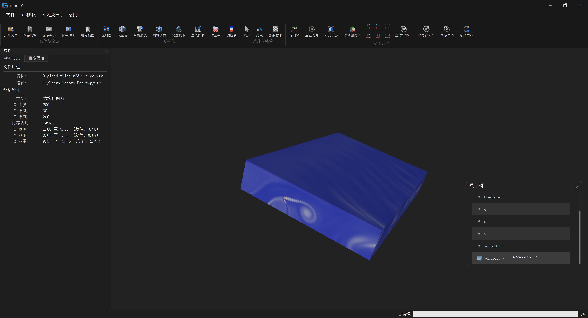
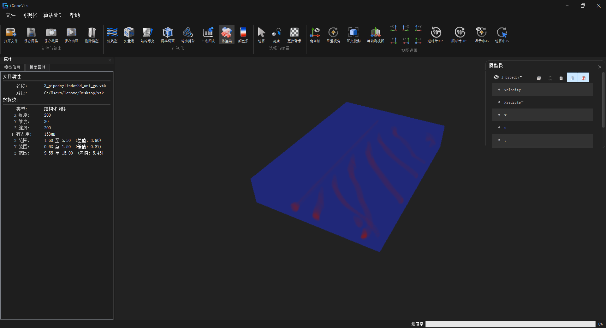
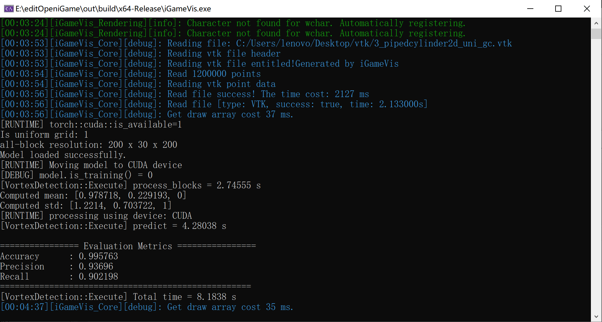
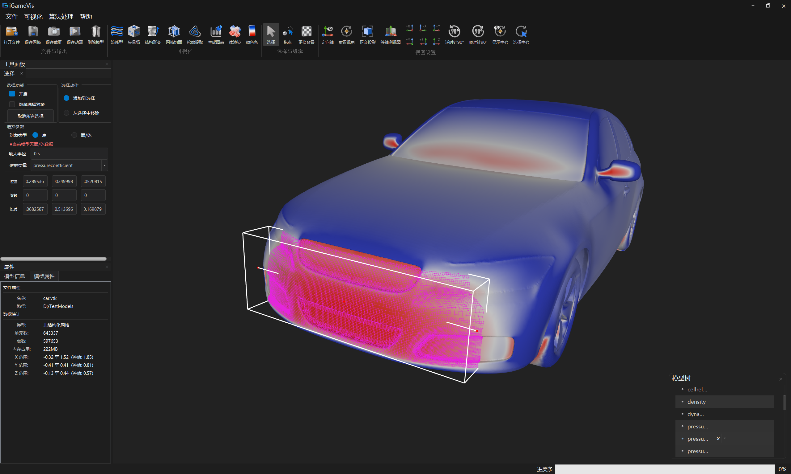

# 指标 10.2：仿真数据关键特征提取

## 指标构成

面向 CAE 仿真物理场数据，提供关键特征场提取、基于神经网络的涡结构检测与人工标注对比评估，以及关键区域交互与关键事件时域演化支撑。技术指标要求：**仿真数据关键特征提取精度（Precision / Recall）≥ 90%**。

| # | 子功能 | 状态 |
|---|--------|------|
| 1 | 经典物理特征提取：梯度 / 曲率 / Laplacian / 涡量 | ✅ 已实现 |
| 2 | 基于神经网络的涡提取，与人工标注对比，计算准确率 / 精确率 / 召回率（精度 ≥ 90%） | ✅ 已实现（评估逻辑）；GUI 指标浮层待恢复 |
| 3 | 关键区域点击 / 选中（点、单元、框选） | ✅ 已实现（交互在 Selection / 10.3；特征提取作用于当前属性场） |
| 4 | 关键事件的时域演化可视化；选中区域单独作用形变场 | ⏳ 部分实现（时序 / 形变见 11.3；区域限定形变待增强） |

> 本文档记录子功能 **1**、**2** 的完整实现，以及 **3**、**4** 与现有交互 / 可视化模块的衔接说明。
> 与 **10.1** 的区别：10.1 侧重**分析数据生成**（局部图表、熵种子、流线筛选）；10.2 侧重**特征场提取与涡结构检测评估**。
> 与 **11.3** 的区别：11.3 提供**时序切换、结构形变、动画导出**通用能力；10.2 的关键事件时域演化依赖这些能力展示检测结果。

---

## 子功能 1：经典物理特征提取（其他关键特征）

### 功能说明

从当前选中的物理属性（标量 / 矢量）出发，在网格上计算经典微分几何与流体力学特征标量，写入 `AttributeSet`，可直接以云图显示，供后续涡检测、选区分析等使用。

| 特征 | 输出属性名 | 说明 |
|------|------------|------|
| 梯度 | `gradient` | 标量 / 矢量场空间梯度 |
| 曲率 | `curvatures` | 曲面曲率（余切型离散） |
| Laplacian | `laplacians` | 离散 Laplacian |
| 涡量 | `vorticities` | 经典涡量 \(\omega = \nabla \times v\)（非神经网络） |

### 源码路径

| 路径 | 类 / API | 说明 |
|------|----------|------|
| `iGameCore/Filters/FeatureExtraction/iGameGradientFilter.*` | `GradientFilter` | 梯度 |
| `iGameCore/Filters/FeatureExtraction/iGameCurvatureFilter.*` | `CurvatureFilter` | 曲率 |
| `iGameCore/Filters/FeatureExtraction/iGameLaplacianFilter.*` | `LaplacianFilter` | Laplacian |
| `iGameCore/Filters/FeatureExtraction/iGameVortexFilter.*` | `VortexFilter` | 经典涡量 |
| `iGameCore/Filters/iGameFilterIncludes.h` | — | 统一 include |

### 调用方式

对应示例 `Examples/Filter/FeatureExtraction/GradientExtraction.cpp`：

```cpp
auto dataObj = iGame::FileIO::ReadFile("./Models/pipedcylinder2d_gt.vtk");
auto drawObj = iGame::DynamicCast<iGame::DrawObject>(dataObj);

auto filter = iGame::GradientFilter::New();  // 或 CurvatureFilter / LaplacianFilter / VortexFilter
filter->SetInput(drawObj);
filter->SetAttributeByIndex(attrIndex);      // 或 SetAttributeByName(name)
filter->Execute();

int newIndex = drawObj->GetAttributeSet()->GetNumberOfAttributes() - 1;
drawObj->ViewCloudPicture(scene, newIndex);
```

统一模式：`Filter::New()` → `SetInput()` →（可选）`SetAttributeByIndex/Name` → `Execute()`，结果追加到 `AttributeSet`。

### GUI

| 入口 | 说明 |
|------|------|
| 菜单「算法处理」→ 特征提取 → 计算梯度 (ComputeGradient) | `GradientFilter` |
| 菜单「算法处理」→ 特征提取 → 计算 Laplacian | `LaplacianFilter` |
| 菜单「算法处理」→ 特征提取 → 计算曲率 | `CurvatureFilter` |
| 菜单「算法处理」→ 特征提取 → 计算涡量 | `VortexFilter` |
| `dockWidget_ScalarField` / `igQtScalarViewWidget` | 提取结果出现在模型树属性列表中，在此切换云图 |



> 图中为 `pipedcylinder2d` 结构化网格（200×30×200）的涡量 `vorticities` 云图（按 magnitude 着色）；模型树中可见提取结果与原有属性并列，可随时切换显示。

### 测试用例

| Target | 源文件 | 默认数据 |
|--------|--------|----------|
| `testGradientExtraction` | `Examples/Filter/FeatureExtraction/GradientExtraction.cpp` | `./Models/Quad_Bicycle.vtk` |
| `testCurvatureExtraction` | `Examples/Filter/FeatureExtraction/CurvatureExtraction.cpp` | `./Models/Quad_Bicycle.vtk` |
| `testLaplacianExtraction` | `Examples/Filter/FeatureExtraction/LaplacianExtraction.cpp` | `./Models/Quad_Bicycle.vtk` |
| `testVortexExtraction` | `Examples/Filter/FeatureExtraction/VortexExtraction.cpp` | `./Models/pipedcylinder2d_gt.vtk` |

---

## 子功能 2：基于神经网络的涡提取与人工标注对比

### 功能说明

对体网格速度场使用 **LibTorch TorchScript** 三维分块 CNN 做涡结构预测，输出点标量 `vortexPredict`。若网格上存在人工标注属性 **`PredictedLabel`**，则逐点与预测结果对比，计算：

| 指标 | 定义 |
|------|------|
| Accuracy（准确率） | \((TP+TN) / (TP+FP+TN+FN)\) |
| Precision（精确率） | \(TP / (TP+FP)\) |
| Recall（召回率） | \(TP / (TP+FN)\) |

**技术指标**：在带标注的仿真数据上，关键特征提取 **Precision / Recall ≥ 90%**（由 `GetPrecision()` / `GetRecall()` 读取；达标与否由评估数据与模型共同决定，代码侧提供完整指标计算）。

阈值阈值：`gt > 0` 为正类，`pred > 0.5` 为正类。

### 源码路径

| 路径 | 类 / 函数 | 说明 |
|------|-----------|------|
| `iGameCore/Filters/FeatureExtraction/iGameVortexDetectionFilter.*` | `VortexDetection` | NN 涡检测核心 |
| 同上 | `EvaluatePredictMetrics` | TP/FP/TN/FN → Accuracy / Precision / Recall |
| 同上 | `GetAccuracy` / `GetPrecision` / `GetRecall` | 指标读取 API |
| `Qt/src/IQCore/igQtMainWindow.cpp` | 菜单「涡旋预测 (PredictVortex)」 | GUI 触发；指标浮层代码已预留（当前注释） |

### 算法要点

1. **输入**：体网格 + 速度矢量属性；非均匀网格可重采样 / 分块（`process_blocks`，`split` 等）。
2. **推理**：加载 TorchScript 模型（默认路径 `./Resources/AI/model_1x64x64x64_1108_cuda.pt`），按 **64³** patch 滑动推理，Hann 窗加权融合。
3. **后处理**：结合 Q 准则辅助场 `ComputePointQ`，KNN 平滑标签 `knn_smooth_labels`。
4. **输出**：点标量 `vortexPredict` 写入 `AttributeSet`。
5. **评估**：若存在属性名 `PredictedLabel`，调用 `EvaluatePredictMetrics`，结果存入 `m_Accuracy` / `m_Precision` / `m_Recall`，并打印到控制台。

### 编译与依赖

```text
-DENABLE_LIBTORCH_MODULE=ON
```

开启后定义 `LibTorch_ENABLE`。需本机 LibTorch 与 CUDA（按模型配置），并将 `.pt` 模型放到 `Resources/AI/`。

### 调用方式

对应示例 `Examples/Filter/FeatureExtraction/VortexDetection.cpp`：

```cpp
auto dataObj = iGame::FileIO::ReadFile("./Models/pipedcylinder2d_gt.vtk");
auto drawObj = iGame::DynamicCast<iGame::DrawObject>(dataObj);
// 人工标注（可选）：AttributeSet 中需有名为 "PredictedLabel" 的点标量

auto filter = iGame::VortexDetection::New();
filter->SetInput(drawObj);
filter->SetAttributeByIndex(velocityAttrIndex);  // 速度场
if (filter->Execute()) {
    double accuracy  = filter->GetAccuracy();   // 无标注时为 -1
    double precision = filter->GetPrecision();
    double recall    = filter->GetRecall();
    // 精度验收示例：precision >= 0.90 && recall >= 0.90

    int newIndex = drawObj->GetAttributeSet()->GetNumberOfAttributes() - 1;
    drawObj->ViewCloudPicture(scene, newIndex);  // 显示 vortexPredict
}
```

### GUI

| 入口 | 说明 |
|------|------|
| 菜单「算法处理」→ 特征提取 → 涡旋预测 (PredictVortex) | 对当前模型当前属性执行 `VortexDetection`，结果挂到模型树 |
| `dockWidget_ScalarField` / `igQtScalarViewWidget` | 切换到 `vortexPredict` 属性查看预测云图 |

> 主窗口中 `vortexMetricsLabel` 与 Precision/Recall 浮层显示逻辑已预留，当前为注释状态；评估数值仍可通过 API / 控制台获取。



> `vortexPredict` 点标量的体渲染显示，可见圆柱绕流尾迹中周期性脱落的涡结构。

### 精度实测

在 `3_pipedcylinder2d_uni_gc.vtk`（120 万点，均匀网格 200×30×200，含 `PredictedLabel` 人工标注）上的实测结果：



| 指标 | 实测值 | 指标要求 | 结论 |
|------|--------|----------|------|
| Accuracy | 0.995763 | — | — |
| **Precision** | **0.93696** | ≥ 0.90 | ✅ 达标 |
| **Recall** | **0.902198** | ≥ 0.90 | ✅ 达标 |

运行环境与耗时（CUDA 推理）：

| 阶段 | 耗时 |
|------|------|
| `process_blocks`（分块预处理） | 2.746 s |
| `predict`（网络推理） | 4.280 s |
| **`VortexDetection::Execute` 总计** | **8.184 s** |

### 测试用例

| Target | 源文件 | 默认数据 | 条件 |
|--------|--------|----------|------|
| `testVortexDetection` | `Examples/Filter/FeatureExtraction/VortexDetection.cpp` | `./Models/pipedcylinder2d_gt.vtk`（含标注） | `ENABLE_LIBTORCH_MODULE=ON` |

> 精度评估需数据中带有人工标注属性 `PredictedLabel`；无标注时仅输出 `vortexPredict` 云图，不计算对比指标。

---

## 子功能 3：关键区域点击 / 选中

### 功能说明

用户可通过交互在 3D 模型上**点击点 / 选单元 / 框选区域**，得到关键区域 ID 集合或包围盒，用于：

- 限制后续分析范围（与 10.1 局部图表、刷选联动一致）；
- 将特征云图观察聚焦到关键结构附近；
- 作为时域演化 / 形变作用的区域输入（见子功能 4）。

特征提取 Filter 本身对**整幅当前属性场**计算；区域语义由 **Selection 交互层**提供，再与特征结果联动显示。

### 源码路径

| 路径 | 类 / API | 说明 |
|------|----------|------|
| `iGameCore/Core/Common/iGameSelection.*` | `Selection` | 选区数据模型 |
| `iGameCore/Rendering/Core/Interactor/iGameSelectionStyle.*` | `SelectionStyle` | 点 / 单元选择交互 |
| `iGameCore/Rendering/Core/Interactor/iGameBoxStyle.*` | `BoxStyle` | 框选包围盒 |

### 使用要点

1. 在视图中启用选择样式，点击或框选得到点 / 单元 ID。
2. 对全场执行特征提取（子功能 1 / 2），再以云图查看 `vortexPredict` 等属性。
3. 需要局部分析时，将选区 bounding box 交给 10.1 图表或刷选管线。

### GUI

| 入口 | 说明 |
|------|------|
| 工具栏「选择」/ `action_Select` | 启用点 / 单元拾取 |
| 「选择」面板 → 选择盒（`SelectBox` / `BoxStyle`） | 拖拽框选关键区域，得到包围盒 |
| 模型树 | 查看选中集合与派生属性 |



---

## 子功能 4：关键事件时域演化与选中区域形变

### 功能说明

**目标能力**：

1. **关键事件时域演化可视化**：在多时间步仿真（如 PVD）上，对涡预测 / 涡量等关键特征场做时间轴播放，观察关键结构随时间的演化。
2. **选中区域单独作用形变场**：仅对用户选中的点 / 单元施加位移形变，突出关键区域的结构响应。

### 当前实现与衔接

| 能力 | 现状 | 主要入口 |
|------|------|----------|
| 时序帧切换 / 动画 | ✅ 通用能力已实现 | `DataObject::UpdateAnimation(keyframeIdx)`；PVD 读取；动画 Dock / FFMPEG（见 **11.3**） |
| 关键特征随时间刷新 | ✅ 可对每帧属性切换云图；涡预测可按帧重跑或预计算后播放 | `ViewCloudPicture` + `UpdateAnimation` |
| 整模结构形变 | ✅ 已实现 | `StressDeformationFilter` + `igQtDeformationWidget`（**11.3**） |
| **仅选中区域作用形变** | ⏳ 待增强 | 选区（子功能 3）与 `DeformationData` 尚未绑定「仅偏移选中点」路径 |

推荐工作流（当前可用）：

```text
加载时序数据 → 特征提取 / 涡预测 → 云图显示关键场
    → 动画面板切换时间步（关键事件时域演化）
    →（可选）形变面板对整模施加位移矢量场
```

选中区域限定形变增强后，预期流程为：

```text
点击 / 框选关键区域 → 仅对该集合写入形变偏移 → 时序播放观察局部响应
```

### 源码路径（跨模块）

| 路径 | 说明 |
|------|------|
| `iGameCore/Core/DataModel/iGameDataObject.*` | `UpdateAnimation` 时序切换 |
| `iGameCore/IO/VTK XML/iGamePVDReader.*` | 时序 PVD |
| `iGameCore/Filters/Deformation/iGameStressDeformationFilter.*` | 结构形变 |
| `Qt/src/IQWidgets/igQtDeformationWidget.*` | 形变 Dock |
| `doc/modules/README_11.3.md` | 时序 / 形变 / 动画完整说明 |

### GUI

| 入口 | 说明 |
|------|------|
| 菜单「可视化」→ 动画输出可视化 / `action_ExportAnimation` | 打开底部动画 Dock，关键特征场随时间播放（11.3） |
| `dockWidget_Animation` | 时间轴播放、缓存帧数、导出 |
| 工具栏 `action_deformation` / `action_StrucDeformation` | 打开形变面板 |
| `DeformationDockWidget` / `igQtDeformationWidget` | 位移矢量、缩放因子、开关形变 |

<!-- 待补充截图：关键事件时域演化

-->

### 测试用例

| Target | 源文件 | 默认数据 | 条件 |
|--------|--------|----------|------|
| `testTimeVaryingVector` | `Examples/Filter/Vector/TestTimeVaryingVector.cpp` | `./Models/redsea/1.pvd`（需自备） | 时序帧切换 |
| `testDeformationCode` | `Examples/Filter/Deformation/TestStressDeformationFilterCode.cpp` | `./Models/sukong_Step-1_2.vtu`（需自备） | 显式 DSF + `Execute` |
| `testAnimation` | `Examples/Animation/TestAnimation.cpp` | `./Models/CAD11/_frames.pvd`（需自备） | 动画播放 |

> 上述示例归属 **11.3**，此处列出以说明本子功能依赖的通用能力入口。

---

## 精度验收说明

| 项目 | 说明 |
|------|------|
| 指标目标 | Precision ≥ 90% **且** Recall ≥ 90%（指标表述中的「精度」按二者验收） |
| 标注属性名 | `PredictedLabel`（点标量，与网格点数一致） |
| 判正阈值 | 标注 `> 0`；预测 `> 0.5` |
| 读取 API | `VortexDetection::GetPrecision()` / `GetRecall()` / `GetAccuracy()` |
| 无标注时 | 上述 getter 保持 `-1`，仅输出 `vortexPredict` 云图，不计算对比指标 |
| **实测结果** | `3_pipedcylinder2d_uni_gc.vtk`：Precision **0.93696**、Recall **0.902198**、Accuracy 0.995763 → **达标** |

实测控制台输出见子功能 2 的「精度实测」章节。

---

## 相关示例汇总

| 示例 Target | 源文件 | 默认数据 | 说明 | 条件 |
|-------------|--------|----------|------|------|
| `testGradientExtraction` | `Examples/Filter/FeatureExtraction/GradientExtraction.cpp` | `./Models/pipedcylinder2d_gt.vtk` | 梯度 | 默认 |
| `testCurvatureExtraction` | `Examples/Filter/FeatureExtraction/CurvatureExtraction.cpp` | `./Models/pipedcylinder2d_gt.vtk` | 曲率 | 默认 |
| `testLaplacianExtraction` | `Examples/Filter/FeatureExtraction/LaplacianExtraction.cpp` | `./Models/pipedcylinder2d_gt.vtk` | Laplacian | 默认 |
| `testVortexExtraction` | `Examples/Filter/FeatureExtraction/VortexExtraction.cpp` | `./Models/pipedcylinder2d_gt.vtk` | 经典涡量 | 默认 |
| `testVortexDetection` | `Examples/Filter/FeatureExtraction/VortexDetection.cpp` | `./Models/pipedcylinder2d_gt.vtk` | NN 涡检测 | `ENABLE_LIBTORCH_MODULE=ON` |
