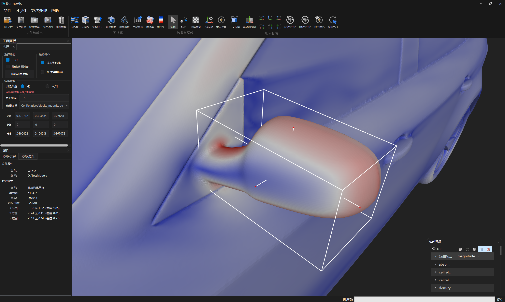
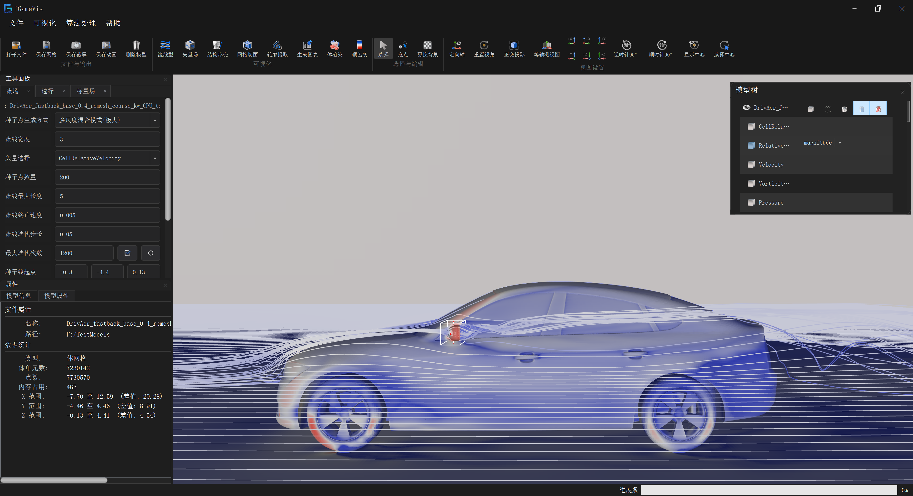
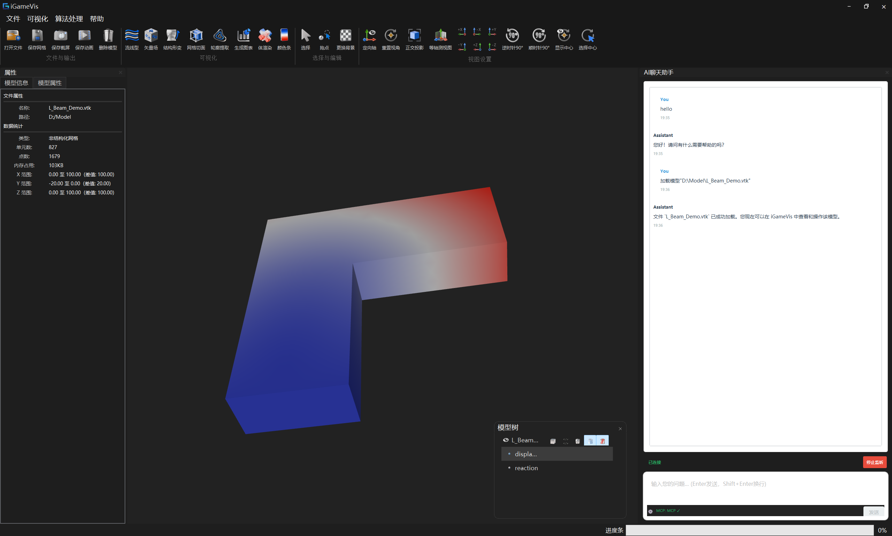

# 指标 10.3：物理场特征可视交互模块

## 指标构成

面向 CAE 仿真物理场数据，提供感知引导的多模态可视交互能力：语义感知的局部聚焦与旋转中心切换、微宏观多尺度流线联合显示，以及基于 MCP 协议的自然语言驱动可视分析。

| # | 子功能 | 状态 |
|---|--------|------|
| 1 | 语义分割，点选物体局部聚焦，改变视角和旋转中心 | ⏳ 旋转中心交互已实现；语义分割标注属性待完善 |
| 2 | 选择局部三维区域计算微观流线，同时显示微观和宏观流线 | ✅ 已实现 |
| 3 | 基于 MCP 的文本交互 | ✅ 已实现 |

---

## 子功能 1：语义分割，点选物体局部聚焦，改变视角和旋转中心

### 功能说明

用户在三维视图中点击目标物体，并构建包围盒，系统以此为新旋转中心，将镜头聚焦到该局部区域，旋转中心坐标轴随之迁移；此后所有旋转、缩放操作均以新中心为基准。

流程：**框选目标区域（BoxStyle）→ 取包围盒极值点 → `ResetCameraView(BoundingBox)` → 相机定位 + 旋转中心迁移 → 坐标轴更新**。

### 源码路径

| 路径 | 类 / 函数 | 说明 |
|------|-----------|------|
| `iGameCore/Rendering/Core/iGameCenterAxesModel.*` | `CenterAxesModel` | 旋转中心三色坐标轴渲染与拖拽 |
| `iGameCore/Rendering/Core/iGameScene.cpp` | `Scene::SetRotationBoundingSphere` | 写入自定义旋转中心包围球，同步更新坐标轴位置 |
| `iGameCore/Rendering/Core/iGameScene.cpp` | `Scene::ResetRotationBoundingSphere` | 恢复默认旋转中心（模型整体包围球） |
| `iGameCore/Rendering/Core/iGameScene.cpp` | `Scene::GetRotationCenterDepth` | 查询旋转中心深度，供交互速度自适应计算 |
| `iGameCore/Rendering/Core/iGameScene.cpp` | `Scene::UpdateAxisSize` | 按相机距离动态缩放坐标轴，保持屏幕空间恒定大小 |
| `iGameCore/Rendering/Core/Interactor/iGameDragCenterStyle.*` | `DragCenterStyle` | 鼠标拖拽坐标轴以实时调整旋转中心 |
| `iGameCore/Core/Common/iGameSelection.*` | `Selection` | 选区数据模型（点选 / 框选 / 单元选），提供聚焦目标 |

### 关键实现

1. **框选包围盒 → 聚焦视角**（GUI 入口：`action_ResetViewByBoundingBox`，`igQtMainWindow.cpp:1007`）：

   ```cpp
   auto boxStyle = DynamicCast<iGame::BoxStyle>(interactor->GetSpecialInteractor("SelectBox"));
   auto minMaxP  = boxStyle->GetBox()->GetExtremePoint();
   auto boundingBox = BoundingBox(minMaxP.first, minMaxP.second);
   scene->ResetCameraView(boundingBox);  // 同时完成相机定位与旋转中心设置
   ```

   `ResetCameraView(BoundingBox)` 内部执行：

   ```cpp
   // iGameScene.cpp:463
   this->SetRotationBoundingSphere(igm::vec4{x, y, z, r}); // 旋转中心 = bbox 中心
   m_Camera->SetPosition(x, y, z + 3.0f * r);             // 相机拉到 bbox 正前方
   m_Camera->SetFocal(igm::vec3{x, y, z});                 // 焦点对准 bbox 中心
   UpdateAxisSize();                                        // 坐标轴随距离缩放
   ```

2. **手动拖拽旋转中心**（GUI 入口：`action_PickCenter`，`igQtMainWindow.cpp:1040`）：

   ```cpp
   // 进入拖拽模式
   scene->GetCenterAxesModel()->SetVisibility(true);
   rendererWidget->ChangeInteractorStyle(Interactor::DragCenterStyle);
   ```

   `DragCenterStyle` 检测鼠标是否在坐标轴附近（容差 80 px），命中后将屏幕偏移转换为世界坐标，调用 `m_AxesModel->HandleDrag(worldOffset)` 并同步写回 `Scene::SetRotationBoundingSphere`。

3. **恢复默认旋转中心**：

   ```cpp
   scene->ResetRotationBoundingSphere();  // 恢复为 m_ModelsBoundingSphere
   ```

### GUI

| 菜单项 / 按钮 | 入口 | 说明 |
|---------------|------|------|
| `action_ResetViewByBoundingBox` | `igQtMainWindow.cpp:1007` | 用 BoxStyle 框选区域后触发，调用 `ResetCameraView(BoundingBox)`，一次性完成相机定位与旋转中心切换 |
| `action_PickCenter`（PickCenter 按钮） | `igQtMainWindow.cpp:1040` | 切换到 `DragCenterStyle`，显示旋转中心坐标轴，允许鼠标拖拽精细调整旋转中心 |
| `action_ShowCenter` | `igQtMainWindow.cpp:1031` | 切换坐标轴显隐（`ToggleCenterAxes`） |



---

## 子功能 2：选择局部三维区域计算微观流线，同时显示微观和宏观流线

### 功能说明

用户框选一个局部三维区域后，系统在**一次流线生成中同时布置两种空间尺度的种子点**，得到并置显示的多尺度流场视图：

| 尺度 | 种子来源 | 作用 |
|------|----------|------|
| **微观流线** | 框选区域内速度模长的**极大值 / 极小值**点 | 呈现关注区域内部的细节流动结构（分离、驻点、局部涡） |
| **宏观流线** | 贯穿整个流场的**种子线**上均匀采样 | 捕捉全局流动趋势与主要结构走向 |

两组种子合并后一次积分，输出到同一个流线网格中，因此微观细节与宏观背景天然对齐、共享同一套着色与线宽设置。

对应「种子点生成方式」下拉框中的两个模式：

| 模式 | `control` | 微观种子 |
|------|-----------|----------|
| **多尺度混合模式(极大)** | 3 | 选区内速度模长最大的 N 个点 |
| **多尺度混合模式(极小)** | 4 | 选区内速度模长最小的 N 个点 |

### 源码路径

| 路径 | 类 / 函数 | 说明 |
|------|-----------|------|
| `iGameCore/Filters/StreamView/iGameStreamTracer.*` | `StreamTracer` | 流线计算核心 |
| `iGameCore/Filters/StreamView/iGameStreamTracer.cpp` | `getModelSelectMax` / `getModelSelectMin` | 选区内极大 / 极小速度点布种（微观） |
| `iGameCore/Filters/StreamView/iGameStreamTracer.cpp` | `seedPCoordGenerate` | 种子线上均匀采样布种（宏观） |
| `Qt/src/IQWidgets/igQtStreamTracerWidget.cpp` | `generateStreamline`（`control == 3 / 4`） | GUI 触发；合并宏 / 微两组种子后一次计算 |
| `iGameCore/Rendering/Core/Interactor/iGameBoxStyle.*` | `BoxStyle` | 框选包围盒，界定微观流线的作用范围 |
| `iGameCore/Core/Common/iGameSelection.*` | `Selection` | 选区数据模型，提供选中点 / 单元集合 |

### 算法要点

以「多尺度混合模式(极大)」（`control == 3`）为例：

1. **激活选择盒**：`Q_EMIT SetUseBox(Smodel)` 把当前选择盒套用到源模型上，拾取落入盒内的点 / 单元。
2. **微观布种**：`getModelSelectMax(vectorName, numOfSeeds)`
   - 从 `model->GetSelection()` 收集选中点（选中单元时展开为其顶点）；
   - 按速度模长 `‖v‖` 降序，取前 `numOfSeeds` 个点作为种子，并沿矢量方向做极小偏移避免退化。
3. **清空选区**：`model->GetSelection()->ClearSelections()`，避免残留选区影响下一次生成。
4. **宏观布种**：`seedPCoordGenerate(numOfSeeds, startP, endP)` 在种子线两端点之间均匀插值出 `numOfSeeds` 个点。
5. **合并**：宏观种子追加到微观种子之后，一并送入 `SetInput` → `Execute`。

「多尺度混合模式(极小)」（`control == 4`）流程相同，第 2 步改用 `getModelSelectMin`，用于观察低速滞止区的局部结构。

> 种子线端点 `startP` / `endP` 可在面板中直接输入，也可在 3D 视图中拖拽两端的绿色控制点交互调整（`StreamLineSelection`），拖拽结果与输入框双向同步。

### 调用方式

对应示例 `Examples/Filter/Vector/TestStreamline.cpp`：

```cpp
auto dataObj = iGame::FileIO::ReadFile("./Models/Driver/driver-1.vtk");

auto tracer = iGame::StreamTracer::New();
tracer->initStreamTracer(dataObj);

// 微观种子：选区内速度极大值点（需先在场景中框选）
auto seeds = tracer->getModelSelectMax(vectorName, numOfSeeds);

// 宏观种子：种子线上均匀采样，贯穿整个流场
auto macroSeeds = tracer->seedPCoordGenerate(numOfSeeds, startP, endP);
seeds.insert(seeds.end(), macroSeeds.begin(), macroSeeds.end());

// 合并后一次积分，输出同时包含宏 / 微两种尺度的流线
tracer->SetInput(seeds, vectorName, lengthOfStreamLine, lengthOfStep, terminalSpeed, maxSteps);
tracer->Execute();
auto streamlines = tracer->GetOutput();
```

### GUI

操作流程：**流线型 → 流场面板 → 框选关注区域 → 选择「多尺度混合模式(极大/极小)」→ 生成流线**

| 步骤 | 入口 | 说明 |
|------|------|------|
| 1 | 工具栏「流线型」/ 菜单「可视化」→ 时序流场 | 打开左侧「流场」面板 |
| 2 | 「选择」面板 → 启用选择盒 | 在 3D 视图中拖拽选择盒，框住关注区域 |
| 3 | `dockWidget_FlowField` → 种子点生成方式 | 选择「多尺度混合模式(极大)」或「多尺度混合模式(极小)」 |
| 4 | 种子线起点 / 终点 | 设定宏观流线的采样线段（可在视图中拖拽绿色端点） |
| 5 | 种子点数量 | 微观与宏观各取该数量的种子（默认 200） |
| 6 | **生成流线** 按钮 | 触发 `generateStreamline()`，合并两级种子一次计算 |



> 图中为 DrivAer 整车外流场（720 万体单元）在「多尺度混合模式(极大)」下的结果：贯穿画面的平行流线为种子线生成的**宏观流线**，展现整体绕流趋势；车顶选择盒附近密集缠绕的流线为**微观流线**，由选区内速度极大值点布种，刻画 A 柱与车顶过渡处的局部流动细节。

### 测试用例

| Target | 源文件 | 默认数据 |
|--------|--------|----------|
| `testStreamline` | `Examples/Filter/Vector/TestStreamline.cpp` | `./Models/Driver/driver-1.vtk` |

---

## 子功能 3：基于 MCP 的文本交互

### 功能说明

通过 **Model Context Protocol（MCP）** 将自然语言请求转换为 iGameVis 的可视化操作指令：用户在内置聊天面板中输入文字，AI 大模型（Qwen / Gemini / Claude / OpenAI GPT）理解意图后调用预定义的 MCP 工具（文件操作、相机控制、网格处理、截图等），iGameVis 执行并将结果回传给 AI，形成多轮对话驱动的可视分析流程。

### 系统架构

```
用户输入（Qt Chat UI）
    ↕ 端口 8080（消息文本）
Python Socket Bridge（iGameVis_Chat.py）
    ↕ stdio（MCP Protocol）
MCP Client（iGameVis_Client.py）  ←→  AI 大模型 API
    ↕ stdio
MCP Tool Server（iGameVis_Server.py）
    ↕ 端口 12345（JSON 命令）
iGameVis C++（igQtCommandManager → igQtCommandExecutor）
```

### 源码路径

**Python 侧**

| 路径 | 说明 |
|------|------|
| `ThirdParty/MCP/iGameVis_Chat.py` | Socket 桥接服务器（端口 8080），iGameVis ↔ MCP 消息中转 |
| `ThirdParty/MCP/Client/iGameVis_Client.py` | MCP 客户端，对接 AI 大模型 API，管理多轮对话历史 |
| `ThirdParty/MCP/Servers/iGameVis_Server.py` | MCP 工具服务器，提供各类可视化操作工具定义 |
| `ThirdParty/MCP/config.py` | 配置文件（模型选择、API Key、Socket 端口） |
| `ThirdParty/MCP/install.bat` | 依赖安装脚本（Python ≥ 3.10，创建 `.venv`） |

**C++ / Qt 侧**

| 路径 | 类 | 说明 |
|------|-----|------|
| `Qt/include/IQWidgets/igQtAiChat/igQtAiChatWidget.h` | `igQtAiChatWidget` | 聊天 UI 面板，消息气泡、流式逐字显示、连接控制 |
| `Qt/include/IQWidgets/igQtAiChat/igQtChatManager.h` | `igQtChatManager` | 聊天消息 Socket 管理（端口 8080） |
| `Qt/include/IQWidgets/igQtAiChat/igQtCommandManager.h` | `igQtCommandManager` | 命令接收与执行 Socket 管理（端口 12345） |
| `Qt/src/IQWidgets/igQtAiChat/igQtCommandExecutor.cpp` | `igQtCommandExecutor` | 将 JSON 命令映射为 iGameVis C++ API 调用 |

### 支持的 MCP 工具

| 类别 | 工具 | 说明 |
|------|------|------|
| 文件操作 | `open_file`、`save_file_as`、`find_desktop_files`、`find_files_in_path` | 打开 / 保存模型，文件搜索 |
| 相机控制 | `camera_control` | 位置、缩放、旋转，支持 8 个标准视角（前 / 后 / 左 / 右 / 上 / 下 / 等轴测 / 重置） |
| 模型信息 | `get_model_info`、`get_current_attribute`、`get_model_eight_views` | 查询模型与属性信息，获取八视图截图 |
| 可视化控制 | `save_screenshot`、`change_background_color`、`toggle_colorbar`、`change_camera_type` | 截图、背景色、色条显隐、透视 / 正交切换 |
| 网格处理 | `apply_mesh_filter`、`apply_mesh_clip_filter` | 执行过滤算法（梯度、曲率、简化、平滑），平面裁切 |
| 场景操作 | `delete_current_model`、`change_interaction_mode` | 删除模型，切换点 / 面选择模式 |

### 配置与启动

```python
# ThirdParty/MCP/config.py
SELECTED_MODEL = "qwen"     # 可选：qwen / gemini / openai / claude
SOCKET_HOST    = "127.0.0.1"
SOCKET_PORT    = 8080
```

启动步骤：

1. 安装依赖（仅首次）：在 `ThirdParty/MCP/` 目录执行 `install.bat`。
2. 配置 API Key：在 `config.py` 中填写所用大模型的 API Key。
3. 启动桥接服务器：`python ThirdParty/MCP/iGameVis_Chat.py`。
4. 在 iGameVis 的 AI Chat Dock 面板中点击 **Connect** 建立连接，随后即可输入自然语言命令。

### 调用方式（C++ 侧）

```cpp
// igQtAiChatWidget 内部持有 igQtChatManager（端口 8080）
// 主窗口另持有 igQtCommandManager（端口 12345），接收并执行 MCP 工具指令

// 命令处理回调（igQtCommandManager 内部）
commandManager->handleCommand(commandJson);  // JSON 命令 → igQtCommandExecutor → API 调用
commandManager->sendResponse(responseJson);  // 执行结果回传 MCP Tool Server
```

### GUI

| 面板 | 说明 |
|------|------|
| AI Chat Dock（`igQtAiChatWidget`） | 消息输入框（支持多行）、历史气泡、流式逐字输出、连接状态指示 |
| 设置按钮 | 配置 MCP 文件夹路径（`onSetMcpPath`）和 Python 解释器路径（`onSetPythonPath`） |



---

