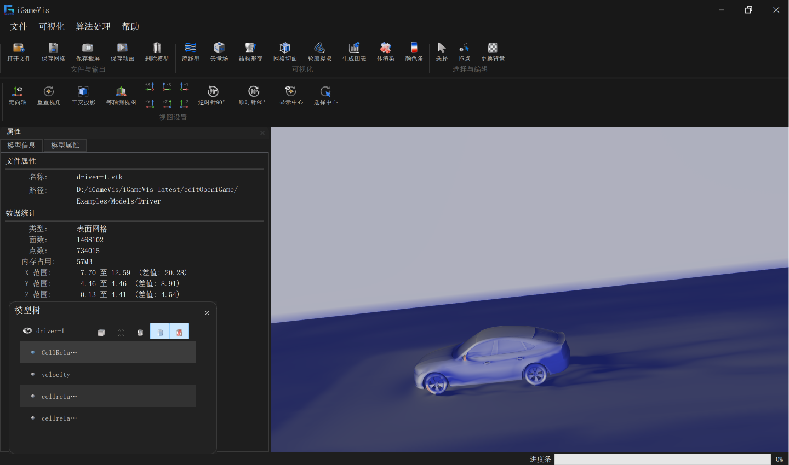
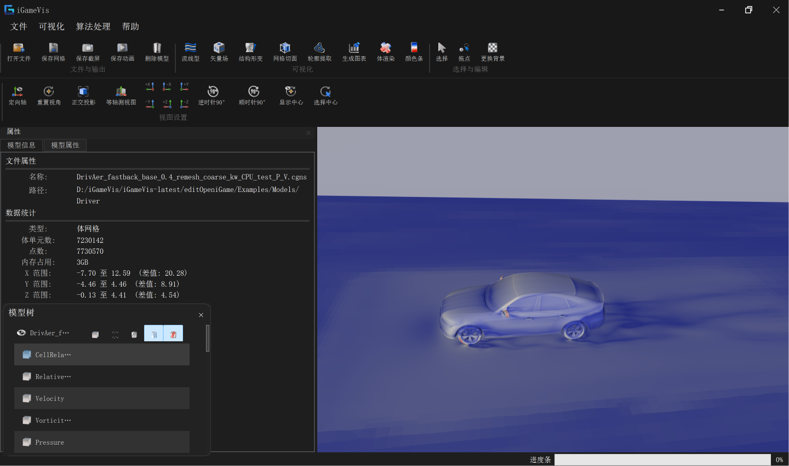

# 指标 11.2：VTK / CGNS 数据接口模块

## 指标构成

面向 CAE 仿真网格、物理场属性、多块数据与时序数据，提供 VTK / CGNS 文件到 iGameVis 数据模型的统一接口，共包含四个子功能：

| # | 子功能 | 状态 |
|---|--------|------|
| 1 | 统一文件类型识别与 IO 分发 | ✅ 已实现 |
| 2 | VTK Legacy / VTK XML 数据导入 | ✅ 已实现 |
| 3 | VTK 数据写出 | ✅ Legacy VTK ASCII 已实现；VTM 路由已接入；其余 XML Writer 未接入统一入口 |
| 4 | CGNS 数据导入 | ✅ 已实现（可选模块） |

> 本文档记录上述子功能的源码路径、API、GUI 与示例。
> 本指标聚焦 VTK / CGNS。OBJ、STL、PLY、MESH、IGC、Nastran、Fluent CAS、Abaqus ODB 等接口位于 `iGameCore/IO/` 的其他子目录。

---

## 子功能 1：统一文件类型识别与 IO 分发

### 功能说明

`FileIO` 根据文件扩展名识别格式并创建对应 Reader / Writer。读取成功后，统一设置对象名称，并将连续的 `X/Y/Z`、`0/1/2` 或 `1/2/3` 标量分量尝试合并为三维矢量属性，供后续场可视化直接使用。

典型读取链路：

```text
FileIO::ReadFile(filePath)
  → GetFileType(filePath)
  → 创建具体 Reader
  → Reader::SetFilePath() / Execute() / GetOutput()
  → DataObject / DrawObject
  → 属性整理与对象命名
```

### VTK / CGNS 分发范围

| 扩展名 | `FileType` | 读取 | `FileIO::WriteFile` | 说明 |
|--------|------------|------|---------------------|------|
| `.vtk` | `VTK` | ✅ | ✅ | VTK Legacy |
| `.vtu` | `VTU` | ✅ | ❌ | VTK XML UnstructuredGrid |
| `.vts` | `VTS` | ✅ | ❌ | VTK XML StructuredGrid |
| `.vtp` | `VTP` | ✅ | ❌ | VTK XML PolyData |
| `.vtm` | `VTM` | ✅ | ⚠️ 已接入 | VTK XML MultiBlock，需按当前对象类型验证子块输出 |
| `.pvd` | `PVD` | ✅ | ❌ | VTK 时序集合 |
| `.cgns` | `CGNS` | 条件启用 | ❌ | 需 `ENABLE_CGNS_MODULE=ON` |

> “读取支持”表示已经接入 `FileIO::ReadFile()`；“写出支持”表示已经接入 `FileIO::WriteFile()`。源码中存在 `VTUWriter`、`VTSWriter` 不等于统一写出入口已经支持 `.vtu`、`.vts`。

### 源码路径

| 路径 | 类 / API | 说明 |
|------|----------|------|
| `iGameCore/IO/iGameFileIO.h` | `FileIO` | 统一读写接口与 `FileType` 枚举 |
| `iGameCore/IO/iGameFileIO.cpp` | `GetFileType`、`ReadFile`、`WriteFile` | 扩展名识别与 Reader / Writer 分发 |
| `iGameCore/IO/iGameFileReader.*` | `FileReader` | 文件读取器基类、文件 / 内存缓冲管理 |
| `iGameCore/IO/iGameFileWriter.*` | `FileWriter` | 写出器基类、缓冲生成与落盘 |
| `iGameCore/Core/DataModel/iGameDataObject.*` | `DataObject` | IO 输出的统一数据对象 |
| `iGameCore/Core/Common/iGameAttributeSet.*` | `AttributeSet` | 点 / 单元属性集合 |

### 调用方式

**统一读取（推荐）：**

```cpp
#include "iGameFileIO.h"

const std::string filePath = "./Models/Tet_Plane.vtk";
auto obj = iGame::FileIO::ReadFile(filePath);

if (obj == nullptr) {
    // 扩展名不支持、文件不存在或解析失败
    return;
}
```

**只识别文件类型：**

```cpp
#include "iGameFileIO.h"

auto type = iGame::FileIO::GetFileType("result.vtu");
auto name = iGame::FileIO::GetFileTypeAsString(type); // "VTU"
```

扩展名判断不区分大小写；无扩展名或未知扩展名返回 `FileIO::NONE`。

### GUI

```text
主窗口“打开文件”
  → igQtFileLoader::LoadFile()
  → igQtFileLoader::OpenFile(filePath)
  → FileIO::ReadFile(filePath)
  → emit NewModel(obj, ItemSource::File)
  → Scene::AddModel(obj)
```

| 入口 | 说明 |
|------|------|
| 文件菜单 / 工具栏“打开” | 打开文件选择框，可多选 |
| 最近文件 | 再次调用 `igQtFileLoader::OpenFile()` |
| `Qt/src/IQCore/igQtFileLoader.cpp` | 文件过滤器、统一读取与模型创建 |
| `Qt/include/IQCore/igQtFileLoader.h` | `OpenFile` / `OpenFiles` 声明 |

> 当前 GUI 的“全部文件”过滤器列出了 `.vtk`、`.vtu`、`.vts`、`.vtm`、`.pvd` 和 `.cgns`，但尚未列出 `.vtp`；`.vtp` 仍可通过 `FileIO::ReadFile()` API 读取。

### 测试用例

统一分发没有独立 Example Target，由各格式示例间接覆盖。VTK 基本链路可使用 `testSetRenderWindow` 或 `testSetScalarField`；CGNS 使用 `testCGNS`。

---

## 子功能 2：VTK Legacy / VTK XML 数据导入

### 功能说明

VTK 导入分为 Legacy VTK 与 VTK XML 两条路径，最终统一转换为 `SurfaceMesh`、`StructuredMesh`、`UnstructuredMesh` 或包含子对象 / 时间帧的 `DrawObject`。

| 格式 | Reader | 输出 / 用途 |
|------|--------|-------------|
| `.vtk` | `VTKReader` | Legacy VTK 网格与属性 |
| `.vtu` | `iGameVTUReader` | 非结构网格 |
| `.vts` | `iGameVTSReader` | 结构网格 |
| `.vtp` | `iGameVTPReader` | PolyData 点、线与表面单元 |
| `.vtm` | `iGameVTMReader` | 多块数据及子文件 |
| `.pvd` | `iGamePVDReader` | 多时间步、多子文件数据 |

### Legacy VTK

`VTKReader` 支持 ASCII / Binary 文件头，并根据 `DATASET` 类型构造对应网格：

| VTK `DATASET` | iGameVis 输出 |
|---------------|---------------|
| `UNSTRUCTURED_GRID` | `UnstructuredMesh` |
| `POLYDATA` | `SurfaceMesh` |
| `STRUCTURED_POINTS` | `StructuredMesh` |
| `STRUCTURED_GRID` | `StructuredMesh` |

点属性和单元属性存入 `AttributeSet`，包括标量、矢量、张量、法向量及 Field 数据等解析路径。

### VTK XML

- `.vtu` / `.vts` 读取点、单元连接关系及 PointData / CellData。
- `.vtp` 支持 PolyData 的 Verts、Lines、Polys、Strips，并处理 ASCII、内嵌 Binary 与 Appended Data。
- `.vtm` 解析 `<Block>` 或扁平 `<DataSet>`，引用的 `.vtk`、`.vtu`、`.vts` 及条件启用的 `.cgns` 作为子对象加载。
- `.pvd` 按 `timestep` 组织 `StreamingData`，首帧子文件并行加载；后续通过 `DataObject::UpdateAnimation()` 切换。

> VTM 引用文件按 VTM 所在目录拼接；当前 Reader 使用 `/` 定位父目录，传入 Windows 反斜杠路径时应重点验证相对引用。

### 源码路径

| 路径 | 类 / API | 说明 |
|------|----------|------|
| `iGameCore/IO/VTK/iGameVTKAbstractReader.*` | `VTKAbstractReader` | Legacy VTK 公共解析逻辑 |
| `iGameCore/IO/VTK/iGameVTKReader.*` | `VTKReader` | Legacy VTK 入口与数据对象创建 |
| `iGameCore/IO/XML/iGameXMLFileReader.*` | `iGameXMLFileReader` | VTK XML 读取基类 |
| `iGameCore/IO/VTK XML/iGameVTUReader.*` | `iGameVTUReader` | `.vtu` |
| `iGameCore/IO/VTK XML/iGameVTSReader.*` | `iGameVTSReader` | `.vts` |
| `iGameCore/IO/VTK XML/iGameVTPReader.*` | `iGameVTPReader` | `.vtp` |
| `iGameCore/IO/VTK XML/iGameVTMReader.*` | `iGameVTMReader` | `.vtm` 多块 |
| `iGameCore/IO/VTK XML/iGamePVDReader.*` | `iGamePVDReader` | `.pvd` 时序 |
| `iGameCore/Core/Common/iGameStreamingData.*` | `StreamingData` / `TimeFrame` | PVD 时间帧元数据 |

### 调用方式

**通过统一入口读取：**

```cpp
#include "iGameFileIO.h"

auto legacyObj = iGame::FileIO::ReadFile("./Models/Tet_Plane.vtk");
auto vtuObj = iGame::FileIO::ReadFile("./Models/result.vtu");
auto vtsObj = iGame::FileIO::ReadFile("./Models/result.vts");
auto vtpObj = iGame::FileIO::ReadFile("./Models/surface.vtp");
auto vtmObj = iGame::FileIO::ReadFile("./Models/blocks.vtm");
auto pvdObj = iGame::FileIO::ReadFile("./Models/frames.pvd");
```

**直接使用 VTU Reader：**

```cpp
#include "VTK XML/iGameVTUReader.h"

auto reader = iGame::iGameVTUReader::New();
reader->SetFilePath("./Models/result.vtu");

if (!reader->Execute()) {
    return;
}
auto obj = reader->GetOutput();
```

**从内存读取：**

```cpp
#include "iGameFileIO.h"

// bytes 的生命周期至少覆盖本次函数调用
const void* data = bytes.data();
const std::size_t size = bytes.size();

auto vtkObj = iGame::FileIO::ReadVTKFromMemory(data, size);
auto vtuObj = iGame::FileIO::ReadVTUFromMemory(data, size);
auto vtpObj = iGame::FileIO::ReadVTPFromMemory(data, size);
```

内存入口对空指针或零长度返回 `nullptr`。当前公开的 VTK 内存入口为 `.vtk`、`.vtu`、`.vtp`，不包含 `.vts`、`.vtm`、`.pvd`。

### GUI

| 入口 | 说明 |
|------|------|
| 文件菜单 / 工具栏“打开” | `.vtk`、`.vtu`、`.vts`、`.vtm`、`.pvd` 可从过滤器选择 |
| `.vtp` | API 已支持；当前文件选择过滤器未列出 |
| 动画 Dock | PVD 加载后按时间帧调用 `UpdateAnimation()` |
| 模型树 | VTM / PVD 多子块显示为父对象和子对象 |

### 测试用例

| Target | 源文件 | 默认数据 | 说明 |
|--------|--------|----------|------|
| `testSetRenderWindow` | `Examples/Rendering/RenderWindow/SetRenderWindow.cpp` | `./Models/Tet_Plane.vtk` | Legacy VTK 读取与显示 |
| `testSetScalarField` | `Examples/Rendering/SetScalarField.cpp` | `./Models/Tet_Plane.vtk` | VTK 属性读取与云图 |
| `testAnimation` | `Examples/Animation/TestAnimation.cpp` | `./Models/CAD11/_frames.pvd`（需自备） | PVD 时序读取 |

> 当前没有单独注册的 `testVTUReader`、`testVTSReader`、`testVTPReader` 或 `testVTMReader` Target。

---

## 子功能 3：VTK 数据写出

### 功能说明

`VTKWriter` 将 `SurfaceMesh`、`VolumeMesh`、`UnstructuredMesh` 和 `StructuredMesh` 写为 Legacy VTK，并写出点 / 单元属性。`FileIO::WriteFile()` 已将 `.vtk` 分发到该 Writer，默认采用 ASCII。

| 数据对象 | Legacy VTK 写出 |
|----------|-----------------|
| `SurfaceMesh` | `POLYDATA` |
| `VolumeMesh` / `UnstructuredMesh` | `UNSTRUCTURED_GRID` |
| `StructuredMesh` | `STRUCTURED_GRID` |

写出属性包括 `IG_SCALAR`、`IG_VECTOR`、`IG_TENSOR`、`IG_NORMAL` 等。单元类型映射覆盖常见线、三角形、四边形、多边形、四面体、六面体、棱柱、金字塔及部分高阶 / Lagrange 单元。

### 统一写出状态

| 格式 | 状态 | 说明 |
|------|------|------|
| `.vtk` | ✅ | `FileIO::WriteFile` → `VTKWriter` |
| `.vtm` | ⚠️ 路由已接入 | `VTMWriter` 具备清单和 `.vts` / `.vtu` 子块逻辑；不同父对象类型需实际验证 |
| `.vtu` | ⚠️ Writer 类存在 | `FileIO::WriteFile` 当前分支未调用 `VTUWriter` |
| `.vts` | ⚠️ Writer 类存在 | `FileIO::WriteFile` 当前分支未调用 `VTSWriter` |
| `.vtp` | ❌ | 无统一写出实现 |
| `.pvd` | ❌ | `FileIO::WriteFile` 当前分支未实现 |
| `.cgns` | ❌ | 当前仅导入 |

### 源码路径

| 路径 | 类 / API | 说明 |
|------|----------|------|
| `iGameCore/IO/iGameFileWriter.*` | `FileWriter` | Writer 基类与缓冲落盘 |
| `iGameCore/IO/VTK/iGameVTKWriter.*` | `VTKWriter` | Legacy VTK 写出 |
| `iGameCore/IO/VTK XML/iGameVTUWriter.*` | `VTUWriter` | VTU Writer，未接入统一扩展名分发 |
| `iGameCore/IO/VTK XML/iGameVTSWriter.*` | `VTSWriter` | VTS Writer，未接入统一扩展名分发 |
| `iGameCore/IO/VTK XML/iGameVTMWriter.*` | `VTMWriter` | VTM 清单与子块写出 |
| `iGameCore/IO/iGameFileIO.cpp` | `FileIO::WriteFile` | 对外统一写出能力的实际范围 |

### 调用方式

**通过统一入口写 Legacy VTK（推荐）：**

```cpp
#include "iGameFileIO.h"

auto obj = iGame::FileIO::ReadFile("./Models/Tet_Plane.vtk");
if (obj == nullptr) {
    return;
}

const bool ok = iGame::FileIO::WriteFile("./Output/result.vtk", obj);
if (!ok) {
    // 路径不可写、对象不支持或 Writer 执行失败
    return;
}
```

**直接使用 VTK Writer：**

```cpp
#include "VTK/iGameVTKWriter.h"

auto writer = iGame::VTKWriter::New();
writer->SetFileType(IGAME_ASCII);

const bool ok = writer->WriteToFile(obj, "./Output/result.vtk");
```

> `SetFileType(IGAME_BINARY)` 接口存在，但当前 Binary 写出分支尚未完整覆盖单元类型和属性数据；生产使用与验收建议采用 ASCII。

### GUI

```text
文件菜单“另存为”
  → igQtFileLoader::SaveFile()
  → 获取当前 Model 的 DataObject
  → FileIO::WriteFile(filePath, obj)
```

GUI 的保存过滤器可能列出尚未接入 `FileIO::WriteFile()` 的扩展名；是否真正可写应以本节“统一写出状态”和 `WriteFile()` 的布尔返回值为准。

### 测试用例

当前没有单独注册的 VTK Writer Example Target。建议采用往返验证：

```cpp
#include "iGameFileIO.h"

auto source = iGame::FileIO::ReadFile("./Models/Tet_Plane.vtk");
bool written = iGame::FileIO::WriteFile("./Output/roundtrip.vtk", source);
auto result = written
    ? iGame::FileIO::ReadFile("./Output/roundtrip.vtk")
    : nullptr;
```

验收时比较读写前后的点数、单元数、单元类型、属性名称、属性挂载位置与数值范围。

---

## 子功能 4：CGNS 数据导入

### 功能说明

`iGameCGNSReader` 基于 CGNS Library 读取 ADF / HDF5 容器中的 Base、Zone、坐标、单元连接关系与 FlowSolution。单 Zone 直接输出网格；多 Zone / 多 Base 以父对象和子对象组织。

| CGNS 内容 | 转换结果 |
|-----------|----------|
| `Structured` Zone | `StructuredMesh` |
| `Unstructured` Zone | `UnstructuredMesh` |
| 多 Zone / 多 Base | 父 `DrawObject` + 多个子网格 |
| `GridLocation=Vertex` | `IG_POINT` 属性 |
| `GridLocation=CellCenter` | `IG_CELL` 属性 |
| `Integer` / `LongInteger` | `IntArray` / `LongLongArray` |
| `RealSingle` / `RealDouble` | `FloatArray` / `DoubleArray` |

常规单元映射包括：

| CGNS 类型 | iGameVis 类型 |
|-----------|---------------|
| `TRI_3` | `IG_TRIANGLE` |
| `QUAD_4` | `IG_QUAD` |
| `TETRA_4` | `IG_TETRA` |
| `HEXA_8` | `IG_HEXAHEDRON` |
| `PYRA_5` | `IG_PYRAMID` |
| `PENTA_6` | `IG_PRISM` |

Reader 还处理 MIXED、NGON / NFACE 等连接关系，并收集边界 Section 名称供多面体 Section 处理路径使用。

### 源码路径

| 路径 | 类 / API | 说明 |
|------|----------|------|
| `iGameCore/IO/CGNS/iGameCGNSReader.h` | `iGameCGNSReader` | CGNS Reader 接口 |
| `iGameCore/IO/CGNS/iGameCGNSReader.cpp` | `Execute`、`ReadFields` 等 | Base / Zone / 网格 / 属性解析 |
| `ThirdParty/cgns/` | CGNS Library | 可选第三方依赖 |
| `iGameCore/CMakeLists.txt` | `CGNS_ENABLE` | 编译定义与 `cgns_static` 链接 |
| `Examples/IO/CGNSReader.cpp` | `testCGNS` | CGNS 读取与显示示例 |

### 编译条件

CGNS 默认关闭，配置时需开启：

```shell
cmake -S . -B out/build/cgns -DENABLE_CGNS_MODULE=ON -DEXAMPLE_COMPILE=ON
cmake --build out/build/cgns --target testCGNS
```

开启后：

- `iGameCore` 定义 `CGNS_ENABLE`；
- 链接 `cgns_static`；
- 注册 `testCGNS` Example Target；
- `FileIO::ReadFile("*.cgns")` 才会进入 CGNS Reader 分支。

### 调用方式

**通过统一入口读取（推荐）：**

```cpp
#include "iGameFileIO.h"

auto obj = iGame::FileIO::ReadFile(
    "./Models/F6-coarse-vol-v2.cgns");

if (obj == nullptr) {
    return;
}
```

**直接使用 CGNS Reader：**

```cpp
#include "CGNS/iGameCGNSReader.h"

auto reader = iGame::iGameCGNSReader::New();
auto obj = reader->ReadFile(
    "./Models/F6-coarse-vol-v2.cgns");

if (obj == nullptr) {
    return;
}
```

### GUI

| 入口 | 说明 |
|------|------|
| 文件菜单 / 工具栏“打开” → CGNS file | 选择 `.cgns` 文件 |
| `igQtFileLoader::OpenFile()` | 仍通过 `FileIO::ReadFile()` 进入 CGNS Reader |
| 读取进度 | Reader 在 Base / Zone / 属性阶段更新进度 |
| 模型树 | 多 Zone 文件显示为父对象及多个子网格 |

> GUI 过滤器始终可能显示 `.cgns`；若构建时未启用 `ENABLE_CGNS_MODULE`，统一入口不会执行 CGNS 读取并返回 `nullptr`。



### 测试用例

| Target | 源文件 | 默认数据 | 条件 |
|--------|--------|----------|------|
| `testCGNS` | `Examples/IO/CGNSReader.cpp` | `./Models/F6-coarse-vol-v2.cgns` | `ENABLE_CGNS_MODULE=ON`，数据文件需存在 |

---

## 数据进入可视化平台的调用总览

```text
VTK / CGNS 文件或 VTK 内存数据
  → FileIO / 具体 Reader
  → Points + Cells + AttributeSet
  → SurfaceMesh / StructuredMesh / UnstructuredMesh
      ├─ VTM / CGNS 多 Zone：父对象 + 子对象
      └─ PVD：StreamingData + TimeFrame
  → igQtFileLoader / Scene::AddModel
  → 11.3 场可视化
  → 11.4 并行与 GPU 加速渲染
```

---

## 相关示例汇总

| 示例 Target | 说明 | 条件 |
|-------------|------|------|
| `testSetRenderWindow` | Legacy VTK 读取与基本显示 | 默认 |
| `testSetScalarField` | VTK 属性读取与云图 | 默认 |
| `testAnimation` | PVD 时序数据 | 示例数据需自备 |
| `testCGNS` | CGNS 网格、属性与显示 | `ENABLE_CGNS_MODULE=ON` |

相关 Example 需编译时开启：

```cmake
EXAMPLE_COMPILE=ON
```

---

## 验收自检清单

| 子功能 | 建议验证 |
|--------|----------|
| 统一分发 | 大小写扩展名均能识别；未知格式返回 `nullptr`；读取成功后对象名称正确 |
| Legacy VTK | ASCII / Binary 文件可读；结构、非结构、表面网格类型正确 |
| VTK 属性 | 点 / 单元属性数量、名称、维度、挂载位置与数值范围正确 |
| VTK XML | `.vtu`、`.vts`、`.vtp` 的几何和属性正确；ASCII / Binary / Appended 样例按实现范围验证 |
| VTM | 子块数量、名称和层级正确；使用 `/` 与 `\` 路径时分别验证相对引用 |
| PVD | 时间步数量和时间值正确；首帧子块可见；`UpdateAnimation()` 可切换后续帧 |
| VTK 写出 | `.vtk` 写出成功且可重新读取；往返后点、单元、类型和属性一致 |
| VTM 写出 | 针对单网格及多子块父对象分别检查清单和 `.vtu` / `.vts` 子文件，并确认可重新打开 |
| CGNS 编译 | 关闭模块时不进入 CGNS 分支；开启后 `testCGNS` 可构建 |
| CGNS 网格 | Structured / Unstructured Zone、常规单元与多 Zone 层级正确 |
| CGNS 属性 | Vertex / CellCenter 属性及 Integer / Real 数据类型正确 |
