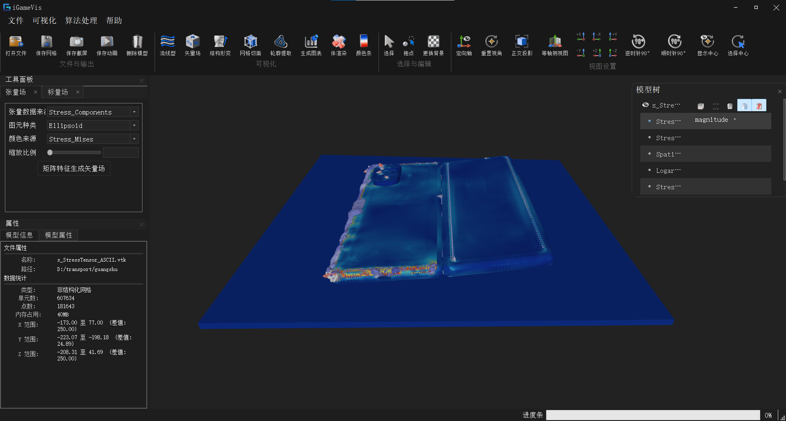

# Metric 11.3: Cloud Map / Adaptive Vector / Tensor / Deformation / Time-Series Flow / Animation Output

## Composition

For CAE simulation results, this metric provides multi-type field visualization plus time-series / animation capabilities. It comprises six sub-features (plus contour as a companion visualization):

| # | Sub-feature | Status |
|---|-------------|--------|
| 1 | Scalar cloud-map visualization | ✅ Implemented |
| 2 | Adaptive vector field (sampling: AllCell / CellInRange / EveryNth) | ✅ Implemented |
| 3 | Tensor-field visualization (ellipsoid / cuboid glyphs) | ✅ Implemented |
| 4 | Structural deformation visualization | ✅ Implemented (whole mesh; region-limited deform is TBD under 10.2) |
| 5 | Time-series flow fields and streamlines | ✅ Implemented |
| 6 | Animation playback and export (image sequence / MP4 / GIF) | ✅ Implemented (video export needs FFMPEG) |

> This document covers source paths, APIs, GUI, and examples for the above.
> Difference from **10.1**: 10.1 focuses on **analysis data generation** (entropy seeds, streamline filtering); 11.3 focuses on **field display and time playback**.
> Difference from **10.2**: 10.2 produces feature scalars / vortex predict; 11.3 visualizes them via cloud maps, time series, and deformation.
> Difference from **10.3**: 10.3 focuses on brush ↔ 3D linking; 11.3 focuses on standard field-visualization panels.

---

## Sub-feature 1: Scalar cloud maps

### Description

Map a selected `AttributeSet` attribute (and optional component `dimension`) to mesh colors. Supports continuous / interval cloud maps, color bars, and custom value ranges for scalars such as pressure, temperature, and vortex predict.

### Source Paths

| Path | Class / API | Notes |
|------|-------------|-------|
| `iGameCore/Core/DataModel/iGameDrawObject.*` | `ViewCloudPicture(Scene*, index, dimension=-1)` | Scalar coloring |
| same | `ViewCloudPictureOfModel(...)` | Bubble refresh to parent model |
| `iGameCore/Rendering/Core/iGameModel.*` | `Model::ViewCloudPicture` | Thin wrapper → DrawObject |
| `Qt/src/IQWidgets/igQtScalarViewWidget.*` | `igQtScalarViewWidget` | Cloud-map dock |

### How It Is Called

From `Examples/Rendering/SetScalarField.cpp`:

```cpp
auto scene = iGame::Scene::New();
auto dataObj = iGame::FileIO::ReadFile("./Models/Tet_Plane.vtk");
scene->AddModel(dataObj);

auto drawObj = iGame::DynamicCast<iGame::DrawObject>(dataObj);
drawObj->SetViewStyle(IG_WIREFRAME | IG_SURFACE);
// arg2 = attribute index; arg3 = component (-1 = magnitude / all)
drawObj->ViewCloudPicture(scene, 1, -1);
```

### GUI

| Entry | Notes |
|-------|-------|
| Menu View → Scalar / `action_Scalar` | Opens left “Scalar” panel |
| `dockWidget_ScalarField` / `igQtScalarViewWidget` | Cloud type, color bar, value range |


### Test Cases

| Target | Source | Default data |
|--------|--------|--------------|
| `testSetScalarField` | `Examples/Rendering/SetScalarField.cpp` | `./Models/Tet_Plane.vtk` |

---

## Sub-feature 2: Adaptive vector fields

### Description

Generate arrow glyphs from point / cell vector attributes. Here “adaptive” means **configurable sampling strategies** that control arrow density for readability, not mesh adaptive refinement.

| `DrawType` mode | Meaning | Main params |
|-----------------|---------|-------------|
| `AllCell` | Glyph at every point / cell center | — |
| `CellInRange` | Index range `[min, max)` only | `SetCellRange(min, max)` (default `0..100000`) |
| `EveryNth` | Keep every Nth sample | `SetNth(n)` (default `1200`) |

Arrow shape: `SetArrow(headRadius, headLength, tailRadius, tailLength)`.

### Source Paths

| Path | Class | Notes |
|------|-------|-------|
| `iGameCore/Filters/VectorView/iGameVectorBase.*` | `iGameVectorBase` | Glyphs + sampling modes |
| `Qt/src/IQWidgets/igQtVectorWidget.*` | `igQtVectorWidget` | Vector dock (mode switch) |

### How It Is Called

From `Examples/Filter/Vector/TestVector*.cpp` (`EveryNth` example):

```cpp
auto m_VectorBase = iGame::iGameVectorBase::New();
m_VectorBase->SetArrow(0.01, 0.03, 0.005, 0.04);  // headR, headL, tailR, tailL
m_VectorBase->SetInit(false);

// DrawType: AllCell / CellInRange / EveryNth
m_VectorBase->SetDrawMode(iGame::iGameVectorBase::DrawType::EveryNth);
m_VectorBase->SetNth(5);
// For CellInRange: m_VectorBase->SetCellRange(0, 1000);

m_VectorBase->DrawVector(vectorName, dataObj);  // vectorName from IG_VECTOR attribute
scene->AddModel(m_VectorBase);
scene->ChangeModelVisibility(0, false);         // optional: hide base mesh
```

### GUI

| Entry | Notes |
|-------|-------|
| Menu View → Vector / Glyph | Opens “Vector” panel |
| `dockWidget_VectorField` | Modes: 0=All, 1=Range, 2=EveryNth |


### Test Cases

| Target | Source | Default data | Sampling |
|--------|--------|--------------|----------|
| `testVector` | `Examples/Filter/Vector/TestVector.cpp` | `./Models/StreamTest.vtk` | `AllCell` |
| `testVectorAllCell` | `Examples/Filter/Vector/TestVectorAllCell.cpp` | `./Models/StreamTest.vtk` | `AllCell` |
| `testVectorCellInRange` | `Examples/Filter/Vector/TestVectorCellInRange.cpp` | Large CGNS (bring your own) | `CellInRange` |
| `testVectorEveryNth` | `Examples/Filter/Vector/TestVectorEveryNth.cpp` | `./Models/StreamTest.vtk` | `EveryNth` |
| `testVectorSubData` | `Examples/Filter/Vector/TestVectorSubData.cpp` | `CAD11/_frames.pvd` (bring your own) | Sub-data vectors |

---

## Sub-feature 3: Tensor fields

### Description

Eigen-decompose 3×3 tensors at points (stress / strain, etc.) and show principal directions/values as ellipsoid or cuboid glyphs. Optionally generate a principal eigenvector field.

| Param | API | Notes |
|-------|-----|-------|
| Glyph type | `SetGlyphType` | `ELLIPSOID` / `CUBOID` |
| Scale | `SetGlyphScale` / `UpdateGlyphScale` | Glyph size |
| Tessellation | `SetSliceNum` | Ellipsoid resolution |
| Data | `SetPoints` / `SetTensorAttributes` | 9-component / 3×3 tensors |

### Source Paths

| Path | Class | Notes |
|------|-------|-------|
| `iGameCore/Filters/TensorView/iGameTensorFilter.*` | `iGameTensorFilter` | Filter pipeline → SurfaceMesh glyphs |
| `iGameCore/Filters/TensorView/iGameTensorBase.*` | `iGameTensorBase` | GUI / DrawObject path |
| `iGameCore/Filters/TensorView/iGameTensorRepresentation.*` | `iGameTensorRepresentation` | Eigen + ELLIPSOID/CUBOID |
| `Qt/src/IQWidgets/igQtTensorWidget.*` | `igQtTensorWidget` | Tensor dock |

### How It Is Called

From `Examples/Filter/Tensor/TestTensorView.cpp`:

```cpp
auto mesh = iGame::DynamicCast<iGame::PointSet>(
    iGame::FileIO::ReadFile("./Models/Quad_Plane_Tensor.vtk"));

// Find point-attached IG_TENSOR (9 components / 3×3) in AttributeSet
iGame::ArrayObject::Pointer tensorData = /* ... */;

auto m_TensorFilter = iGame::iGameTensorFilter::New();
m_TensorFilter->SetInput(mesh);
m_TensorFilter->SetTensorAttributes(tensorData);
m_TensorFilter->SetGlyphType(iGame::iGameTensorRepresentation::CUBOID);  // or ELLIPSOID
m_TensorFilter->SetSliceNum(5);
m_TensorFilter->SetGlyphScale(0.02);

if (m_TensorFilter->Execute()) {
    auto res = iGame::DynamicCast<iGame::DrawObject>(m_TensorFilter->GetOutput());
    scene->AddModel(res);
    if (res->GetAttributeSet()->GetNumberOfAttributes() > 0) {
        res->ViewCloudPicture(scene, 0);  // optional: color glyphs by attribute
    }
}
```

GUI path may also use `iGameTensorBase::ShowTensorField()`.

### GUI

| Entry | Notes |
|-------|-------|
| Menu View → Tensor / `action_Tensor` | Opens “Tensor” panel |
| `dockWidget_TensorField` | Glyph type, scale, coloring |



> Only ellipsoid and cuboid glyphs are implemented; the representation class notes room for later glyph types.

### Test Cases

| Target | Source | Default data |
|--------|--------|--------------|
| `testTensorView` | `Examples/Filter/Tensor/TestTensorView.cpp` | `./Models/Quad_Plane_Tensor.vtk` |

---

## Sub-feature 4: Structural deformation

### Description

Offset **render coordinates** by a displacement vector attribute: \(p' = p + (s_x, s_y, s_z) \cdot U\). Supports uniform / non-uniform scale factors and an ideal DSF estimate \(DSF \approx K \cdot \sqrt[3]{V_{bbox}} / U_{max}\) (\(K \approx 0.15\)).

Deformation state lives on each `DataObject` via `DeformationData`. When animation play has deformation enabled, it is reapplied each frame.

### Source Paths

| Path | Class / API | Notes |
|------|-------------|-------|
| `iGameCore/Core/Common/iGameDeformationData.*` | `DeformationData` | Scales, attribute name, enable, auto DSF |
| `iGameCore/Filters/Deformation/iGameStressDeformationFilter.*` | `StressDeformationFilter` | In-place render-point offset (GUI) |
| `iGameCore/Filters/Deformation/iGameStressDeformationFilterCode.*` | `StressDeformationCodeFilter` | Variant that can emit new geometry (examples) |
| `Qt/src/IQWidgets/igQtDeformationWidget.*` | `igQtDeformationWidget` | Deformation dock |

### How It Is Called

Full API is in `Examples/Filter/Deformation/TestStressDeformationFilterCode.cpp`:

```cpp
auto obj = iGame::FileIO::ReadFile("./Models/sukong_Step-1_2.vtu");  // bring your own
auto filter = iGame::StressDeformationCodeFilter::New();  // GUI uses StressDeformationFilter

obj->GetDeformationData()->SetAttributeName("UVW");  // displacement vector name
filter->SetInput(obj);
filter->CalculateIdealDSF();   // or SetScaleFactorX/Y/Z
filter->Execute();             // p' = p + s * U

auto res = filter->GetOutput(0);  // Code variant emits new geometry; Filter offsets in place
scene->AddModel(res);
```

### GUI

| Entry | Notes |
|-------|-------|
| Toolbar `action_deformation` / `action_StrucDeformation` | Opens deformation panel |
| `DeformationDockWidget` (created in code, moved into left tabs) | Vector attribute, auto/uniform/non-uniform DSF, enable offset, execute |


> **Region-limited deformation** is not wired yet; current behavior is whole-mesh offset. See `README_10.2.md` sub-feature 4 for the planned selection binding.

### Test Cases

| Target | Source | Default data | Notes |
|--------|--------|--------------|-------|
| `testDeformation` | `Examples/Filter/Deformation/TestStressDeformationFilter.cpp` | `./Models/sukong_Step-1_2.vtu` (bring your own) |
| `testDeformationCode` | `Examples/Filter/Deformation/TestStressDeformationFilterCode.cpp` | Hardcoded local VTU; comment uses `sukong_Step-1_2.vtu` | Explicit DSF + `Execute` |

---

## Sub-feature 5: Time-series flow fields and streamlines

### Description

Two related capabilities:

1. **Time-series switching**: move between timesteps (e.g. PVD) by swapping meshes or attribute sets.
2. **Streamline visualization**: seed and integrate on a vector field; the GUI can also use entropy seeding and streamline filtering (algorithm details in **10.1**).

The menu item “Time-series flow field” opens the **streamline / flow panel**; timeline playback is in the Animation panel (sub-feature 6).

### Time-series data model

| `StreamingType` | Meaning |
|-----------------|---------|
| `MultiSubFiles` | One sub-mesh / file per frame (typical PVD) |
| `SingleFieldAttributes` | Same mesh; swap `AttributeSet` per frame |

Key APIs: `DataObject::UpdateAnimation(keyframeIdx)`, `GetTimeFrames()`.

### Source Paths

| Path | Class | Notes |
|------|-------|-------|
| `iGameCore/Core/DataModel/iGameDataObject.*` | `UpdateAnimation` | Frame switch |
| `iGameCore/Core/Common/iGameStreamingData.*` | `StreamingData` / `TimeFrame` | Frame list + cache |
| `iGameCore/IO/VTK XML/iGamePVDReader.*` | `iGamePVDReader` | PVD → MultiSubFiles |
| `iGameCore/Filters/StreamView/iGameStreamTracer.*` | `StreamTracer` | Integration / seeding |
| `iGameCore/Filters/StreamView/iGameStreamBase.*` | `StreamBase` | Drawable streamline container |
| `iGameCore/Filters/StreamView/iGameStreamlineSimplifier.*` | `StreamlineSimplifier` | Filtering (10.1) |
| `Qt/src/IQWidgets/igQtStreamTracerWidget.*` | `igQtStreamTracerWidget` | Flow dock |

### How It Is Called

**Time switch + vector refresh** (`Examples/Filter/Vector/TestTimeVaryingVector.cpp`):

```cpp
auto obj = iGame::FileIO::ReadFile("./Models/redsea/1.pvd");  // bring your own
auto currentDrawObject = iGame::DynamicCast<iGame::DrawObject>(obj);
currentDrawObject->GetTimeFrames()->EnableCache(1000);
currentDrawObject->UpdateAnimation(8);

auto m_VectorBase = iGame::iGameVectorBase::New();
m_VectorBase->SetArrow(0.1, 0.3, 0.5, 0.4);
m_VectorBase->SetInit(false);
m_VectorBase->SetDrawMode(iGame::iGameVectorBase::DrawType::EveryNth);
m_VectorBase->SetNth(1200);
m_VectorBase->DrawVector(vectorName, dataObj);
scene->AddModel(m_VectorBase);
```

**Streamlines** (`Examples/Filter/Vector/TestStreamline.cpp`):

```cpp
auto m_StreamBase = iGame::StreamBase::New();
auto streamtracer = m_StreamBase->streamFilter;
streamtracer->initStreamTracer(dataObj);

auto boundMax = streamtracer->GetMesh()->GetBoundingBox().max;
auto boundMin = streamtracer->GetMesh()->GetBoundingBox().min;
auto centerMax = (boundMax - boundMin) / 5 + boundMin;
auto seeds = streamtracer->getAllSubBlockCenters(
    boundMax, boundMin, centerMax, boundMin, 2, 4, 2, 2, 4, 2);

streamtracer->SetInput(seeds, vectorName, /*length*/5.f, /*step*/0.3f,
                       /*terminalSpeed*/0.005f, /*maxSteps*/1000.f);
streamtracer->Execute();
m_StreamBase->SetUpdate(true);
scene->AddModel(m_StreamBase);
```

### GUI

| Entry | Notes |
|-------|-------|
| Menu View → Time-series flow / `action_FlowField` | Opens flow / streamline panel |
| `dockWidget_FlowField` | Seeding, integration, Cluster filtering |
| Toolbar Streamline | Same panel |


### Test Cases

| Target | Source | Default data | Notes |
|--------|--------|--------------|-------|
| `testTimeVaryingVector` | `Examples/Filter/Vector/TestTimeVaryingVector.cpp` | `./Models/redsea/1.pvd` (bring your own) | Time frame + vector glyphs |
| `testStreamline` | `Examples/Filter/Vector/TestStreamline.cpp` | `./Models/kit.vtk` | Streamline integration |

---

## Sub-feature 6: Animation playback and export

### Description

Play the timeline of loaded time-series data and export as an image sequence, MP4, or GIF. Each played frame may optionally reapply deformation and refresh the cloud map.

### Playback flow (GUI)

Typical Snap path in `igQtAnimationWidget`:

```text
UpdateAnimation(i)
  → ConvertToDrawableData if needed
  → if deformation enabled: StressDeformationFilter::Execute
  → refresh cloud map / scene
```

Also supports interpolate playback (VCR path) and configurable frame cache size.

### How It Is Called

**Single-frame prepare / play one frame** (`PlayAnimation` in `Examples/Animation/SaveAnimation.cpp`):

```cpp
auto currentDrawObject = iGame::DynamicCast<iGame::DrawObject>(obj);
currentDrawObject->GetTimeFrames()->EnableCache(1000);
currentDrawObject->UpdateAnimation(keyframe_idx);

if (obj->GetDeformationData()->GetEnableStatus()) {
    auto deformFilter = iGame::StressDeformationFilter::New();
    deformFilter->SetInput(currentDrawObject);
    deformFilter->Execute();
}
if (currentDrawObject->GetAttributeIndex() != -1) {
    currentDrawObject->ViewCloudPicture(scene, currentDrawObject->GetAttributeIndex());
}
scene->Draw();
```

**Export MP4 / GIF** (`SaveAnimationToMP4` / `SaveAnimationToGIF`):

```cpp
auto obj = iGame::FileIO::ReadFile("./Models/CAD11/_frames.pvd");  // bring your own
scene->AddModel(obj);

iGame::VideoInputInfo inputInfo;
inputInfo.width = 1920;
inputInfo.height = 1080;
inputInfo.bit_rate = 1000000;
inputInfo.frame_rate = 1;

for (int i = 0; i < obj->GetTimeFrames()->GetTimeNum(); ++i) {
    PlayAnimation(obj, scene, i);
    auto rgba = scene->CaptureScreen(0, 0, 1920, 1080, iGame::GLFramebuffer::Type::RGBA, true);
    inputInfo.bytes_per_line = 1920 * 4;
    inputInfo.raw_image_data.emplace_back(rgba);
}

auto writer = iGame::FFMPEGVideoWriter::New();
inputInfo.output_path = "./AnimationExample.mp4";
writer->SetVideoInputInfo(inputInfo);
writer->SaveMP4();   // or SaveGIF()
```

| Export form | Condition |
|-------------|-----------|
| PNG / screenshot sequence | Always available |
| MP4 / GIF | Requires `FFMPEG_FOUND` at build time (`FFMPEG_ENABLE`) |

### Source Paths

| Path | Class | Notes |
|------|-------|-------|
| `Qt/src/IQWidgets/igQtAnimationWidget.*` | `igQtAnimationWidget` | Play / export dock |
| `Qt/src/IQWidgets/igQtAnimationVcrController.*` | VCR controller | Playback control |
| `iGameCore/IO/FFMPEG/iGameFFMPEGVideoWriter.*` | `FFMPEGVideoWriter` | `SaveMP4` / `SaveGIF` |
| `Examples/Animation/SaveAnimation.cpp` | `testSaveAnimation` | Export example |

### GUI

| Entry | Notes |
|-------|-------|
| Menu View → Animation export / `action_ExportAnimation` | Opens bottom animation dock |
| `dockWidget_Animation` | Play, cache, export |
| Toolbar `action_SaveAnimation` | Calls `saveAnimation()` |


### Test Cases

| Target | Source | Default data | Condition |
|--------|--------|--------------|-----------|
| `testAnimation` | `Examples/Animation/TestAnimation.cpp` | `./Models/CAD11/_frames.pvd` (bring your own) | default |
| `testSaveAnimation` | `Examples/Animation/SaveAnimation.cpp` | `./Models/CAD11/_frames.pvd` (bring your own) | `FFMPEG_FOUND` |

---

## Related Examples (summary)

| Target | Notes | Condition |
|--------|-------|-----------|
| `testSetScalarField` | Cloud map | default |
| `testVector` / `testVectorAllCell` / `testVectorCellInRange` / `testVectorEveryNth` / `testVectorSubData` | Vector sampling modes | default |
| `testTensorView` | Tensor glyphs | default |
| `testDeformation` | Deformation (minimal) | default |
| `testDeformationCode` | Explicit DSF + Execute | default |
| `testTimeVaryingVector` | Time series + vectors | default |
| `testStreamline` | Streamlines | default |
| `testContourLine` | Isolines | default |
| `testAnimation` | Animation play setup | default |
| `testSaveAnimation` | Animation export | `FFMPEG_FOUND` |
