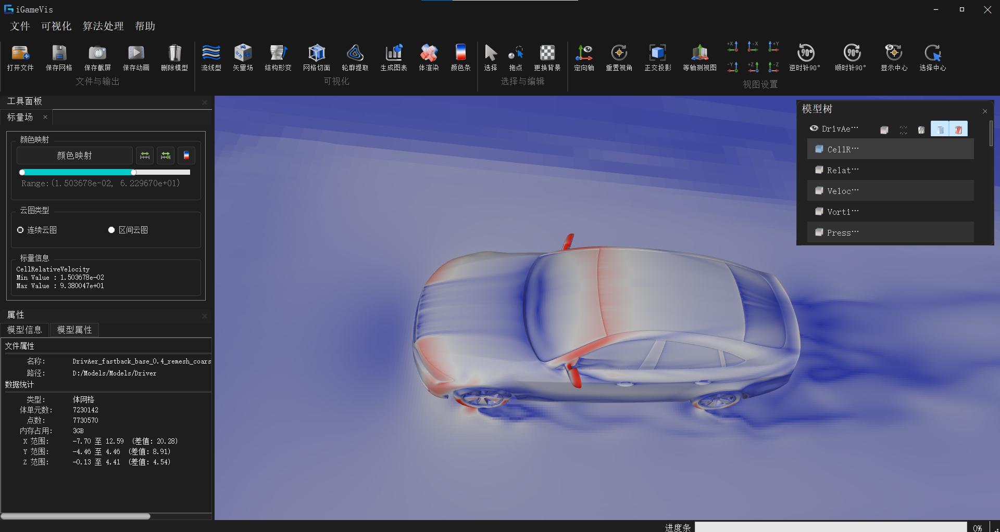
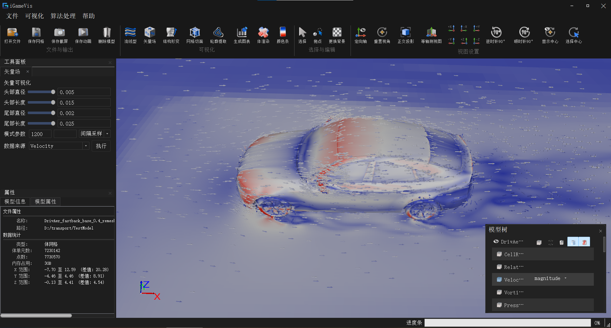
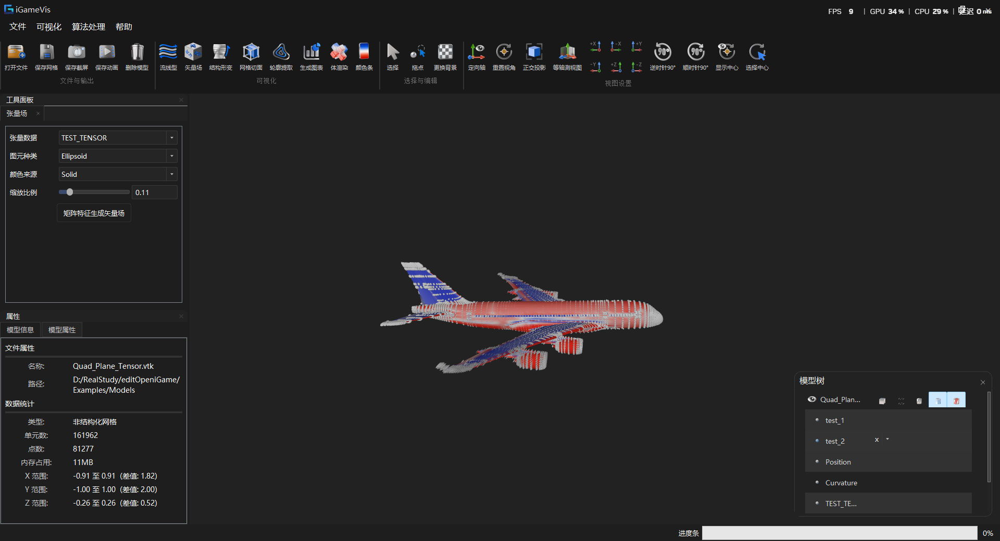
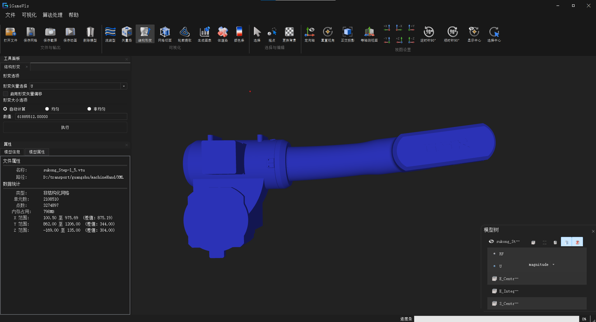
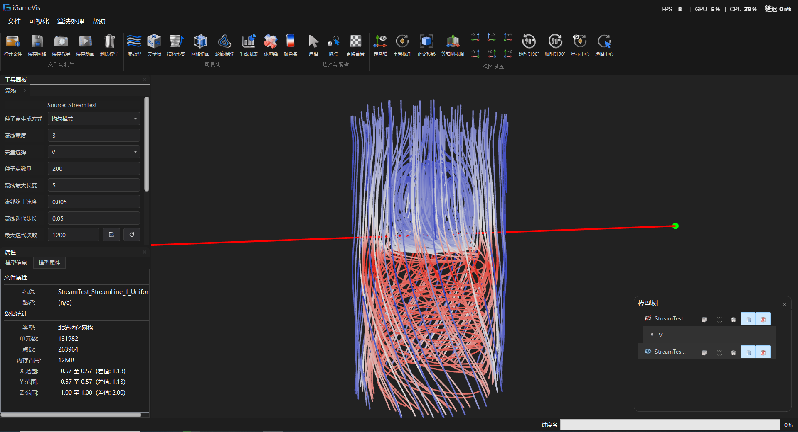
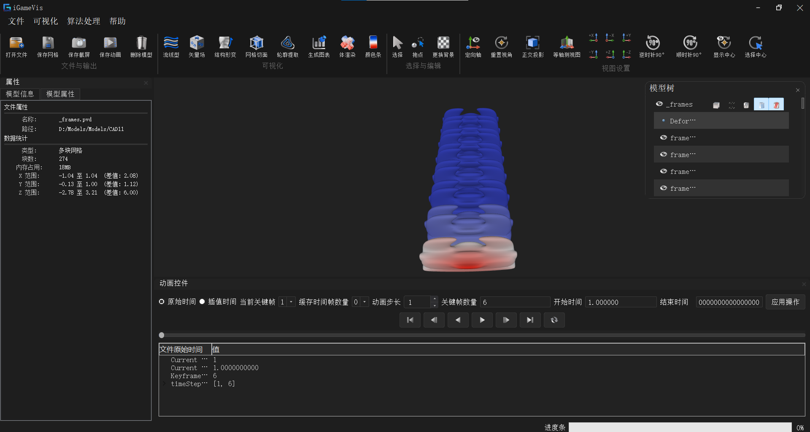

# 指标 11.3：云图 / 自适应矢量场 / 张量场 / 结构形变 / 时序流场 / 动画输出可视化

## 指标构成

面向 CAE 仿真结果，提供多类型场可视化输出与时序 / 动画能力，共含六个子功能（另含等值面作为配套可视化）：

| # | 子功能 | 状态 |
|---|--------|------|
| 1 | 标量云图可视化 | ✅ 已实现 |
| 2 | 自适应矢量场（采样模式：全单元 / 区间 / 每隔 N 个） | ✅ 已实现 |
| 3 | 张量场可视化（椭球 / 立方体 Glyph） | ✅ 已实现 |
| 4 | 结构形变可视化 | ✅ 已实现（整模；选中区域限定形变见 10.2 待增强） |
| 5 | 时序流场与流线可视化 | ✅ 已实现 |
| 6 | 动画播放与动画输出（截图序列 / MP4 / GIF） | ✅ 已实现（视频导出需 FFMPEG） |

> 本文档记录上述子功能的源码路径、API、GUI 与示例。
> 与 **10.1** 的区别：10.1 侧重熵种子 / 流线筛选等**分析数据生成**；11.3 侧重**场显示与时序播放**。
> 与 **10.2** 的区别：10.2 产出特征标量 / 涡预测；11.3 用云图、时序、形变把结果可视化出来。
> 与 **10.3** 的区别：10.3 侧重刷选 ↔ 3D 联动；11.3 侧重标准场可视化面板。

---

## 子功能 1：标量云图

### 功能说明

将 `AttributeSet` 中指定属性（及可选分量 `dimension`）映射为网格颜色，支持连续云图 / 区间云图、色带与自定义数值范围，用于压力、温度、涡预测等标量场显示。

### 源码路径

| 路径 | 类 / API | 说明 |
|------|----------|------|
| `iGameCore/Core/DataModel/iGameDrawObject.*` | `ViewCloudPicture(Scene*, index, dimension=-1)` | 标量云图着色 |
| 同上 | `ViewCloudPictureOfModel(...)` | 向上层模型冒泡刷新 |
| `iGameCore/Rendering/Core/iGameModel.*` | `Model::ViewCloudPicture` | 薄封装 → DrawObject |
| `Qt/src/IQWidgets/igQtScalarViewWidget.*` | `igQtScalarViewWidget` | 云图 Dock |

### 调用方式

对应示例 `Examples/Rendering/SetScalarField.cpp`：

```cpp
auto scene = iGame::Scene::New();
auto dataObj = iGame::FileIO::ReadFile("./Models/Tet_Plane.vtk");
scene->AddModel(dataObj);

auto drawObj = iGame::DynamicCast<iGame::DrawObject>(dataObj);
drawObj->SetViewStyle(IG_WIREFRAME | IG_SURFACE);
// 第 2 个参数为属性索引；第 3 个为分量，-1 表示按模长 / 全部分量
drawObj->ViewCloudPicture(scene, 1, -1);
```

### GUI

| 入口 | 说明 |
|------|------|
| 菜单「可视化」→ 标量场 / `action_Scalar` | 打开左侧「标量场」面板 |
| `dockWidget_ScalarField` / `igQtScalarViewWidget` | 云图类型、色带、数值范围 |



### 测试用例

| Target | 源文件 | 默认数据 |
|--------|--------|----------|
| `testSetScalarField` | `Examples/Rendering/SetScalarField.cpp` | `./Models/Tet_Plane.vtk` |

---

## 子功能 2：自适应矢量场

### 功能说明

在点 / 单元矢量属性上生成箭头 Glyph。此处「自适应」指**可配置的采样策略**，在保证流场可读性的同时控制箭头密度，而非网格自适应加密。

| 采样模式 `DrawType` | 含义 | 主要参数 |
|---------------------|------|----------|
| `AllCell` | 每个点 / 单元中心都画 | — |
| `CellInRange` | 仅索引区间 `[min, max)` | `SetCellRange(min, max)`（默认 `0..100000`） |
| `EveryNth` | 每隔 N 个采样一个 | `SetNth(n)`（默认 `1200`） |

箭头外形：`SetArrow(headRadius, headLength, tailRadius, tailLength)`。

### 源码路径

| 路径 | 类 | 说明 |
|------|-----|------|
| `iGameCore/Filters/VectorView/iGameVectorBase.*` | `iGameVectorBase` | 矢量 Glyph 与采样模式 |
| `Qt/src/IQWidgets/igQtVectorWidget.*` | `igQtVectorWidget` | 矢量场 Dock（模式切换） |

### 调用方式

对应示例 `Examples/Filter/Vector/TestVector*.cpp`（以 `EveryNth` 为例）：

```cpp
auto m_VectorBase = iGame::iGameVectorBase::New();
m_VectorBase->SetArrow(0.01, 0.03, 0.005, 0.04);  // headR, headL, tailR, tailL
m_VectorBase->SetInit(false);

// DrawType: AllCell / CellInRange / EveryNth
m_VectorBase->SetDrawMode(iGame::iGameVectorBase::DrawType::EveryNth);
m_VectorBase->SetNth(5);
// CellInRange 时：m_VectorBase->SetCellRange(0, 1000);

m_VectorBase->DrawVector(vectorName, dataObj);  // vectorName 来自 IG_VECTOR 属性名
scene->AddModel(m_VectorBase);
scene->ChangeModelVisibility(0, false);         // 可选：隐藏原网格只看箭头
```

### GUI

| 入口 | 说明 |
|------|------|
| 菜单「可视化」→ 矢量场 / Glyph | 打开「矢量场」面板 |
| `dockWidget_VectorField` | 模式：0=All，1=Range，2=EveryNth |



### 测试用例

| Target | 源文件 | 默认数据 | 采样模式 |
|--------|--------|----------|----------|
| `testVector` | `Examples/Filter/Vector/TestVector.cpp` | `./Models/StreamTest.vtk` | `AllCell` |
| `testVectorAllCell` | `Examples/Filter/Vector/TestVectorAllCell.cpp` | `./Models/StreamTest.vtk` | `AllCell` |
| `testVectorCellInRange` | `Examples/Filter/Vector/TestVectorCellInRange.cpp` | 大 CGNS（需自备） | `CellInRange` |
| `testVectorEveryNth` | `Examples/Filter/Vector/TestVectorEveryNth.cpp` | `./Models/StreamTest.vtk` | `EveryNth` |
| `testVectorSubData` | `Examples/Filter/Vector/TestVectorSubData.cpp` | `CAD11/_frames.pvd`（需自备） | 子数据矢量 |

---

## 子功能 3：张量场

### 功能说明

对点上的 3×3 张量（应力 / 应变等）做特征分解，以椭球或立方体 Glyph 显示主方向与主值；可选生成主特征向量场。

| 参数 | API | 说明 |
|------|-----|------|
| Glyph 类型 | `SetGlyphType` | `ELLIPSOID` / `CUBOID` |
| 缩放 | `SetGlyphScale` / `UpdateGlyphScale` | Glyph 尺寸 |
| 细分 | `SetSliceNum` | 椭球分辨率 |
| 数据 | `SetPoints` / `SetTensorAttributes` | 9 分量 / 3×3 张量 |

### 源码路径

| 路径 | 类 | 说明 |
|------|-----|------|
| `iGameCore/Filters/TensorView/iGameTensorFilter.*` | `iGameTensorFilter` | Filter 管线 → SurfaceMesh Glyph |
| `iGameCore/Filters/TensorView/iGameTensorBase.*` | `iGameTensorBase` | GUI / DrawObject 路径 |
| `iGameCore/Filters/TensorView/iGameTensorRepresentation.*` | `iGameTensorRepresentation` | 特征分解 + ELLIPSOID/CUBOID |
| `Qt/src/IQWidgets/igQtTensorWidget.*` | `igQtTensorWidget` | 张量场 Dock |

### 调用方式

对应示例 `Examples/Filter/Tensor/TestTensorView.cpp`：

```cpp
auto mesh = iGame::DynamicCast<iGame::PointSet>(
    iGame::FileIO::ReadFile("./Models/Quad_Plane_Tensor.vtk"));

// 从属性集中找点上的 IG_TENSOR（9 分量 / 3×3）
iGame::ArrayObject::Pointer tensorData = /* ... */;

auto m_TensorFilter = iGame::iGameTensorFilter::New();
m_TensorFilter->SetInput(mesh);
m_TensorFilter->SetTensorAttributes(tensorData);
m_TensorFilter->SetGlyphType(iGame::iGameTensorRepresentation::CUBOID);  // 或 ELLIPSOID
m_TensorFilter->SetSliceNum(5);
m_TensorFilter->SetGlyphScale(0.02);

if (m_TensorFilter->Execute()) {
    auto res = iGame::DynamicCast<iGame::DrawObject>(m_TensorFilter->GetOutput());
    scene->AddModel(res);
    if (res->GetAttributeSet()->GetNumberOfAttributes() > 0) {
        res->ViewCloudPicture(scene, 0);  // 可选：用 Glyph 属性着色
    }
}
```

GUI 路径也可通过 `iGameTensorBase::ShowTensorField()` 显示。

### GUI

| 入口 | 说明 |
|------|------|
| 菜单「可视化」→ 张量场 / `action_Tensor` | 打开「张量场」面板 |
| `dockWidget_TensorField` | Glyph 类型、缩放、着色 |



> 当前 Glyph 仅实现椭球与立方体；表示类中预留了后续扩展注释。

### 测试用例

| Target | 源文件 | 默认数据 |
|--------|--------|----------|
| `testTensorView` | `Examples/Filter/Tensor/TestTensorView.cpp` | `./Models/Quad_Plane_Tensor.vtk` |

---

## 子功能 4：结构形变

### 功能说明

按位移矢量属性，将**渲染坐标**偏移：\(p' = p + (s_x, s_y, s_z) \cdot U\)。支持均匀 / 非均匀缩放因子，以及理想 DSF 估算 \(DSF \approx K \cdot \sqrt[3]{V_{bbox}} / U_{max}\)（\(K \approx 0.15\)）。

形变状态挂在每个 `DataObject` 的 `DeformationData` 上；动画播放时若开启形变，会在每帧重新应用。

### 源码路径

| 路径 | 类 / API | 说明 |
|------|----------|------|
| `iGameCore/Core/Common/iGameDeformationData.*` | `DeformationData` | 缩放因子、属性名、开关、自动 DSF |
| `iGameCore/Filters/Deformation/iGameStressDeformationFilter.*` | `StressDeformationFilter` | 原地偏移渲染点（GUI 使用） |
| `iGameCore/Filters/Deformation/iGameStressDeformationFilterCode.*` | `StressDeformationCodeFilter` | 可输出新几何的变体（示例） |
| `Qt/src/IQWidgets/igQtDeformationWidget.*` | `igQtDeformationWidget` | 形变 Dock |

### 调用方式

完整 API 见 `Examples/Filter/Deformation/TestStressDeformationFilterCode.cpp`：

```cpp
auto obj = iGame::FileIO::ReadFile("./Models/sukong_Step-1_2.vtu");  // 需自备
auto filter = iGame::StressDeformationCodeFilter::New();  // GUI 路径用 StressDeformationFilter

obj->GetDeformationData()->SetAttributeName("UVW");  // 位移矢量属性名
filter->SetInput(obj);
filter->CalculateIdealDSF();   // 估算理想缩放；也可 SetScaleFactorX/Y/Z
filter->Execute();             // p' = p + s * U

auto res = filter->GetOutput(0);  // Code 变体可得到新几何；Filter 变体原地改渲染点
scene->AddModel(res);
```

### GUI

| 入口 | 说明 |
|------|------|
| 工具栏 `action_deformation` / `action_StrucDeformation` | 打开形变面板 |
| `DeformationDockWidget`（代码创建，并入左侧 Tab） | 矢量属性、自动/均匀/非均匀 DSF、启用偏移、执行 |



> **选中区域单独形变**尚未接入；当前为整模偏移。与选区绑定的增强见 `README_10.2.md` 子功能 4。

### 测试用例

| Target | 源文件 | 默认数据 | 说明 |
|--------|--------|----------|------|
| `testDeformation` | `Examples/Filter/Deformation/TestStressDeformationFilter.cpp` | `./Models/sukong_Step-1_2.vtu`（需自备）
| `testDeformationCode` | `Examples/Filter/Deformation/TestStressDeformationFilterCode.cpp` | 示例写死本地 VTU；注释中为 `sukong_Step-1_2.vtu` | 显式 DSF + `Execute` |

---

## 子功能 5：时序流场与流线

### 功能说明

两部分能力：

1. **时序数据切换**：多时间步仿真（PVD 等）在帧之间切换网格或属性集，用于观察流场随时间变化。
2. **流线可视化**：在矢量场上布种并积分，得到流线；GUI 还可结合信息熵种子与流线筛选（算法细节见 **10.1**）。

菜单中「时序流场」打开的是**流线 / 流场面板**；时间轴播放在「动画」面板（子功能 6）。

### 时序数据模型

| `StreamingType` | 含义 |
|-----------------|------|
| `MultiSubFiles` | 每帧对应子网格 / 文件（典型 PVD） |
| `SingleFieldAttributes` | 同一网格，每帧切换 `AttributeSet` |

关键 API：`DataObject::UpdateAnimation(keyframeIdx)`、`GetTimeFrames()`。

### 源码路径

| 路径 | 类 | 说明 |
|------|-----|------|
| `iGameCore/Core/DataModel/iGameDataObject.*` | `UpdateAnimation` | 时序帧切换 |
| `iGameCore/Core/Common/iGameStreamingData.*` | `StreamingData` / `TimeFrame` | 帧列表与缓存 |
| `iGameCore/IO/VTK XML/iGamePVDReader.*` | `iGamePVDReader` | PVD → MultiSubFiles |
| `iGameCore/Filters/StreamView/iGameStreamTracer.*` | `StreamTracer` | 积分 / 布种 |
| `iGameCore/Filters/StreamView/iGameStreamBase.*` | `StreamBase` | 可绘制流线容器 |
| `iGameCore/Filters/StreamView/iGameStreamlineSimplifier.*` | `StreamlineSimplifier` | 流线筛选（10.1） |
| `Qt/src/IQWidgets/igQtStreamTracerWidget.*` | `igQtStreamTracerWidget` | 流场 Dock |

### 调用方式

**时序切换 + 矢量刷新**（`Examples/Filter/Vector/TestTimeVaryingVector.cpp`）：

```cpp
auto obj = iGame::FileIO::ReadFile("./Models/redsea/1.pvd");  // 需自备
auto currentDrawObject = iGame::DynamicCast<iGame::DrawObject>(obj);
currentDrawObject->GetTimeFrames()->EnableCache(1000);
currentDrawObject->UpdateAnimation(8);  // 切到指定帧

auto m_VectorBase = iGame::iGameVectorBase::New();
m_VectorBase->SetArrow(0.1, 0.3, 0.5, 0.4);
m_VectorBase->SetInit(false);
m_VectorBase->SetDrawMode(iGame::iGameVectorBase::DrawType::EveryNth);
m_VectorBase->SetNth(1200);
m_VectorBase->DrawVector(vectorName, dataObj);
scene->AddModel(m_VectorBase);
```

**流线**（`Examples/Filter/Vector/TestStreamline.cpp`）：

```cpp
auto m_StreamBase = iGame::StreamBase::New();
auto streamtracer = m_StreamBase->streamFilter;
streamtracer->initStreamTracer(dataObj);

auto boundMax = streamtracer->GetMesh()->GetBoundingBox().max;
auto boundMin = streamtracer->GetMesh()->GetBoundingBox().min;
auto centerMax = (boundMax - boundMin) / 5 + boundMin;
auto seeds = streamtracer->getAllSubBlockCenters(
    boundMax, boundMin, centerMax, boundMin, 2, 4, 2, 2, 4, 2);

streamtracer->SetInput(seeds, vectorName, /*length*/5.f, /*step*/0.3f,
                       /*terminalSpeed*/0.005f, /*maxSteps*/1000.f);
streamtracer->Execute();
m_StreamBase->SetUpdate(true);
scene->AddModel(m_StreamBase);
```

### GUI

| 入口 | 说明 |
|------|------|
| 菜单「可视化」→ 时序流场 / `action_FlowField` | 打开「流场」流线面板 |
| `dockWidget_FlowField` | 布种、积分参数、筛选（Cluster） |
| 工具栏 Streamline | 同上 |



### 测试用例

| Target | 源文件 | 默认数据 | 说明 |
|--------|--------|----------|------|
| `testTimeVaryingVector` | `Examples/Filter/Vector/TestTimeVaryingVector.cpp` | `./Models/redsea/1.pvd`（需自备） | 时序帧 + 矢量 Glyph |
| `testStreamline` | `Examples/Filter/Vector/TestStreamline.cpp` | `./Models/kit.vtk` | 流线积分 |

---

## 子功能 6：动画播放与动画输出

### 功能说明

在已加载的时序数据上播放时间轴，并可导出为截图序列、MP4 或 GIF。播放每一帧时可选重新应用形变与刷新云图。

### 播放流程（GUI）

`igQtAnimationWidget` 典型路径（Snap 模式）：

```text
UpdateAnimation(i)
  → 必要时 ConvertToDrawableData
  → 若开启形变：StressDeformationFilter::Execute
  → 刷新云图 / 场景
```

另支持插值播放（VCR / interpolate 路径）与缓存帧数配置。

### 调用方式

**单帧准备 / 播放一帧**（`Examples/Animation/SaveAnimation.cpp` 中的 `PlayAnimation`）：

```cpp
auto currentDrawObject = iGame::DynamicCast<iGame::DrawObject>(obj);
currentDrawObject->GetTimeFrames()->EnableCache(1000);
currentDrawObject->UpdateAnimation(keyframe_idx);

if (obj->GetDeformationData()->GetEnableStatus()) {
    auto deformFilter = iGame::StressDeformationFilter::New();
    deformFilter->SetInput(currentDrawObject);
    deformFilter->Execute();
}
if (currentDrawObject->GetAttributeIndex() != -1) {
    currentDrawObject->ViewCloudPicture(scene, currentDrawObject->GetAttributeIndex());
}
scene->Draw();
```

**导出 MP4 / GIF**（同文件 `SaveAnimationToMP4` / `SaveAnimationToGIF`）：

```cpp
auto obj = iGame::FileIO::ReadFile("./Models/CAD11/_frames.pvd");  // 需自备
scene->AddModel(obj);

iGame::VideoInputInfo inputInfo;
inputInfo.width = 1920;
inputInfo.height = 1080;
inputInfo.bit_rate = 1000000;
inputInfo.frame_rate = 1;

for (int i = 0; i < obj->GetTimeFrames()->GetTimeNum(); ++i) {
    PlayAnimation(obj, scene, i);
    auto rgba = scene->CaptureScreen(0, 0, 1920, 1080, iGame::GLFramebuffer::Type::RGBA, true);
    inputInfo.bytes_per_line = 1920 * 4;
    inputInfo.raw_image_data.emplace_back(rgba);
}

auto writer = iGame::FFMPEGVideoWriter::New();
inputInfo.output_path = "./AnimationExample.mp4";
writer->SetVideoInputInfo(inputInfo);
writer->SaveMP4();   // 或 SaveGIF()
```

| 导出形式 | 条件 |
|----------|------|
| PNG / 截图序列 | 默认可用 |
| MP4 / GIF | 需编译期 `FFMPEG_FOUND`，定义 `FFMPEG_ENABLE` |

### 源码路径

| 路径 | 类 | 说明 |
|------|-----|------|
| `Qt/src/IQWidgets/igQtAnimationWidget.*` | `igQtAnimationWidget` | 播放 / 导出 Dock |
| `Qt/src/IQWidgets/igQtAnimationVcrController.*` | VCR 控制器 | 播放控制 |
| `iGameCore/IO/FFMPEG/iGameFFMPEGVideoWriter.*` | `FFMPEGVideoWriter` | `SaveMP4` / `SaveGIF` |
| `Examples/Animation/SaveAnimation.cpp` | `testSaveAnimation` | 导出示例 |

### GUI

| 入口 | 说明 |
|------|------|
| 菜单「可视化」→ 动画输出可视化 / `action_ExportAnimation` | 打开底部动画 Dock |
| `dockWidget_Animation` | 播放、缓存、导出 |
| 工具栏 `action_SaveAnimation` | 触发 `saveAnimation()` |



### 测试用例

| Target | 源文件 | 默认数据 | 条件 |
|--------|--------|----------|------|
| `testAnimation` | `Examples/Animation/TestAnimation.cpp` | `./Models/CAD11/_frames.pvd`（需自备） | 默认 |
| `testSaveAnimation` | `Examples/Animation/SaveAnimation.cpp` | `./Models/CAD11/_frames.pvd`（需自备） | 需 `FFMPEG_FOUND` |

---

## 配套：等值面 / 等值线

虽未写入指标标题六项，但同属场可视化输出，GUI 与示例已接入。

| 路径 | 说明 |
|------|------|
| `iGameCore/Filters/Contour/iGameContourFilter.*` | 等值面 / 等值线 |
| `Qt/src/IQWidgets/igQtContourExtractWidget.*` | `dockWidget_ContourExtract` |
| 示例 `testContourLine` | 等值线 |

---

## Meshlet 加速（可选）

大网格云图 / 绘制可通过 Meshlet 加速：

```cpp
drawObj->SetAccelerationOption(/* ... */);
```

见 `iGameDrawObject::SetAccelerationOption`，细节可对照指标 **11.4**。

---

## 相关示例汇总

| 示例 Target | 说明 | 条件 |
|-------------|------|------|
| `testSetScalarField` | 云图 | 默认 |
| `testVector` / `testVectorAllCell` / `testVectorCellInRange` / `testVectorEveryNth` / `testVectorSubData` | 矢量场采样模式 | 默认 |
| `testTensorView` | 张量 Glyph | 默认 |
| `testDeformation` | 形变（示例较简） | 默认 |
| `testDeformationCode` | 显式 DSF + Execute | 默认 |
| `testTimeVaryingVector` | 时序 + 矢量 | 默认 |
| `testStreamline` | 流线 | 默认 |
| `testContourLine` | 等值线 | 默认 |
| `testAnimation` | 动画播放准备 | 默认 |
| `testSaveAnimation` | 动画导出 | `FFMPEG_FOUND` |

---

## 验收自检清单

| 子功能 | 建议验证 |
|--------|----------|
| 云图 | 打开标量属性，色带与范围正确 |
| 矢量场 | 三种采样模式箭头密度符合预期 |
| 张量场 | 椭球 / 立方体 Glyph 随张量主值变化 |
| 形变 | 开关偏移后几何随位移矢量变化；动画帧保持形变 |
| 时序 / 流线 | PVD 切换帧；流线积分可见 |
| 动画输出 | 播放流畅；有 FFMPEG 时可导出 MP4/GIF |
