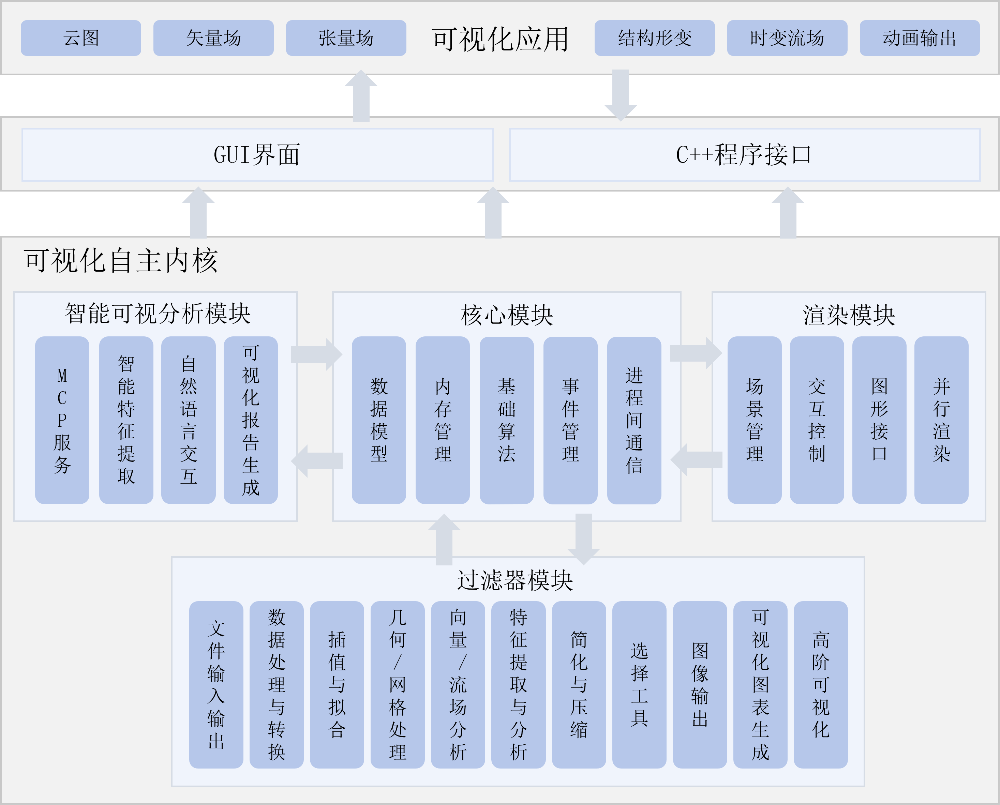

# Metric 11.4: High-Precision Parallel CAE Visualization Platform

## Composition

This metric builds a **high-precision parallel visualization platform** for CAE results: on a unified data model and OpenGL / Meshlet pipeline it integrates high-order (IGA) high-fidelity display, multi-type field visualization, multi-scale interaction, critical-feature extraction, and result evaluation into an open-source deliverable stack.

| # | Sub-feature (vs. assessment text) | Status | Detail doc |
|---|-----------------------------------|--------|------------|
| 1 | High-precision parallel kernel (VTK-class: Meshlet GPU accel, thread pool, render-pressure pacing) | ✅ Implemented | **This document** |
| 2 | IGA / high-order high-fidelity visualization (spectral methods: see Known gaps) | ✅ Partial (Spline / Lagrange) | [README_7.1.en.md](README_7.1.en.md) |
| 3 | Cloud maps / adaptive vectors / tensors and related field visualization | ✅ Implemented | [README_11.3.en.md](README_11.3.en.md) |
| 4 | Large-scale multi-scale physical-field visual interaction | ✅ Implemented | This overview |
| 5 | Multi-level critical-feature intelligent extraction | ✅ Implemented | [README_10.2.en.md](README_10.2.en.md) |
| 6 | Visualization-result intelligent evaluation (expert / annotation fusion) | ✅ Partial (vortex Precision/Recall; mesh metrics pending stronger GUI) | This overview + [README_10.2.en.md](README_10.2.en.md) |

> **Doc style**: 11.4 is a **platform umbrella**. Sub-features 1 and 6 are expanded here; 2–5 are mainly cross-links to avoid duplicating 7.1 / 10.x / 11.3.  
> Differs from **11.3**: 11.3 answers “how to draw fields”; 11.4 answers “how the platform parallelizes / accelerates and integrates those modules”.  



---

## Platform Overview

`iGameCore` + `Qt` form the iGameVis visualization product:

| Layer | Path | Role |
|-------|------|------|
| Data & parallel | `iGameCore/Core/` | `DataObject` / `DrawObject`, `ThreadPool` |
| Filters | `iGameCore/Filters/` | Features, field viz, deformation, multi-scale analytics |
| IO | `iGameCore/IO/` | VTK / CGNS / PVD / Spline, etc. |
| Rendering | `iGameCore/Rendering/` | Scene, OpenGL, Meshlet, interactor |
| GUI | `Qt/` | Main window, docks, model tree, filter menus |

Typical GUI data path:

```text
main.cpp → igQtMainWindow → igQtFileLoader::OpenFile()
         → FileIO::ReadFile() → Scene::AddModel()
         → Docks / menus call Filters / DrawObject / Meshlet
```

---

## Sub-feature 1: High-precision parallel visualization kernel

### Description

Three parallel / acceleration pillars on the shared `DrawObject` pipeline for large CAE meshes:

1. **Meshlet GPU acceleration** — meshlets + mesh/compute shaders for culling and draw scheduling.  
2. **CPU thread pool** — `ThreadPool::parallelFor` / `Commit` for filters, codecs, time-frame loads.  
3. **Render-pressure pacing** — `Scene` skips frames under target FPS / GPU usage caps.

### Source Paths

| Path | Class / API | Notes |
|------|-------------|-------|
| `iGameCore/Rendering/Core/Meshleter/` | `Meshleter` / `SurfaceMeshMeshleter` | Build & draw meshlets |
| `iGameCore/Rendering/Shaders/GLSL/MeshShaders/` | Mesh / Task / MeshletCull | GPU shaders |
| `iGameCore/Core/DataModel/iGameDrawObject.*` | `SetAccelerationOption` / `SetRenderWithMeshlet` | Enable acceleration |
| `iGameCore/Core/Common/iGameThreadPool.h` | `parallelFor` / `Commit` | CPU parallelism |
| `iGameCore/Rendering/Core/iGameScene.*` | `SetTargetFps` / `SetGpuUsageLimit` / `ShouldRenderThisCall` | FPS / pressure control |
| `Qt/src/IQComponents/igQtModelTreeWidget.*` | Model-tree menus | Toggle acceleration |

### How It Is Called

**Meshlet** (`Examples/Rendering/MeshletRendering.cpp`):

```cpp
auto scene = iGame::Scene::New();
auto dataObj = iGame::FileIO::ReadFile("./Models/Tet_Plane.vtk");
auto drawObj = iGame::DynamicCast<iGame::DrawObject>(dataObj);
drawObj->SetAccelerationOption(true);
scene->AddModel(dataObj);
scene->ResetCameraView();
```

**Render pressure / target FPS** (`Examples/Rendering/SetRenderingPressure.cpp`):

```cpp
auto scene = iGame::Scene::New();
auto dataObj = iGame::FileIO::ReadFile("./Models/Tet_Plane.vtk");
scene->AddModel(dataObj);
scene->ResetCameraView();
// scene->SetGpuUsageLimit(0.1f);  // optional GPU usage cap
scene->SetTargetFps(30);
```

**CPU parallel** (used widely inside filters / IO):

```cpp
iGame::ThreadPool::parallelFor(0, count, [&](int i) {
    // process element i
});
```

### GUI

| Entry | Notes |
|-------|-------|
| Model-tree context / acceleration menus | `SetAccelerationOption`, Meshlet toggle |
| Scene interaction | Large meshes stay interactive via FPS / GPU caps |

### Test Cases

| Target | Source | Default data | Notes |
|--------|--------|--------------|-------|
| `testMeshletRendering` | `Examples/Rendering/MeshletRendering.cpp` | `./Models/Tet_Plane.vtk` | Meshlet GPU path |
| `testSetRenderingPressure` | `Examples/Rendering/SetRenderingPressure.cpp` | `./Models/Tet_Plane.vtk` | Target FPS / pressure |

Build Examples with `EXAMPLE_COMPILE=ON` (or the repo’s current Examples CMake workflow).

---

## Sub-feature 2: IGA / high-order high-fidelity visualization

### Description

Lagrange high-order conversion and NURBS/Spline CPU/GPU readers for IGA-style high-fidelity display.

Full detail, API, GUI, and examples: **[README_7.1.en.md](README_7.1.en.md)**.

### Test Cases (entry points)

| Target | Condition |
|--------|-----------|
| `testConvertToLagrangeUnstructuredMesh` | default |
| `testSplineReaderCPU` | default |
| `testSplineReaderGPU` | `ENABLE_GPSCUDA_MODULE=ON` |

### Known gaps

- No dedicated **spectral-methods** visualization module; high-fidelity is carried mainly by **Spline / Lagrange**.  
- VTK high-order end-to-end visualization still has documented limits (see 7.1 / user notice).

---

## Sub-feature 3: Cloud / adaptive vector / tensor field visualization

### Description

Platform integrates scalar cloud maps, adaptive vector glyphs, tensor glyphs, deformation, time-series streamlines, and animation export.

Full detail, screenshots, call sites, and tests: **[README_11.3.en.md](README_11.3.en.md)** (Chinese: [README_11.3.md](README_11.3.md)).

### Test Cases (entry points)

| Target | Notes |
|--------|-------|
| `testSetScalarField` | Cloud map |
| `testVector` / `testVectorEveryNth` / … | Adaptive vectors |
| `testTensorView` | Tensors |
| `testDeformation` / `testDeformationCode` | Deformation |
| `testStreamline` / `testTimeVaryingVector` | Streamlines / time series |
| `testAnimation` / `testSaveAnimation` | Playback / export |

---

## Sub-feature 4: Large-scale multi-scale visual interaction

### Description

Brush/box selection in parallel coordinates, correlation, density, and plot-line views links to 3D highlight/filter via `Selection`.

### Test Cases (entry points)

| Target | Source |
|--------|--------|
| `testMultiscaleInteraction` | `Examples/MultiscaleInteraction/TestMultiscaleInteraction.cpp` |
| `testParallelCoordinatesData`, etc. | Per-view examples |

---

## Sub-feature 5: Multi-level critical-feature extraction

### Description

Classical features (gradient / curvature / Laplacian / vorticity) plus NN vortex detection; results land in `AttributeSet` for 11.3 cloud maps and selection analysis.

Detail and Precision/Recall ≥ 90% target: **[README_10.2.en.md](README_10.2.en.md)**.

### Test Cases (entry points)

| Target | Condition |
|--------|-----------|
| `testGradientExtraction` / `testCurvatureExtraction` / `testLaplacianExtraction` / `testVortexExtraction` | default |
| `testVortexDetection` | `ENABLE_LIBTORCH_MODULE=ON` |

---

## Sub-feature 6: LLM-Based Analysis Report Generation

### Description

The platform uses `MeshReportGenerator` to convert the current model into surface data suitable for report analysis: triangulation, simplification, and temporary VTK export are performed first. `MeshReportClient` then sends the VTK data to the report generation server (ReportGenerate Server). The server reads the preprocessed model and attribute fields, invokes the configured LLM to generate analysis conclusions, and returns the report file to the client for saving.

If the model already contains `part_id`, the report generation server splits the model into parts (MultiBlock) and generates part-level focused analysis. If `part_id` is absent, the report is generated for the whole model.

### Workflow

1. **Configure LLM API information**: Configure the LLM API base URL, API key, and model name in the report generation server (external Python service). API credentials are stored only on the server side and are never written into the iGameVis client or repository.
2. **Start the report generation server and load the pre-cut model**: Start `mesh_report_server.py`, which listens on `127.0.0.1:8766` by default. Load a pre-cut/preprocessed model in iGameVis and make sure the attribute fields to be analyzed are available. If a raw model is provided, the client automatically performs surface conversion, triangulation, and simplification before sending.
3. **Generate the analysis report**: In the iGameVis report generation dialog, set the report save path, report server address/port, and the attribute fields to analyze, then call `MeshReportGenerator::Execute()`. The client sends VTK data, receives the report binary returned by the report generation server, and saves it to the specified file (e.g., `.docx`).

> **Version notes (based on the latest `main` branch):**
> 
> - The report generation dialog supports configuring the server IP/port, defaulting to `127.0.0.1:8766`; the settings are persisted via `QSettings` (`MeshReport/host`, `MeshReport/port`).
> - The iGameVis report generation dialog currently allows selecting at most **1** attribute field; the `MeshReportGenerator::SetSpecifiedFields` API itself supports multiple fields.
> - Use a **pure-English save path** to avoid encoding-related save failures on Windows.

For general instructions on the external Python environment, LLM service, and API key configuration, see **[GitCode README_10.3.md “MCP-Based Text Interaction”](https://gitcode.com/yanhekaiyuan/iGameVis-Open/blob/main/doc/modules/README_10.3.md)**. The model preprocessing, TCP request, and file saving flow described in this section remain authoritative for report generation.

### Source Code Paths

| Path | Class / API | Description |
| --- | --- | --- |
| `iGameCore/Core/Common/MeshReport/iGameMeshReportGenerator.*` | `MeshReportGenerator::Execute` | Full pipeline: triangulation, simplification, transmission, reception, and report saving |
| `iGameCore/Core/Common/MeshReport/iGameMeshReportClient.*` | `connect` / `requestReport` | TCP client for the report generation server, default port `8766` |
| `iGameCore/Filters/DataProcessing/iGameMeshTriangulationFilter.*` | `MeshTriangulationFilter` | Mesh triangulation before sending |
| `iGameCore/Filters/DataProcessing/iGameMeshSimplificationFilterPro.*` | `MeshSimplificationFilterPro` | Model simplification before sending |

### Usage

```cpp
auto obj = iGame::FileIO::ReadFile("./Models/precut_model.vtk");

auto report = iGame::MeshReportGenerator::New(
    "./output/analysis_report.docx", "127.0.0.1", 8766);
report->SetInput(obj);
report->SetSpecifiedFields({"pressure", "velocity"}); // empty list means analyze all fields
report->SetSimplificationRatio(0.1f);                // API default 0.1; iGameVis UI uses 0.2
// report->SetServerHost("192.168.1.100");
// report->SetServerPort(8766);

if (!report->Execute()) {
    std::cerr << report->GetErrorMessage() << std::endl;
}
```

### Acceptance Criteria

- The report generation server starts successfully with the configured LLM API, and the client can connect to the configured host and port.
- The pre-cut model and specified attribute fields are readable; the VTK data received by the server is non-empty.
- After generation, a report file appears at the save path and can be opened normally, containing analysis results for the selected attribute fields.
- If the model contains `part_id`, the report should include part-level focused analysis; otherwise, the report should be generated for the whole model.
- If the save path contains Chinese characters, verify that the target environment can save correctly, or use an English path.
- This repository provides the iGameVis-side model preprocessing and TCP client; LLM configuration, prompts, and report templates are the responsibility of the external report generation server.

## Related Examples (summary)

| Target | Sub-feature | Condition |
|--------|-------------|-----------|
| `testMeshletRendering` | 1 Parallel accel | default |
| `testSetRenderingPressure` | 1 Render pressure | default |
| `testSplineReaderCPU` / `GPU` / `testConvertToLagrangeUnstructuredMesh` | 2 High-fidelity | GPU spline needs GPS CUDA |
| `testSetScalarField` / `testVector*` / `testTensorView` / … | 3 Field viz | see 11.3 |
| `testMultiscaleInteraction` | 4 Multi-scale | default |
| `testGradientExtraction` / … / `testVortexDetection` | 5–6 Features & eval | vortex needs LibTorch |

---

## Related Metrics

| Metric | Doc | Relation to 11.4 |
|--------|-----|------------------|
| 7.1 | [README_7.1.en.md](README_7.1.en.md) | High-order / IGA fidelity |
| 10.1 | [README_10.1.en.md](README_10.1.en.md) | Analysis data generation |
| 10.2 | [README_10.2.en.md](README_10.2.en.md) | Critical features & evaluation |
| 11.3 | [README_11.3.en.md](README_11.3.en.md) | Field visualization output |

Index: [README.md](README.md)
