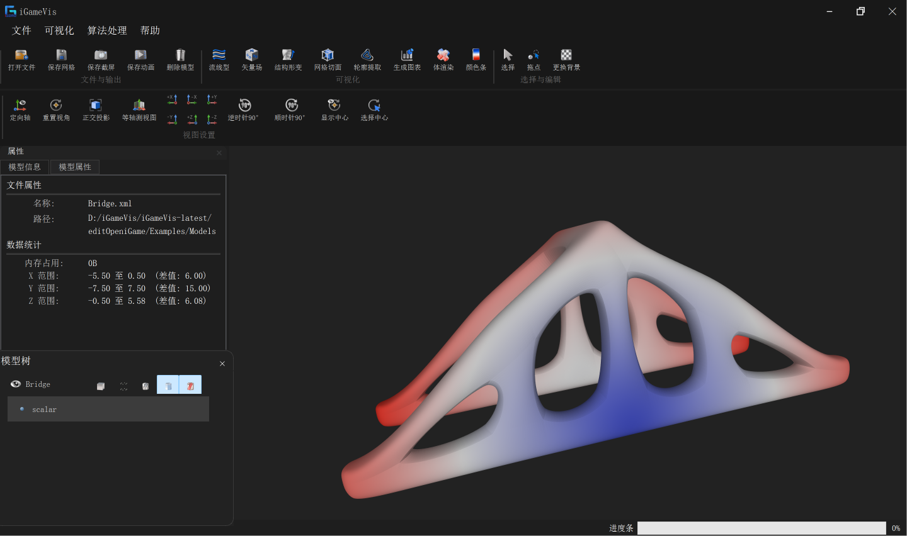
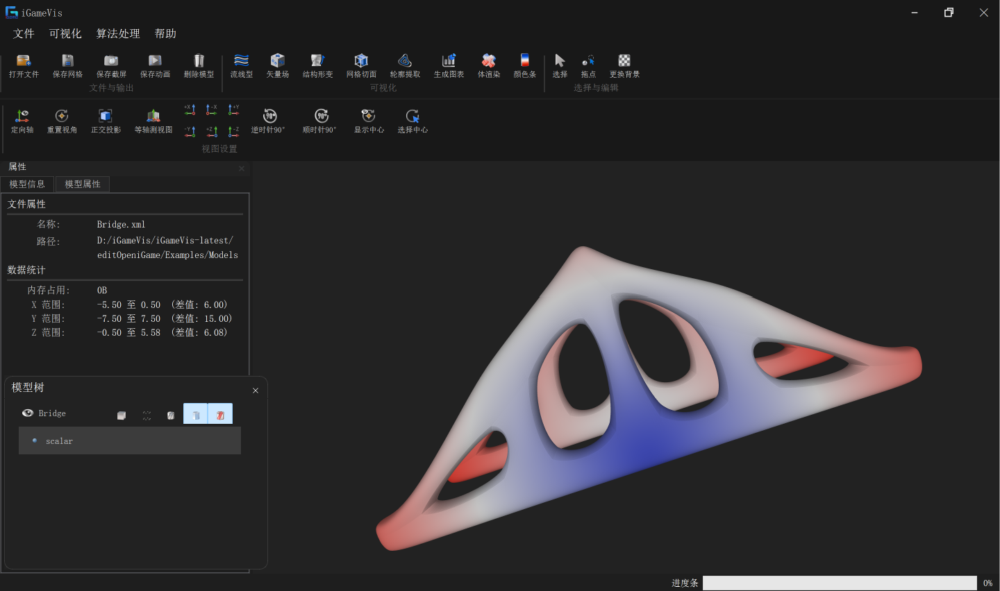

# Metric 7.1: High-Order Visualization Module

## Purpose

High-fidelity visualization for high-order CAE simulation data, including Lagrange mesh conversion and NURBS/Spline geometry reading/rendering.

Key capabilities:

- Linear to Lagrange high-order unstructured mesh conversion
- Lagrange / Quadratic cell definitions and tessellated drawing
- CPU/GPU NURBS/Spline surface and volume visualization

## Source Paths

| Path | Description |
|------|-------------|
| `iGameCore/Filters/Convert/iGameConvertToLagrangeUnstructuredMeshFilter.*` | Linear to Lagrange conversion |
| `iGameCore/Core/CellModel/iGameLagrange*.h` | Lagrange cell models |
| `iGameCore/Core/CellModel/Quadratic/` | Quadratic cell models |
| `iGameCore/Core/DataModel/iGameLagrangeUnstructuredMesh.*` | Tessellation and drawable conversion |
| `iGameCore/Core/DataModel/iGameSplineGeometry.h` | Spline geometry object |
| `iGameCore/IO/Spline XML/iGameSplineReaderCPU.h` | CPU spline reader |
| `iGameCore/IO/Spline XML/iGameSplineReaderGPU.h` | GPU spline reader (`ENABLE_GPSCUDA_MODULE`) |

## How It Is Called

### High-order mesh conversion

```cpp
auto filter = iGame::ConvertToLagrangeUnstructuredMeshFilter::New();
filter->SetInput(mesh);
filter->Execute();
auto output = filter->GetOutput(0);
```

### Spline reading

```cpp
auto reader = iGame::SplineReaderCPU::New();
reader->SetFilePath(filePath);
reader->Execute();
auto obj = reader->GetOutput();
```

### GUI

`igQtFileLoader::OpenSplineFile()` loads `.xml` spline files with CPU/GPU surface or volume readers.

## Related Examples

| Target | Description | Condition |
|--------|-------------|-----------|
| `testConvertToLagrangeUnstructuredMesh` | Linear to Lagrange conversion | default |
| `testSplineReaderCPU` | CPU spline visualization | default |
| `testSplineReaderGPU` | GPU spline visualization | `ENABLE_GPSCUDA_MODULE=ON` |

Figure 1: High-order visualization_Surface_CPU (surface mode)



Figure 2: High-order visualization_Volume_CPU (volume mode)



## Known Limitations

- VTK high-order cell types are parsed at IO level, but end-to-end VTK high-order visualization is **not yet fully adapted** (`iGameVisNoticeToUsers.md`).
