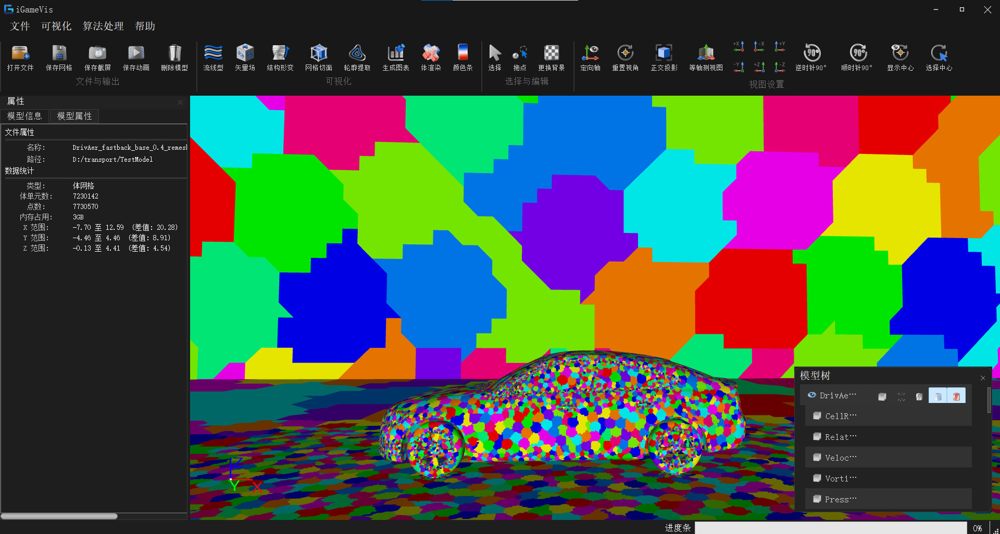
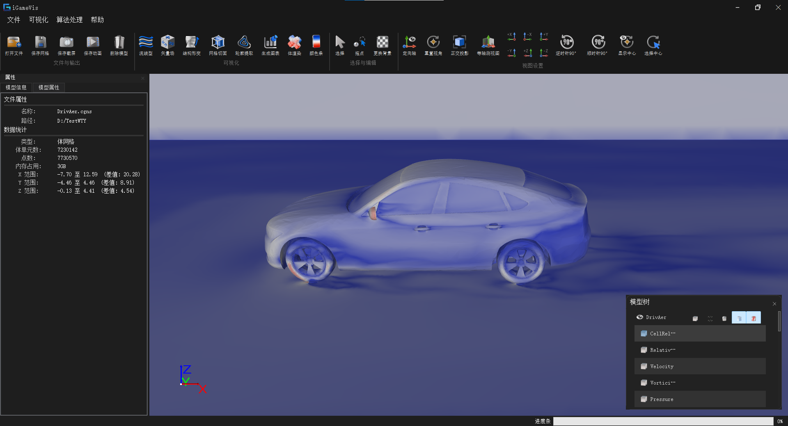

# 指标 8.1：CAE 仿真数据轻量可视化与高性能渲染

## 指标构成

| # | 子功能 | 状态 |
|---|--------|------|
| 1 | 基于 Meshlet 的 GPU 加速渲染 | ✅ 已实现（面向三角表面网格） |
| 2 | 基于二次误差度量的网格简化 | ✅ 已实现（面向三角表面网格） |

---

## 子功能 1：Meshlet GPU 加速渲染

### 功能说明

针对三角表面网格，系统使用 meshoptimizer 构建 Meshlet，将局部顶点、三角形索引和包围体上传至 OpenGL 缓冲区；渲染阶段通过计算着色器进行可见性剔除并调度绘制，降低不可见几何的处理开销。

当前 Meshlet 配置的每个簇最多包含 64 个顶点和 124 个三角形。

### 源码路径

| 路径 | 类 / 文件 | 说明 |
|------|-----------|------|
| `iGameCore/Rendering/Core/Meshleter/iGameMeshleter.*` | `Meshleter` | Meshlet 数据结构、GPU 缓冲和同步 |
| `iGameCore/Rendering/Core/Meshleter/iGameSurfaceMeshMeshleter.*` | `SurfaceMeshMeshleter` | 三角表面网格 Meshlet 构建、优化和包围体计算 |
| `iGameCore/Rendering/Shaders/GLSL/MeshletCull.comp` | 计算着色器 | Meshlet 可见性剔除 |
| `iGameCore/Rendering/Core/iGameModel.cpp` | 模型绘制路径 | Meshlet 渲染调度 |
| `Examples/Rendering/MeshletRendering.cpp` | `testMeshletRendering` | Meshlet 渲染示例 |

### 调用方式

对应示例 `Examples/Rendering/MeshletRendering.cpp`：

```cpp
auto dataObj = iGame::FileIO::ReadFile("./Models/Tet_Plane.vtk");
auto drawObj = iGame::DynamicCast<iGame::DrawObject>(dataObj);

if (drawObj != nullptr) {
    drawObj->SetAccelerationOption(true);
    scene->AddModel(dataObj);
}
```

`SetAccelerationOption(true)` 启用模型的加速渲染路径。输入应为当前实现支持的三角表面网格；非三角表面或不满足构建条件的对象会回退为普通绘制。

### GUI

| 入口 | 操作 | 说明 |
|------|------|------|
| 模型树中选中对象后右键 | 构建渲染加速结构 | 为当前对象构建 Meshlet 渲染加速结构。 |
| 模型树中选中对象后右键 | 关闭渲染加速结构 | 关闭当前对象的渲染加速路径。 |
| 模型树中选中对象后右键 | 开启/关闭 Meshlet 可视化 | 切换 Meshlet 可视化状态，用于查看 Meshlet 划分效果。 |

### 效果图



图 1：模型树右键菜单中的 Meshlet 渲染加速与可视化操作。

### 测试用例

| Target | 源文件 | 默认数据 | 说明 |
|--------|--------|----------|------|
| `testMeshletRendering` | `Examples/Rendering/MeshletRendering.cpp` | `./Models/Tet_Plane.vtk` | Meshlet 构建与 GPU 绘制 |

---

## 子功能 2：网格简化

### 功能说明

`MeshSimplificationFilter` 面向三角表面网格提供基于二次误差度量的简化能力。调用方可设置目标简化率、边界保持和参与误差计算的属性，以减少渲染几何规模。

### 源码路径

| 路径 | 类 / 文件 | 说明 |
|------|-----------|------|
| `iGameCore/Filters/DataProcessing/iGameMeshSimplificationFilter.*` | `MeshSimplificationFilter` | 网格简化 Filter |
| `iGameCore/Filters/DataProcessing/Simplification/` | 简化辅助算法 | 属性保持与误差计算支撑 |
| `iGameCore/Core/DataModel/iGameDrawObject.cpp` | 交互压力路径 | 绘制压力下的简化调用 |
| `Examples/Filter/Compression/TestSimplification.cpp` | `testSimplification` | 网格简化示例 |

### 调用方式

```cpp
auto filter = iGame::MeshSimplificationFilter::New();
filter->SetTargetReduction(0.5);
filter->SetPreserveBoundary(true);
filter->SetInput(surfaceMesh);
filter->Execute();

auto simplified = filter->GetOutput();
```

`SetTargetReduction(0.5)` 表示示例中的目标面数减少比例为 50%。实际简化结果还受输入拓扑、边界和属性保持约束影响。

### GUI

| 入口 | 操作 | 说明 |
|------|------|------|
| 菜单“网格处理” | 表面网格简化 (Surface Simplification) | 打开“表面网格简化”对话框，设置简化比例（0 到 1）后执行常规表面网格简化。 |
| 菜单“网格处理” | 快速表面简化 (Fast Surface Simplification) | 打开快速简化对话框，设置目标简化比例（0 到 1）后执行快速表面网格简化。 |

仅三角表面网格支持上述简化操作。

### 效果图

| 简化前 | 简化后 |
|--------|--------|
|  |  |

图 2：表面网格简化前后对比。

### 测试用例

| Target | 源文件 | 默认数据 | 说明 |
|--------|--------|----------|------|
| `testSimplification` | `Examples/Filter/Compression/TestSimplification.cpp` | `./Models/mazewheel.obj` | 三角表面网格简化与显示 |

---

## 开放链接库与验收边界

根工程在 Release 构建并执行安装后，可输出头文件、库文件、运行时依赖和 CMake 包配置，供外部程序集成。发布包应包含与测试版本一致的 `include/`、`lib/`、`bin/`、`Resources/` 及版本说明。

| 验收项 | 建议验证内容 |
|--------|--------------|
| Meshlet 渲染 | Meshlet 目标可构建、加载三角网格后正常显示、切换加速选项无异常 |
| 网格简化 | 记录简化前后的点/面数量、边界保持状态和关键属性范围 |
| 轻量可视化 | 比较普通绘制与加速/简化绘制的首帧、交互帧率和显存/内存占用 |
| 10 亿级 C/S | 固定客户端/服务端硬件、网络、数据规模、传输、解码、首帧和交互日志，由第三方复测 |
| 成果证明 | 论文、专利和学位证明与软件测试材料独立归档 |

当前仓库包含本地渲染、Meshlet 和网格简化实现，但未包含可直接证明 10 亿级 C/S 分布式处理能力的服务端调度实现或第三方性能报告。论文、专利和人才培养须由独立证明材料验收。
