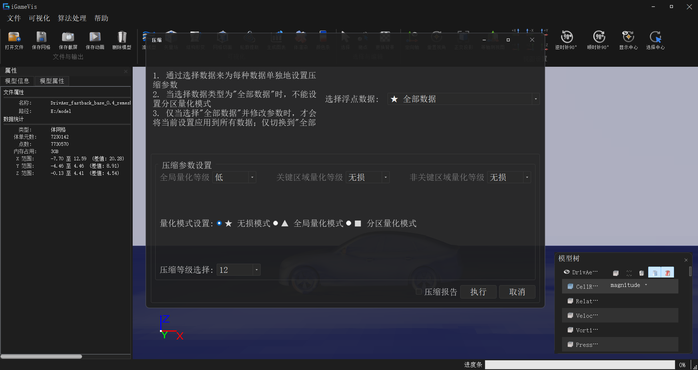
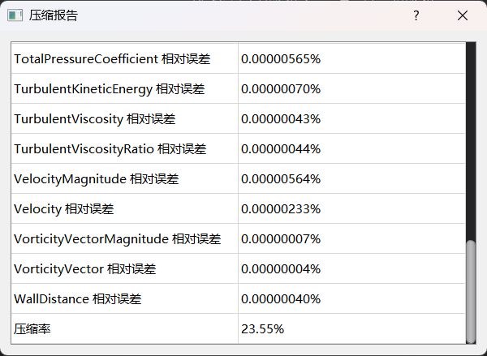
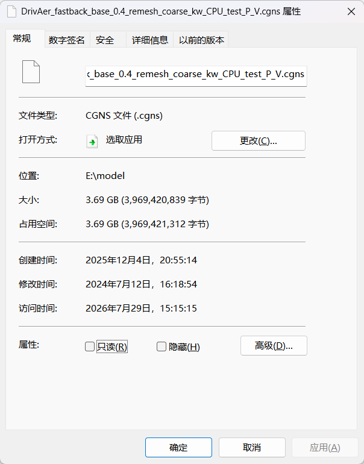
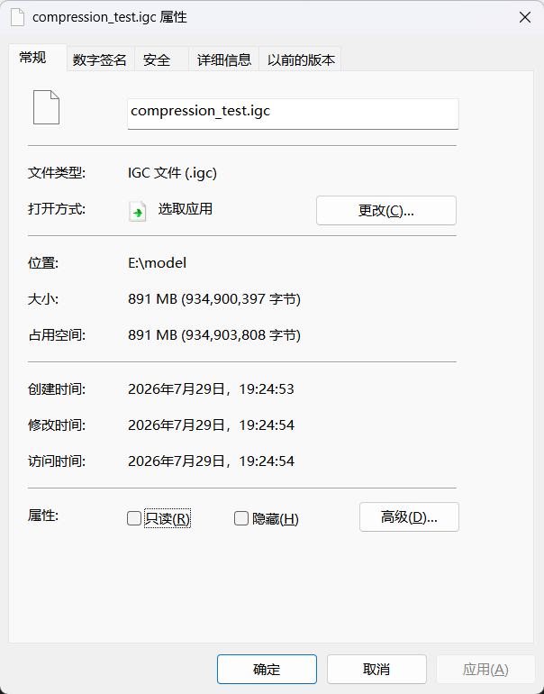
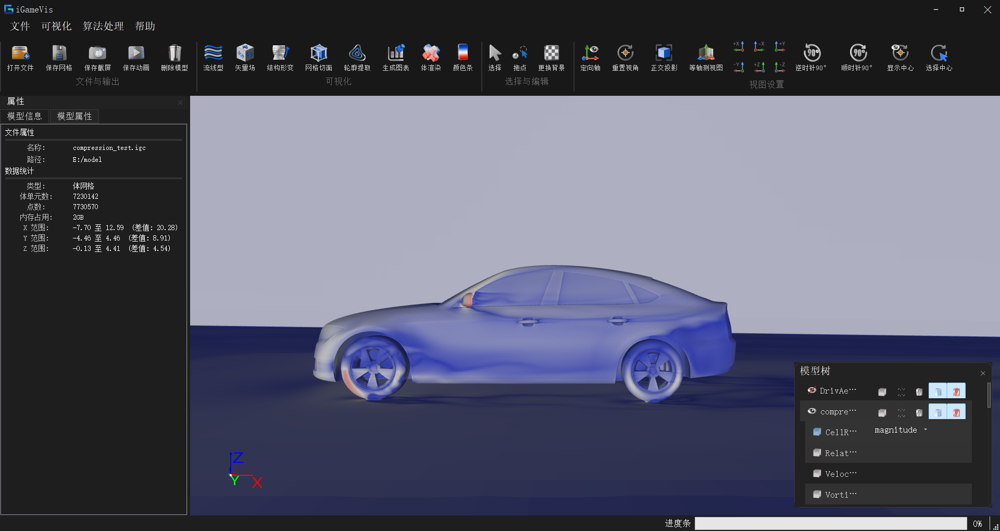

# Metric 9.1: Adaptive Compression for Large-Scale CAE Simulation Data

## Metric Scope

| Item | Requirement |
|------|-------------|
| Error | Variable error in visual-feature regions no greater than 5% |
| Compression | CAE data compression ratio no less than 20% |
| Assessment | Qualified third-party evaluation |
| Deliverable | Open link library |

> The repository provides IGC encoding and decoding. Compliance with the error and compression thresholds requires fixed datasets, feature-region masks, and a third-party report.

## Sub‑feature 1: IGC Mesh and Attribute Encoding

### Description

The encoder organises geometry, topology, attributes and parameters as independent payloads, compresses each payload with Zstandard, and writes them into a `.igc` file. Control parameters are managed by `CodecControlParams`; they can be generated from input data or adjusted before encoding.

### Source Paths

| Path                                                        | Class / File        | Notes                                                        |
| ----------------------------------------------------------- | ------------------- | ------------------------------------------------------------ |
| `iGameCore/Filters/MeshCodec/iGameMeshEncoderFilter.h`      | `MeshEncoderFilter` | Geometry, topology, attribute encoding and compression scheduling |
| `iGameCore/Filters/MeshCodec/EncodeAdapter/`                | Encode adapters     | Extract encode data from `DataObject`                        |
| `iGameCore/Filters/MeshCodec/SubCodec/iGameMeshCodecZSTD.h` | `MeshCodecZSTD`     | Zstandard compression / decompression wrapper                |
| `iGameCore/IO/IGC/iGameIGCWriter.*`                         | `IGCWriter`         | Write `.igc` file                                            |
| `Examples/Filter/Compression/TestEncoder.cpp`               | `testEncoder`       | Encoding example                                             |

### How It Is Called

From `Examples/Filter/Compression/TestEncoder.cpp`:

```cpp
auto source = iGame::FileIO::ReadFile("./Models/Quad_Plane_Tensor.vtk");

auto writer = iGame::IGCWriter::New();
writer->SetCodecControlParams(
    iGame::MeshEncoderFilter<iGame::EncodeOutputBinaryArray>::GenerateDefaultCodecParams(source));
writer->WriteToFile(source, "./Models/comp.igc");
```

### GUI

| Entry                                    | Notes                                              |
| ---------------------------------------- | -------------------------------------------------- |
| Menu File → Compress / `action_compress` | Opens the “Compress” panel                         |
| `igQtMeshCodecDialog`                    | Adjust encoding parameters and perform compression |



### Effect



|                      Before compression                      |                      After compression                       |
| :----------------------------------------------------------: | :----------------------------------------------------------: |
|  |  |

### Test Cases

| Target               | Source                                               | Default input                     | Output                           |
| -------------------- | ---------------------------------------------------- | --------------------------------- | -------------------------------- |
| `testEncoder`        | `Examples/Filter/Compression/TestEncoder.cpp`        | `./Models/Quad_Plane_Tensor.vtk`  | `./Models/comp.igc`              |
| `testLosslessEncode` | `Examples/Filter/Compression/TestLosslessEncode.cpp` | Data file passed via command line | Encode/decode consistency output |

---

## Sub‑feature 2: IGC Decoding and Visualization Recovery

### Description

The decoder reads the `.igc` payload, performs Zstandard decompression, rebuilds the mesh and attribute data objects, and then feeds them into the existing rendering pipeline for display.

### Source Paths

| Path                                                   | Class / File        | Notes                                         |
| ------------------------------------------------------ | ------------------- | --------------------------------------------- |
| `iGameCore/Filters/MeshCodec/iGameMeshDecoderFilter.h` | `MeshDecoderFilter` | Payload decompression and data reconstruction |
| `iGameCore/Filters/MeshCodec/DecodeInput/`             | Decode inputs       | File/memory input adapters                    |
| `iGameCore/Filters/MeshCodec/DecodeAdapter/`           | Decode adapters     | Rebuild `DataObject`, mesh and attributes     |
| `iGameCore/IO/IGC/iGameIGCReader.*`                    | `IGCReader`         | Read `.igc` file                              |
| `Examples/Filter/Compression/TestDecoder.cpp`          | `testDecoder`       | Decoding and display example                  |

### How It Is Called

From `Examples/Filter/Compression/TestDecoder.cpp`:

```cpp
auto object = iGame::FileIO::ReadFile("./Models/comp.igc");
if (object != nullptr) {
    scene->AddModel(object);
}
```

### Effect



### Test Cases

| Target        | Source                                        | Precondition                                   | Notes                  |
| ------------- | --------------------------------------------- | ---------------------------------------------- | ---------------------- |
| `testDecoder` | `Examples/Filter/Compression/TestDecoder.cpp` | Run `testEncoder` first to generate `comp.igc` | Display after decoding |

---

## Assessment

```text
compressionRatio = (originalBytes - compressedBytes) / originalBytes
```

Assessment should fix input files, feature-region masks, variables, error definition, library version, build environment, and logs. Verify compression ratio, regional variable error, topology, attribute names, dimensions, attachment, and value ranges after decoding. The link-library release should include headers, libraries, runtime dependencies, CMake configuration, examples, and version information.
